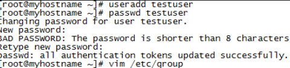
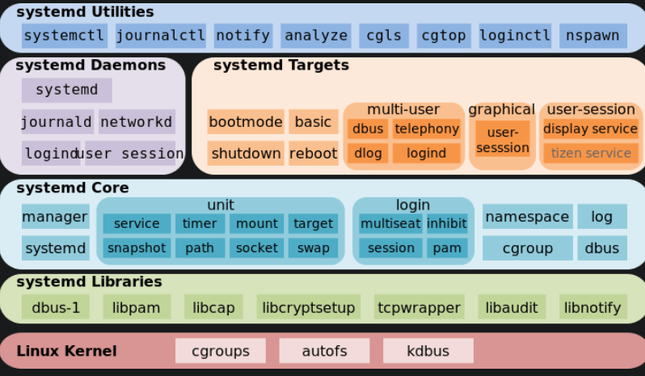
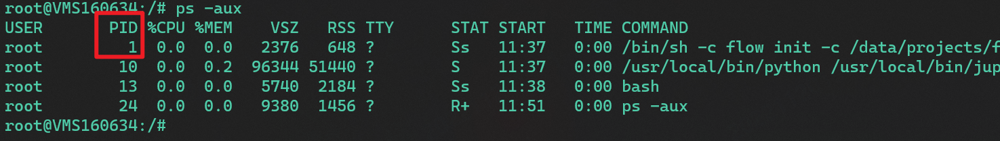
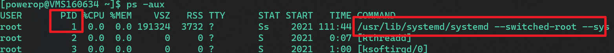

# Linux

## 命令学习

### 常用命令

```shell
1. 查找文件
find ./  finename.txt 


```


### 命令列表


- du df
- ln
- which(在path中搜索可执行文件) vs. whereis(搜索程序、二进制)
- chown
- chmod
- chgrp
- su vs sudo: 推荐sudo?
- curl: mock http
- wget: 下载文件，是curl的子集
- ping:Packet Internet Groper
- host
- nc: tcp udp发包
- netstat
- telnet:查看网络连接
- tcpdump 网络抓包工具
- 
- ssh  远程登录
- scp 远程拷贝
- ps
- free 内存使用
- top  CPU使用率 内存信息 进程信息等
- kill ： ctrl+c即信号2
- 

### top

top - display Linux processes

top -hv|-bcEHiOSs1 -d secs -n max -u|U user -p pid -o fld -w [cols]

The traditional switches `-' and whitespace are optional

### CAT EOF 

多行导入文件

cat << EOF >abcd.txt命令

```
root@unbuntu:/# cat << EOF >abcd.txt
> uu
> hello world
> ii
> hah
> EOF
```

追加

cat << EOF >> test.sh


### su and sudo 

主要是因为在实际工作当中需要在Linux不同用户之间进行切换。root用户权限最高很多时候需要root用户才能执行一些关键命令。所以需要临时切换为root用户。工作完成后，考虑到系统的安全性避免误操作需要切换为普通用户。su和sudo就是为了解决该问题内置的Linux命令。

su: 

su: 它表示**切换到某某用户模式**，提示输入密码时该密码为切换后账户的密码。

[su taxchen]表示切换到taxchen用户模式，需要输入该用户密码。如果是root用户使用该命令，则不需要输入密码，因为root权限最高。
[su]只输入su后面不加账户名称时，系统默认切换到root账户，密码也为root的密码。没有时间限制。
[su -]表示申请切换root用户，需要申请root用户密码。有些Linux发行版，例如ubuntu，默认没有设置root用户的密码，所以需要我们先使用sudo passwd root设置root用户密码。

[su]只是切换了root身份，但Shell环境仍然是普通用户的Shell；而**[su -]连用户和Shell环境一起切换成root身份**了。只有切换了Shell环境才不会出现PATH环境变量错误，报command not found的错误。

[su]切换成root用户以后，pwd一下，发现工作目录仍然是普通用户的工作目录；而用[su -]命令切换以后，工作目录变成root的工作目录了。
用echo $PATH命令看一下su和su - 后的环境变量已经变了。


sudo:

简单的说，sudo 是一种权限管理机制，管理员可以授权于一些普通用户去执行一些 root 执行的操作，而不需要知道 root 的密码。

严谨些说，sudo 允许一个已授权用户以超级用户或者其它用户的角色运行一个命令。当然，能做什么不能做什么都是通过安全策略来指定的。sudo 支持插件架构的安全策略，并能把输入输出写入日志。第三方可以开发并发布自己的安全策略和输入输出日志插件，并让它们无缝的和 sudo 一起工作。**默认的安全策略记录在 /etc/sudoers 文件中**。而安全策略可能需要用户通过密码来验证他们自己。也就是在用户执行 sudo 命令时要求用户输入自己账号的密码。如果验证失败，sudo 命令将会退出。


**sudo暂时切换到超级用户模式以执行超级用户权限**，提示输入密码时该密码为当前用户的密码，而不是超级账户的密码。不过有时间限制，Ubuntu默认为一次时长15分钟。

由于不需要超级用户的密码，部分类Unix系统甚至利用sudo使一般用户取代超级用户作为管理帐号，例如Ubuntu、[Mac OS X]。

sudo [-bhHpV][-s ][-u <用户>][指令]
或
sudo [-klv]
参数
-b 在后台执行指令。
-h 显示帮助。
-H 将HOME环境变量设为新身份的HOME环境变量。
-k 结束密码的有效期限，也就是下次再执行sudo时便需要输入密码。
-l 列出目前用户可执行与无法执行的指令。
-p 改变询问密码的提示符号。
-s 执行指定的shell。
-u <用户> 以指定的用户作为新的身份。若不加上此参数，则预设以root作为新的身份。
-v 延长密码有效期限5分钟。
-V 显示版本信息。
-S 从标准输入流替代终端来获取密码


sudo相关的文件：

/etc/sudoers
/etc/init.d/sudo
/etc/pam.d/sudo
/var/lib/sudo
/usr/share/doc/sudo
/usr/share/lintian/overrides/sudo
/usr/share/bash-completion/completions/sudo
/usr/bin/sudo
/usr/lib/sudo

**系统默认创建了一个名为 sudo 的组**。**只要把用户加入这个组，用户就具有了 sudo 的权限。**
至于如何把用户加入 sudo 组，您可以直接编辑 /etc/group 文件，当然您得使用一个有 sudo 权限的用户来干这件事：
先创建用户并设置密码后，然后在sudo组中加入该用户，多个用户用逗号隔开



[sudo su]表示前用户暂时申请root权限，所以输入的不是root用户密码，而是当前用户的密码。sudo是用户申请管理员权限执行一个操作，而此处的操作就是变成管理员。运行结果 PWD=/home/用户名（当前用户主目录） 

[sudo -i]表示为了频繁的执行某些只有超级用户才能执行的权限，而不用每次输入密码，可以使用该命令。提示输入密码时该密码为当前账户的密码。没有时间限制。执行该命令后提示符变为“#”而不是“$”。想退回普通账户时可以执行“exit”或“logout” 。运行结果 PWD=/root


[sudo !!]以root权限执行上一条命令。

[sudo -u userb ls -l]指定用户执行命令。

[sudo -l]列出目前的权限。

[sudo -u uggc vi ~www/index.html]以 uggc 用户身份编辑 home 目录下www目录中的 index.html 文件

**[sudo su] 切换root身份，不携带当前用户环境变量。**
**[sudo su -]切换root身份，携带当前用户环境变量。**


## 进程管理

### pstree

打印进程树

| -a   | 显示启动每个进程对应的完整指令，包括启动进程的路径、参数等。 |
| ---- | ------------------------------------------------------------ |
| -c   | 不使用精简法显示进程信息，即显示的进程中包含子进程和父进程。 |
| -n   | 根据进程 PID 号来排序输出，默认是以程序名排序输出的。        |
| -p   | 显示进程的 PID。                                             |
| -u   | 显示进程对应的用户名称。                                     |

需要注意的是，在使用 pstree 命令时，如果不指定进程的 PID 号，也不指定用户名称，则会以 init 进程为根进程，显示系统中所有程序和进程的信息；反之，若指定 PID 号或用户名，则将以 PID 或指定命令为根进程，显示 PID 或用户对应的所有程序和进程。

**init 进程是系统启动的第一个进程，进程的 PID 是 1**，也是系统中所有进程的父进程。

### systemctl systemd

历史上，[Linux 的启动](http://www.ruanyifeng.com/blog/2013/08/linux_boot_process.html)一直采用[`init`](https://en.wikipedia.org/wiki/Init)进程。

下面的命令用来启动服务。

> ```bash
> $ sudo /etc/init.d/apache2 start
> # 或者
> $ service apache2 start
> ```

这种方法有两个缺点。

一是启动时间长。`init`进程是串行启动，只有前一个进程启动完，才会启动下一个进程。

二是启动脚本复杂。`init`进程只是执行启动脚本，不管其他事情。脚本需要自己处理各种情况，这往往使得脚本变得很长。

**Systemd** 就是为了解决这些问题而诞生的。它的设计目标是，为系统的启动和管理提供一套完整的解决方案。

根据 Linux 惯例，字母`d`是守护进程（daemon）的缩写。 Systemd 这个名字的含义，就是它要守护整个系统。

使用了 Systemd，就不需要再用`init`了。Systemd 取代了`initd`，**成为系统的第一个进程（PID 等于 1）**，其他进程都是它的子进程。


```
systemctl --version
# systemd version
```

Systemd 的优点是功能强大，使用方便，缺点是体系庞大，非常复杂。事实上，现在还有很多人反对使用 Systemd，理由就是它过于复杂，与操作系统的其他部分强耦合，违反"keep simple, keep stupid"的[Unix 哲学](http://www.ruanyifeng.com/blog/2009/06/unix_philosophy.html)。




Systemd 并不是一个命令，而是一组命令，涉及到系统管理的方方面面。

`systemctl`是 Systemd 的主命令，用于管理系统。

```
# 重启系统
$ sudo systemctl reboot

# 关闭系统，切断电源
$ sudo systemctl poweroff

# CPU停止工作
$ sudo systemctl halt

# 暂停系统
$ sudo systemctl suspend

# 让系统进入冬眠状态
$ sudo systemctl hibernate

# 让系统进入交互式休眠状态
$ sudo systemctl hybrid-sleep

# 启动进入救援状态（单用户状态）
$ sudo systemctl rescue

```

`systemd-analyze`命令用于查看启动耗时。

```
# 查看启动耗时
$ systemd-analyze                                                                                       

# 查看每个服务的启动耗时
$ systemd-analyze blame

# 显示瀑布状的启动过程流
$ systemd-analyze critical-chain

# 显示指定服务的启动流
$ systemd-analyze critical-chain atd.service

```

`hostnamectl`命令用于查看当前主机的信息。

```
# 显示当前主机的信息
$ hostnamectl

# 设置主机名。
$ sudo hostnamectl set-hostname rhel7

```

`localectl`命令用于查看本地化设置。

`timedatectl`命令用于查看当前时区设置。


Systemd 可以管理所有系统资源。不同的资源统称为 Unit（单位）。

Unit 一共分成12种。

> - Service unit：系统服务
> - Target unit：多个 Unit 构成的一个组
> - Device Unit：硬件设备
> - Mount Unit：文件系统的挂载点
> - Automount Unit：自动挂载点
> - Path Unit：文件或路径
> - Scope Unit：不是由 Systemd 启动的外部进程
> - Slice Unit：进程组
> - Snapshot Unit：Systemd 快照，可以切回某个快照
> - Socket Unit：进程间通信的 socket
> - Swap Unit：swap 文件
> - Timer Unit：定时器

### 1号进程



在容器中，ps -aux出来的第一个进程 PID=1



宿主机上是 systemd

init 进程 就是 1号进程

Linux 操作系统中，打开电源执行[BIOS](https://so.csdn.net/so/search?q=BIOS&spm=1001.2101.3001.7020)/boot-loader之后，boot-loader 负责加载Linux 内核。

Linux内核执行文件一般放在 /boot 目录下，文件名类似 vmlinuxz* ，在内核完成了操作系统的各种初始化后。 **这个程序需要执行的第一个用户态进程就是init 进程。**

**1 号进程是第一个用户态的进程，由它直接或者间接创建了 Namespace 中的其他进程**

对于 1号进程， kill -9 1是杀不死的，不只是kill，其他命令也是kill不掉的


## shell

### 语法

```
定义数组：arr =(v1 v2)
读取数组： ${ar[0]}
@或*可以获取数组中所有的元素


```


参数

$N : 

- 0：文件名
- 1：第一个参数，依次类推
- $# : 参数个数
- $*:以一个单字符串显示所有的参数
- $@: 同上* , 不过使用时需要添加引号，并在引号中返回每个参数 


流程控制：

- if
- for
- while
- until
- case esac
- break continue
- 


函数

```
[function] funcname[(param)]

{

 action

}
```


- xargs:

将参数列表转换为小块分段传递给其他命令

command | xargs

- alias
- crontab
- rsync
- iostat
- vmstat
- atnodes
- tonodes


### 多进程

由于shell是单线程的，要想实现“多线程”可以通过在后台运行多进程的方式来实现。在bash中，使用后台任务来实现任务的“多进程化”。在不加控制的模式下，不管有多少任务，全部都后台执行。也就是说，在这种情况下，有多少任务就有多少“进程”在同时执行

加了一个后台执行&符号

wait是等待前面的后台任务全部完成才往下执行，否则程序本身是不会等待的

### wait

wait [作业指示或进程号]

　　1.等待作业号或者进程号制定的进程退出，返回最后一个作业或进程的退出状态状态。如果没有制定参数，则等待所有子进程的退出，其退出状态为0.

　　2.如果是shell中等待使用wait，则不会等待调用函数中子任务。在函数中使用wait，则只等待函数中启动的后台子任务。

　　3.在shell中使用wait命令，相当于高级语言里的多线程同步。

wait(参数)  使用 wait 是在等待上一批或上一个脚本执行完（即上一个的进程终止），再执行wait之后的命令。

　　**参数**

　　进程或作业标示：指定进程号或者作业号。


wait $\$!表示上个子进程的进程号


## 环境变量

Linux是一个多用户多任务的操作系统，可以在Linux中为不同的用户设置不同的运行环境，具体做法是设置不同用户的环境变量。

### 分类

一、按照**生命周期**来分，Linux环境变量可以分为两类：
 1、**永久的**：需要用户修改相关的配置文件，变量永久生效。
 2、**临时的**：用户利用**export**命令，**在当前终端下声明环境变量，关闭Shell终端失效。**

二、按照**作用域**来分，Linux环境变量可以分为：
 1、**系统环境变量**：系统环境变量**对该系统中所有用户**都有效。
 2、**用户环境变量**：顾名思义，这种类型的环境变量**只对特定的用户有效**。

### Linux设置环境变量

#### 系统环境变量

在`/etc/profile`文件中添加变量 **对所有用户生效（永久的）**

```bash
 export CLASSPATH=./JAVA_HOME/lib;$JAVA_HOME/jre/lib
```

修改文件后要想马上生效还要运行`source /etc/profile`不然只能在下次重进此用户时生效。

#### 用户环境变量

在用户目录下的.bash_profile文件中增加变量 **对单一用户生效（永久的）**

```bash
vim ~/.bash.profile
export CLASSPATH=./JAVA_HOME/lib;$JAVA_HOME/jre/lib
```

修改文件后要想马上生效还要运行$ source ~/.bash_profile不然只能在下次重进此用户时生效。

#### 临时环境变量

直接运行export命令定义变量 **【只对当前shell（BASH）有效（临时的）】**

### Linux环境变量的使用

#### 常见环境变量

- PATH：**指定命令的搜索路径**

  ```bash
  PATH=$PAHT:<PATH 1>:<PATH 2>:<PATH 3>:--------:< PATH n >
  export PATH
  ```

  中间用冒号隔开。环境变量更改后，在用户下次登陆时生效。

  `echo $PATH` 查看

- HOME：指定用户的主工作目录（即用户登陆到Linux系统中时，默认的目录）。

- HISTSIZE：指保存历史命令记录的条数。

- LOGNAME：指当前用户的登录名。

- HOSTNAME：指主机的名称，许多应用程序如果要用到主机名的话，通常是从这个环境变量中来取得的

- SHELL：指当前用户用的是哪种Shell。

- LANG/LANGUGE：和语言相关的环境变量，使用多种语言的用户可以修改此环境变量。

- MAIL：指当前用户的邮件存放目录。

#### 查看和修改命令

- echo         显示某个环境变量值 echo $PATH

- export   设置一个新的环境变量 export HELLO="hello" (可以无引号)

- env      显示所有环境变量

- set      显示本地定义的shell变量

- unset        清除环境变量 unset HELLO

- readonly     设置只读环境变量 readonly HELLO


## 目录结构

- usr: Not user的缩写，Unix Software Resource的缩写
- /home：普通用户的主目录

在shell的命令行下直接使用`export 变量名=变量值`
 定义变量，该变量只在当前的shell（BASH）或其子shell（BASH）下是有效的，shell关闭了，变量也就失效了，再打开新shell时就没有这个变量，需要使用的话还需要重新定义。


### 文件权限

Linux的权限不是很细致，只有RWX三种
r(Read，读取)：对文件而言，具有读取文件内容的权限；对目录来说，具有浏览目录的权限。
w(Write,写入)：对文件而言，具有新增,修改,删除文件内容的权限；对目录来说，具有新建，删除，修改，移动目录内文件的权限。
x(eXecute，执行)：对文件而言，具有执行文件的权限；**对目录了来说该用户具有进入目录的权限**（**当前用户无执行权限时不能cd到该目录**）。
1、目录的只读访问不允许使用cd进入目录，必须要有执行的权限才能进入。
2、只有执行权限只能进入目录，不能看到目录下的内容，要想看到目录下的文件名和目录名，需要可读权限。
3、一个文件能不能被删除，主要看该文件所在的目录对用户是否具有写权限，如果目录对用户没有写权限，则该目录下的所有文件都不能被删除，文件所有者除外
4、目录的w位不设置，即使你拥有目录种某文件的w权限也不能写该文件

特殊文件权限：

- setuid
- setgid
- sticky粘滞位：只能文件创建者和root可以删除，对目录有效文件无效，只限删除操作

## 包管理

### apt-get

**apt-get命令**是**Debian** Linux发行版中的APT软件包管理工具。所有基于Debian的发行都使用这个包管理系统。deb包可以把一个应用的文件包在一起，大体就如同Windows上的安装文件。

```bash
apt-get(选项)(参数)
```

使用apt-get命令的第一步就是引入必需的软件库，Debian的软件库也就是所有Debian软件包的集合，它们存在互联网上的一些公共站点上。把它们的地址加入，apt-get就能搜索到我们想要的软件。**/etc/apt/sources.list**是存放这些地址列表的配置文件

```bash
apt-get update # 在修改/etc/apt/sources.list或者/etc/apt/preferences之后运行该命令。此外您需要定期运行这一命令以确保您的软件包列表是最新的
apt-get install packagename
apt-get remove packagename # 卸载一个已安装的软件包（保留配置文件）
apt-get –purge remove packagename # 卸载一个已安装的软件包（删除配置文件）
apt-get autoclean apt # 会把已装或已卸的软件都备份在硬盘上，所以如果需要空间的话，可以让这个命令来删除你已经删掉的软件
apt-get clean # 更新所有已安装的软件包
apt-get upgrade # 更新所有已安装的软件包
apt-get dist-upgrade # 将系统升级到新版本
apt-get autoclean # 定期运行这个命令来清除那些已经卸载的软件包的.deb文件。通过这种方式，您可以释放大量的磁盘空间。如果您的需求十分迫切，可以使用apt-get clean以释放更多空间。这个命令会将已安装软件包裹的.deb文件一并删除。大多数情况下您不会再用到这些.debs文件
```


搜索包：

apt-cache search openjdk


## 打包与压缩

tar: 打包，没有压缩

tar.gz; 打包，gzip压缩


```bash
tar -cvf a.tar a # 压缩
tar -xvf a.tar # 打包
```


## shell

### shell type

- bin/sh:  bourne shell
- bin/bash: bbourne again shell
- /usr/bin/sh: C shell
- /usr/bin/ksh: K shell
- /sbin/sh: shell for root

### $() ``

$()\$  和反引号` 都可以将命令执行结果赋值给变量


unset 删除变量

readonly 只读变量

### set +-eu

-u Treats unset parameters as an error when substituting.
Using + rather than - causes these flags to be turned off.

也就是 -u时候，我们输入的参数如果不是设置的话，就会进行报错，改成+u就没有问题了。

### 单双引号

单引号：单纯是字符串

双引号：类似字符串模板，会解析 \$ 等


### 注释

当行注释：#

多行注释1： 

```bash
: '  comments '
# :后面有一个space
```


### 字符串操作

```bash
$(str:0:4)
可以截取、匹配、返回长度等
$(str#*//)

```


### 数字操作

科学计数法转十进制：

```
res=`echo $res | awk '{printf("%f",$0)}'`
```


### 脚本中改变当前工作路径

在脚本中 cd路径，对当前工作路径是无效的

执行脚本时候，只是在当前的shell下开了一个子进程，切换目录的操作只对该进程中相关后续指令有效，但改变不了父进程的目录。

解决方法：

- source a.sh
- . a.sh: .表示在当前shell中执行


## 传参

-$# 参数个数


## DNS

### /etc/resolv.conf

/etc/resolv.conf

是dns配置


## ENV

临时环境变量：使用export声明即可

```bash
export qunar=val
```

永久ENV

/ect/profile中使用export声明，对所有用户生效

~/.bash_profile只对自己生效

```bash
export PATH=$JAVA_HOME$/bin
```


## Problems

### **Argument list too long**

On Linux, creating, replacing, or altering a UDF, UDM, or external stored procedure (collectively called *external routines*) can produce an “Argument list too long” error.

If you get this error, the database in which you want to create, replace, or alter the external routine either already contains a lot of other external routines or contains external routines with very long names.

The new external routine compiles (or recompiles) successfully, but when the name of the resulting object file is added to the list of object files for all of the external routines already in the database, the compiler cannot create a new dynamic linked library (.so file) because the resulting list exceeds the maximum command line argument size.

To work around this limitation on Linux, you can do any of the following:

- Drop all unnecessary UDTs and external routines from the database.
- Instead of installing each external routine individually, create a package or library of external routines and install them collectively.

This may not work in all cases, for example, if you reach the maximum number of UDTs allowed on a system.


### apt-get update失败

更新镜像源

/etc/apt/sources.list:


获取国内镜像：

注意：**不要从其他帖子直接复制一些地址，这些很多都不对**。

从阿里云镜像官网这里查询对应系统的软件源：

https://developer.aliyun.com/mirror/

https://developer.aliyun.com/mirror/ubuntu?spm=a2c6h.13651102.0.0.3e221b11kWYlKc

```sql
deb http://mirrors.aliyun.com/ubuntu/ focal main restricted universe multiverse
deb-src http://mirrors.aliyun.com/ubuntu/ focal main restricted universe multiverse

deb http://mirrors.aliyun.com/ubuntu/ focal-security main restricted universe multiverse
deb-src http://mirrors.aliyun.com/ubuntu/ focal-security main restricted universe multiverse

deb http://mirrors.aliyun.com/ubuntu/ focal-updates main restricted universe multiverse
deb-src http://mirrors.aliyun.com/ubuntu/ focal-updates main restricted universe multiverse

# deb http://mirrors.aliyun.com/ubuntu/ focal-proposed main restricted universe multiverse
# deb-src http://mirrors.aliyun.com/ubuntu/ focal-proposed main restricted universe multiverse

deb http://mirrors.aliyun.com/ubuntu/ focal-backports main restricted universe multiverse
deb-src http://mirrors.aliyun.com/ubuntu/ focal-backports main restricted universe multiverse

```

如果update失败，去掉deb-src


更新源

```sql
sudo apt-get update
```

更新软件

```csharp
sudo apt-get upgrade
```


如果 失败是网络问题，更新阿里dns:

vi /etc/resolv.conf

nameserver 223.5.5.5  
nameserver 223.6.6.6


如果：

Failed to fetch store:/var/lib/apt/lists/partial/mirrors.aliyun.com_ubuntu_dists_trusty_multiverse_binary-amd64_Packages.gz  Hash Sum mismatch

> apt-key list

rm删除过期的KEY


## 服务器运维

### 服务器登录不上

情况：

腾讯云服务器登录不上，22端口已经在安全组 准入

但实际无效

```sql
telnet edwinxu.xyz 22
```

问题：服务器的ssh程序已经挂了，需要重启

但是，22端口无法访问，无法通过公网访问，怎么办？

原来云供应商还提供另一种直接的登录的方式

VNC：虚拟网络控制台

通过VNC登录，然后重启ssh


### 磁盘清理

```shell
1.查看磁盘信息
df -lh

2.定位最大的文件目录
du-h --max-depth=1

3.定位最大的文件
ls -lhs # 从大到小排序

4.确认文件没有被占用
/usr/sbin/lsof |grep deleted 
```


