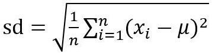
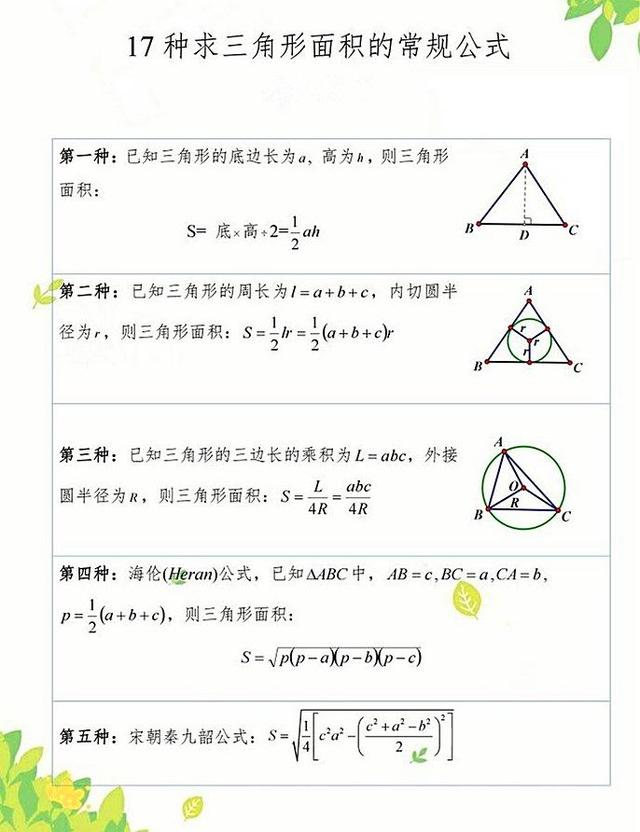
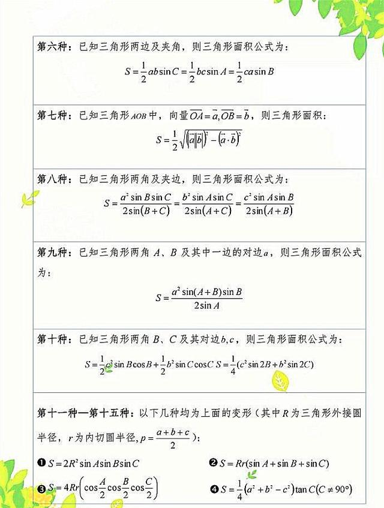
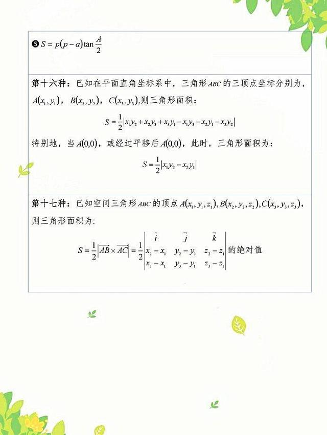

# Math Notes

## Basic Concepts

### 离差

指单项数值和平均值的差，正负可以作为方向。用来反映某一数值与平均值的偏离程度（距离）。

### **标准差（sd）**

用来反映样本数据离散程度的指标。多用来反映样本是否“稳重”。比如一学生整个学期的数学成绩作为样本，计算其标准差，标准差小代表该学生的成绩比较稳定。当然没有固定的标准，多用来比较多组数据的“靠谱性”。

### 方差

标准差平方后的值。一样的作用。

### 峰度

http://www.zzkook.com/content/yang-ben-de-chi-chai-biao-zhun-chai-fang-chai-pian-du-duo-tu

### 协方差

https://blog.csdn.net/LaoYuanPython/article/details/108864527

### 分位数

分位数（Quantile），也称分位点，是指将一个随机变量的概率分布范围分为几个等份的数值点，分析其数据变量的趋势。常用的有中位数、四分位数、百分位数等。

中位数（Medians）是一个统计学的专有名词，代表一个样本、种群或概率分布中的一个数值，可以将数值集合划分为相等的两部分，即，若设连续随机变量 *X* 的分布函数为 *F(X)*，那么满足条件 *F(X)=1/2* ，称为 *X* 或分布 *F* 的中位数。中位数是用来衡量集中趋势的方法。对于一个有限的、有序的数集，位于中间位置的那个数值就是中位数，用 Me 表示。

> 中位数可以扩展到四分位数，即中位数再取中位数，变成四分位数。

若设连续随机变量 *X* 的分布函数为 *F(X)*，那么满足条件 *F(X)=1/4* ，称为 *X* 或分布 *F* 的四分位数。四分位数通常用箱形图（Box Plots）表示。箱形图能显示出一组数据的最大值（Maximum）、最小值（Minimum）、中位数（Q2）、下四分位数（Q1）及上四分位数（Q3）。

百分位数又称百分位分数（percentile），是一种相对地位量数，它是次数分布（Frequency Distribution，频数分布）中的一个点。把一个次数分布排序后，分为 100 个单位，百分位数就是次数分布中相对于某个特定百分点的原始分数，它表明在次数分布中特定个案百分比低于该分数。百分位数用P加下标 m（特定百分点）表示。譬如，若P30等于60，则其表明在该次数分布中有 30％ 的个案低于 60 分。

### 箱形图

## 二维

### 三角形

#### 三角形面积

## 空间

