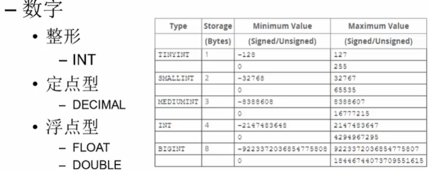
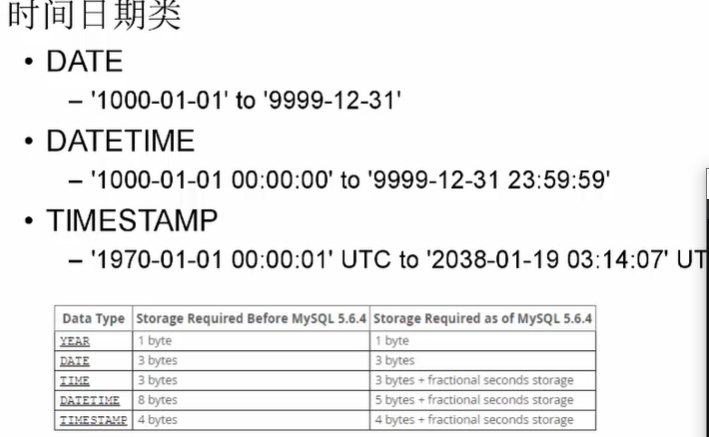
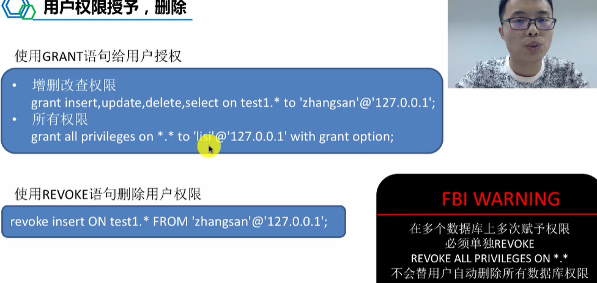
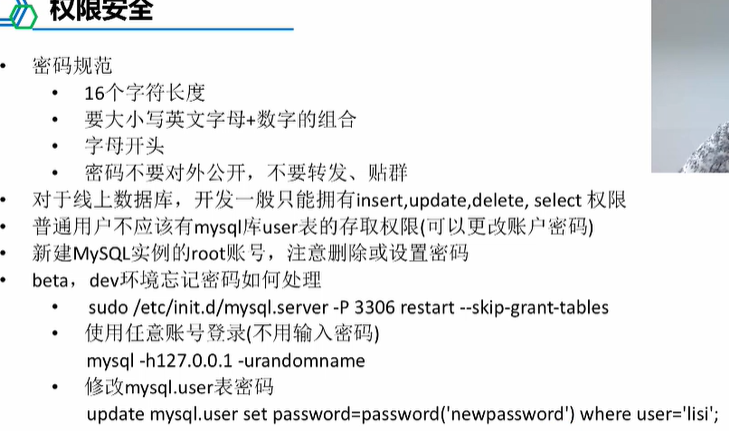
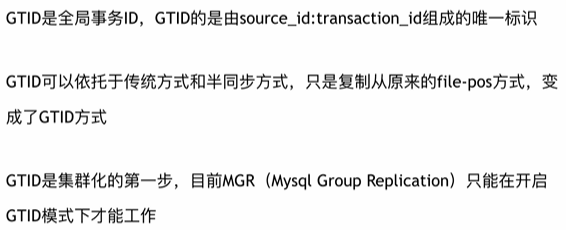
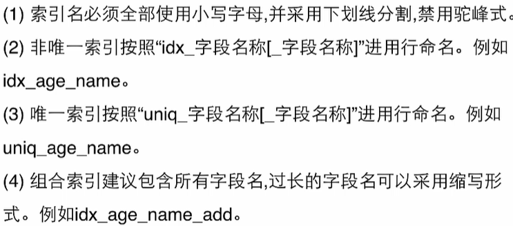
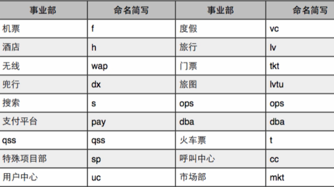
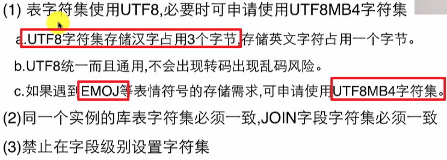
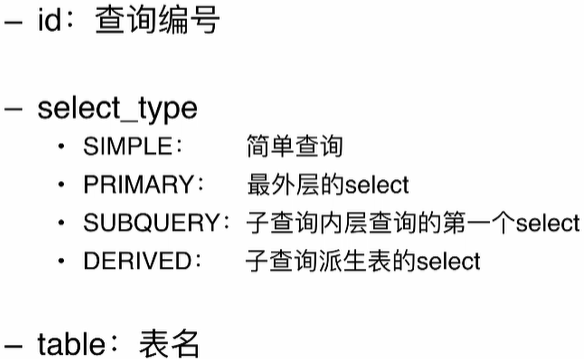
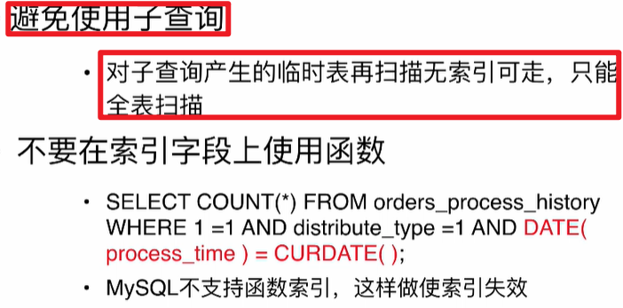

# MySQL Notes

1. [数据库笔记](_pdf/database/数据库笔记.pdf)
2. [MySQL学习笔记](_pdf/database/MySQL学习笔记.pdf)
3. [MySQL常用基本SQL语句小结](_pdf/database/MySQL常用基本SQL语句小结.pdf)
4. [JDBC学习笔记](_pdf/database/JDBC学习笔记.pdf)


## SQL

SQL语言共分为四大类：数据查询语言**DQL**，数据操纵语言**DML**，数据定义语言**DDL**，数据控制语言**DCL**。

### DQL

select

### DML

**数据操纵语言**（Data Manipulation Language, DML）

insert

update: update tb set a =b

delete： delete from table where

### DDL

Data Definition Language 数据定义语言

- create 
- drop
- truncate: 清空数据，保存结构，比delete from性能高
- rename: rename table a to b
- alter
  - add: alter table a add column city varchar
  - modify/change: 
  - drop

>  show full columns from tbl_hive_meta;


### DCL

控制语言

DBA的职责

1) GRANT：授权。
2) ROLLBACK [WORK] TO [SAVEPOINT]：回退到某一点。回滚---ROLLBACK回滚命令使数据库状态回到上次最后提交的状态。其格式为：SQL>ROLLBACK;


### 显示建表语句

>  show create table book\G

```sql
show create table book\G
***************************[ 1. row ]***************************
Table        | book
Create Table | CREATE TABLE `book` (
  `id` int(11) NOT NULL AUTO_INCREMENT,
  `book_id` int(11) NOT NULL,
  `book_name` varchar(128) COLLATE utf8_bin NOT NULL,
  `pages` int(11) NOT NULL,
  `price` int(11) NOT NULL DEFAULT '0',
  `press` varchar(256) COLLATE utf8_bin NOT NULL DEFAULT '',
  PRIMARY KEY (`id`),
  UNIQUE KEY `book_id_UNIQUE` (`book_id`),
  KEY `book_index` (`book_id`)
) ENGINE=InnoDB AUTO_INCREMENT=4 DEFAULT CHARSET=utf8 COLLATE=utf8_bin
```

### not null and default

not null是在插入的时候进行限制

而default是插入时为声明该字段时取的默认值，插入时声明字段，不会为null填充默认值

二者没有绝对关系

#### default

修改字段时，如果要将函数返回值赋值给default，需要使用括号将函数包括起来：

```sql
ALTER TABLE tbl01 MODIFY dt date NOT NULL default (current_date());
```

否则不会成功


 mysql5.7下不能给date类型设置函数作为default值


### delete vs. truncate

```sql
1. truncate和 delete只删除数据不删除表的结构(定义) 

2.delete语句是dml,这个操作会放到rollback segement中,事务提交之后才生效;如果有相应的trigger,执行的时候将被触发. 
truncate是ddl, 操作立即生效,原数据不放到rollback segment中,不能回滚. 操作不触发trigger. 

3.delete语句不影响表所占用的extent, 高水线(high watermark)保持原位置不动 
显然drop语句将表所占用的空间全部释放 
truncate 语句缺省情况下见空间释放到 minextents个 extent,除非使用reuse storage; truncate 会将高水线复位(回到最开始). 

4.速度,一般来说: truncate > delete 

5.安全性:小心使用drop 和truncate,尤其没有备份的时候.否则哭都来不及. 

使用上,想删除部分数据行用delete,注意带上where子句. 回滚段要足够大. 
想保留表而将所有数据删除. 如果和事务无关,用truncate即可. 如果和事务有关,或者想触发trigger,还是用delete. 
如果是整理表内部的碎片,可以用truncate跟上reuse stroage,再重新导入/插入数据/
```


#### binlog相关

二进行日志的格式为row时，truncate的binlog只是一条SQL语句？

而delete是完全的差异数据。

嗯应该是对的，truncate SQL就足以表示删除所有数据，而delete则必须要明细。

truncate后仍然可以通过binlog恢复。


### upsert

- upsert(update or insert), 即更新或写入。
- MySQL中实现upsert操作方式：
  思路：通过判断插入的记录里是否存在主键索引或唯一索引冲突，来决定是插入还是更新。当出现主键索引或唯一索引冲突时则进行update操作，否则进行insert操作。
  实现：使用 ON DUPLICATE KEY UPDATE

```sql
insert into demo(a,b,c,d,e,f) values(1,1,1,2,2,2) ON DUPLICATE KEY UPDATE a=2,b=2,c=3,d=4,e=5,f=6;
-- 因为已经存在由abc三列组成唯一索引数据：1，1，1，本次又写入demo(a,b,c,d,e,f) values(1,1,1,2,2,2)，会造成唯一索引冲突。因此，会触发ON DUPLICATE KEY 后面的 UPDATE a=2,b=2,c=3,d=4,e=5,f=6操作。
```

### replace into

replace into 跟 insert 功能类似，不同点在于：replace into 首先尝试插入数据到表中， 

**1. 如果发现表中已经有此行数据（根据主键或者唯一索引判断）则先删除此行数据，然后插入新的数据。 **

**2. 否则，直接插入新数据。**

MySQL replace into 有三种形式：

1. replace into tbl_name(col_name, ...) values(...)

2. replace into tbl_name(col_name, ...) select ...

3. replace into tbl_name set col_name=value, ...

### FIND_IN_SET

FIND_IN_SET(str,strList)

- str          要查询的字符串
- strList    字段名，参数以“,”分隔，如(1,2,6,8)
- 查询字段(strList)中包含的结果，返回结果null或记录。

### create table as select

```sql
use tmp_dw_temp;
create table rsk_feature_idcode_cq_all_snap as
select * from dm_cardrisk.rsk_feature_idcode_cq_all_snap
```

create table a as select * from b可以创建一个与b表结构一样的表，但是在实际应用中最好不要这么创建表。原因是这样只创建表的结构，而不会将原表的默认值一起创建。

这种方法会将old_table中所有的内容都拷贝过来,用这种方法需要注意,new_table中没有了old_table中的primary key,Extra,auto_increment等属性

### ON DULICATE KEY UPDATE

在MySQL数据库中，如果在insert语句后面带上ON DUPLICATE KEY UPDATE 子句，而要插入的行与表中现有记录的**惟一索引或主键中产生重复值**，那么就会发生旧行的更新；如果插入的行数据与现有表中记录的唯一索引或者主键不重复，则执行新纪录插入操作。

```SQL
INSERT INTO table (a,b,c) VALUES (1,2,3),(4,5,6)  
      ON DUPLICATE KEY UPDATE c=VALUES(a)+VALUES(b); 
```

### order by null

在SQL语句中会隐含对`GROUP BY`列进行排序，如果在`GROUP BY`列后面加上`ORDER BY NULL`会去掉这个隐含排序，以提升语句查询的速度。

查看一个group by的执行计划：

```sql
mysql> explain select name, count(1) from tbl02 group by name\G;
*************************** 1. row ***************************
           id: 1
  select_type: SIMPLE
        table: tbl02
   partitions: NULL
         type: ALL
possible_keys: NULL
          key: NULL
      key_len: NULL
          ref: NULL
         rows: 2
     filtered: 100.00
        Extra: Using temporary
1 row in set, 1 warning (0.00 sec)
```

可以看到Using temporary，即使用临时表排序————这当然有性能开销，对于不需要排序是不必要的。

使用 order by null时：

如果版本小于8则没有排序了


注意：

MySQL 8.0之后版本使用ORDER BY NULL将没有任何的查询性能上收益了。

原因是**8.0版本之后，GROUP BY的隐含排序已经去掉**了，在GROUP BY后面使用ORDER BY NULL也不会出现5.7版本之前压制字段隐含排序的现象，所以也没有必要在SQL语句中加上ORDER BY NULL

#### join中on与where条件的区别

1. on条件是在生成临时表时使用的条件，**它不管on中的条件是否为真，都会返回左边表中的记录。**

2. where条件是在临时表生成好后，再对临时表进行过滤的条件。这时已经没有left join的含义（必须返回左边表的记录）了，条件不为真的就全部过滤掉。

注意join/left join中on条件不管是否为True，都会返回左表的内容，达不到筛选的目的！！！


### 聚合函数

#### 表达式

看一个DEMO：

```sql
-- 1.
select count(1) from tbl_tag  where id < 10  -- 7
-- 2.
select count(id<10) from tbl_tag  -- 3352
-- 3.
select count(id<10 OR NULL) from tbl_tag  -- 7
-- 4.
select count(if(id<10, 1, null)) from tbl_tag  -- 7
```

使用方式1，count(distinct/ 字段),count(1),count(*)等时没有问题的，使用where可以正确统计数据，注意会跳过NULL

但是对于方式2，count(表达式)则非常需要注意，按道理count(exp)是可以的，但是为什么查询到的是所有数据，因为当 id<10不成立时，值为false，count(false)也是会被统计的。

所以，对于方式3：当id<10为false时，则会执行OR NULL, NULL不会被计数，i<10为true是，后面则会被短路。

对于方式4，则是使用if函数

#### IF

Mysql的if既可以作为表达式用，也可在存储过程中作为流程控制语句使用

```sql
IF(expr1,expr2,expr3)
```

如果 expr1 是TRUE (expr1 <> 0 and expr1 <> NULL)，则 IF()的返回值为expr2; 否则返回值则为 expr3

作为表达式的if也可以用CASE when来实现：

```sql
select CASE sva WHEN 1 THEN '男' ELSE '女' END as ssva from taname where sva != ''
```

#### IFNULL

```sql
IFNULL(expr1,expr2)
```

假如expr1 不为 NULL，则 IFNULL() 的返回值为 expr1; 否则其返回值为 expr2。IFNULL()的返回值是数字或是字符串，具体情况取决于其所使用的语境。


### 普通函数

#### length

返回字节数

```sql
SELECT LENGTH('name'),LENGTH('数据库');
+----------------+---------------------+
|LENGTH('name')  | LENGTH('数据库')    |
+----------------+---------------------+
|              4 |                   9 |
+----------------+---------------------+
```


## 主键 外键


### 外键

> 以前对外键的理解有误，外键是一种约束，需要通过语句添加

由于一个班级可以有多个学生，在关系模型中，这两个表的关系可以称为“一对多”，即一个`classes`的记录可以对应多个`students`表的记录。

为了表达这种一对多的关系，我们需要在`students`表中加入一列`class_id`，让它的值与`classes`表的某条记录相对应：

这样，我们就可以根据`class_id`这个列直接定位出一个`students`表的记录应该对应到`classes`的哪条记录。

在`students`表中，通过`class_id`的字段，可以把数据与另一张表关联起来，这种列称为`外键`。


**外键并不是通过列名实现的，而是通过定义外键约束实现的**：

```sql
ALTER TABLE students
ADD CONSTRAINT fk_class_id
FOREIGN KEY (class_id)
REFERENCES classes (id);
```

其中，外键约束的名称`fk_class_id`可以任意，`FOREIGN KEY (class_id)`指定了`class_id`作为外键，`REFERENCES classes (id)`指定了这个外键将关联到`classes`表的`id`列（即`classes`表的主键）。

**通过定义外键约束，关系数据库可以保证无法插入无效的数据。即如果`classes`表不存在`id=99`的记录，`students`表就无法插入`class_id=99`的记录。**

由于外键约束会降低数据库的性能，大部分互联网应用程序为了追求速度，并不设置外键约束，而是仅靠应用程序自身来保证逻辑的正确性。这种情况下，`class_id`仅仅是一个普通的列，只是它起到了外键的作用而已。

要删除一个外键约束，也是通过`ALTER TABLE`实现的：

```sql
ALTER TABLE students
DROP FOREIGN KEY fk_class_id;

# 注意：删除外键约束并没有删除外键这一列。删除列是通过DROP COLUMN ...实现的。
```

## 索引

- 主键索引(聚簇索引)
- 唯一索引 非唯一索引
- 单列索引  组合索引
- 全文索引

### 索引选择性

索引的选择性，指的是不重复的索引值（基数）和表记录数的比值。选择性是索引筛选能力的一个指标。索引的取值范围是 0—1 ，当选择性越大，索引价值也就越大。

举例说明：假如有一张表格，总共有一万行的记录，其中有一个性别列sex，这个列的包含选项就两个：男/女。那么，这个时候，这一列创建索引的话，索引的选择性为万分之二，这时候，在性别这一列创建索引是没有啥意义的。假设个极端情况，列内的数据都是女，那么索引的选择性为万分之一，其效率还不如直接进行全表扫描。如果是主键索引的话，那么选择性为1，索引价值比较大。可以直接根据索引定位到数据。

索引选择性 = 基数 / 总行数 

　　举例：有个学校表 school ,学校名称 school_nick 的索引选择性为： 

```SELECT COUNT(DISTINCT(school_nick))/COUNT(id) AS Selectivity FROM school; ```

### 覆盖索引

覆盖索引是select的数据列只用从索引中就能够取得，不必读取数据行，换句话说查询列要被所建的索引覆盖。


覆盖索引必须要存储索引列的值，而哈希索引、空间索引和全文索引不存储索引列的值，所以mysql只能用B-tree索引做覆盖索引。


### 索引原理

B+Tree


### 索引类型

- 聚簇索引
- 非聚簇索引/辅助索引， 二级索引---**回表**


- 单列索引

  

- 联合索引

  

- 覆盖索引

- 

### 索引失效


注意： 

- join字段/字符集不一致
- 扫描全表20%（非确定值）
- 聚合函数
- like

### 不同数据类型的索引性能差别

索引的性能好坏，主要是由建立索引字段的数据的分散程度决定，与字段类型无关。如果是完全相同的数据内容，int理论上性能略好，但是实际差异不可能体现出来。

？？？

这是错的吧，int索引应该在性能上好


## 事务

### 事务实践

```sql
# 查看事务自动提交设置
mysql> show variables like 'autocommit' \G
*************************** 1. row ***************************
Variable_name: autocommit
        Value: ON
        
# 关闭
set autocommit=off

# 手动提交

        
```


## 数据类型




### char

如何存储的？


### varchar

当长度<=255时，使用一个字节来记录长度，超过255后使用两个字节来记录


如何存储的？


char vs varchar

#### varchar长度设置问题

https://www.jianshu.com/p/08eff7720c6f

1. 强迫症派：长度设置为4或者8的倍数，达到内存对齐的目的;
2. 贴心派：长度设置成（2^n）-1；
3. 务实派：需要多长就设置多长，不关心2的几次幂；
4. 逍遥派：varchar是存储可变长字符串的，n值尽可能设置的大，比如varchar(1000)。

varchar的最大可以保存65535字节，但是具体保存多少个字符，不同的编码不一样。

**MySql 5.0 之前的版本: n指的是n个字节**
 n的最大值是65535，如果存放utf-8格式只能保存 (n / 3)个汉字，即如果varchar(20) 那么只能保存6个汉字；

**MySql 5.0 之后的版本: n指的是n个字符**
 如果存放utf-8格式，那么无论是数字，字母还是汉字，都可存放n个，即如果varchar(20) 那么可以保存20个汉字（自己亲测可以）;
 gbk类型：varchar(n)中每个字符最多占2个字节，最大长度不能超过(65535 / 2);
 utf-8类型：varchar(n)中每个字符最多占3个字节，最大长度不能超过(65535 / 3)。


varchar(n)需要**1到2个额外字节记录长度n的值**

当n<=255的时候，只需要1个字节记录即可（数据表示范围：0 ~ (2^8-1)，即0~255）；当n>255的时候，则需要2个字节存储n的值（（2^8）~ (2^16)-1，即256~65535）。


varchar字段保存的实际值得长度保存在第一个或者前两个字节中。
 所以：
 a.如果varchar(20)，实际是需要1+20个字节的存储空间;
 b.如果varchar(255)，实际是需要1+255个字节的存储空间;
 c.如果varchar(256)，实际是需要2+256个字节的存储空间;
 d.如果varchar(500)，实际是需要2+500个字节的存储空间.

因此`1.强迫症派`的n=4或者8的倍数达到内存对齐的目的是不成立的，如果要达到内存对齐，varchar长度应该为(2^n)-1才能够达到，所以`强迫症派`的方法不可取

`贴心派`的varchar长度应该为(2^n)-1是不能够达到内存对齐的目的的，**长度是以实际保存的字符串长度为准**的，因此`贴心派`也是不准确的。
 另外，**InnoDB是以页（page）为基本的存储单位，一个页会有一行或者多行（row）数据，数据的读取是基于page的，不是按照row读取的，因此也就没有内存对齐的问题**了。

在MySql在查询是需要创建临时表的时候（union，order by、group by，子查询），**在MySql读取数据之前，是只知道varchar的长度n，不知道实际数据的长度的，但是读取数据之前需要预分配内存空间，MySql是根据varchar(n)中的n来进行分配内存的**，这样也是最合理的方式，不可能分配小于n个字符的空间，因此针对逍遥派的varchar(1000)设置就会预先分配1000个字符空间，很显然这个是十分不靠谱的设计。

varchar需要多长就设置多长，不必考虑2的多少次幂的问题。但是如果遇到了varchar(256)这种情况，你为啥不将他设置为varchar(255)呢，明显节省了一个存储长度的字节呀


### Text

长字符串

以字节为单位，注意 和varchar/char不同的。

- `TEXT`：65,535 bytes，64kb；
- `MEDIUMTEXT`：16,777,215bytes，16Mb；
- `LONGTEXT`：4,294,967,295 bytes，4Gb；

#### VARCHAR和TEXT

- VARCHAR中的VAR表示您可以将最大大小设置为1到65,535之间的任何值。 TEXT字段的最大固定大小为65,535个字符。
- VARCHAR可以是索引的一部分，而TEXT字段要求您指定前缀长度，该长度可以是索引的一部分。
- VARCHAR与表内联存储（至少对于MyISAM存储引擎而言），因此在大小合理时可能会更快。当然，快得多少取决于您的数据和硬件。同时，**TEXT存储在表外，该表具有指向实际存储位置的指针。**
- 排序使用TEXT列将需要使用基于磁盘的临时表作为MEMORY（HEAP）存储引擎。


varchar：varchar(n)中的n表示字符数，最大空间是65535个字节， 存放字符数量跟字符集有关系；

   MySQL5.0.3以前版本varchar(n)中的n表示字节数；

   MySQL5.0.3以后版本varchar(n)中的n表示字符数；

varchar实际范围是65532或65533， 因为内容头部会占用1或2个字节保存该字符串的长度；如果字段default null（即默认值为空），整条记录还需要1个字节保存默认值null。

如果是utf8编码， 那么varchar最多存65532/3 = 21844个字符。，n因此最大取 21844


varchar和text在最大存储大小是几乎差不多的，但是

不过单表可以设置多个text字段,这就突破了单表最大行宽度65535的限制

而varchar有单表行宽限制65535


- MySQL表具有65,535字节的最大行大小限制，即使存储引擎能够支持更大的行也是如此。
- 对于默认的16KB InnoDB页大小，最大行大小略小于8KB 。对于64KB页，最大行大小略小于16KB。如果包含可变长度列(例如：text)的InnoDB 行超过最大行大小，InnoDB选择可变长度列进行页外存储。

MySQL对表设计时候，肯定有小伙伴遭遇表字段一多，而设计又烂的话，会发现表无法创建，错误如下：

```sql
mysql>  CREATE  TABLE t (a VARCHAR(10000), b VARCHAR(10000), c VARCHAR(10000), d VARCHAR(10000), 
e VARCHAR(10000), f VARCHAR(10000), g VARCHAR(6000))  ENGINE=InnoDB CHARACTER  SET latin1;  

ERROR 1118 (42000): Row size too large. The maximum row size for the used table type,
 not counting BLOBs, is 65535\. This includes storage overhead, check the manual.
 You have to change some columns to TEXT or BLOBs
```

更改列为 TEXT可以避免MySQL 65,535字节的行大小限制，而InnoDB 变长列的页外存储可以避免 InnoDB行大小限制。


### Blob

二进制

可以存储文件等


### 字符字节

不同的编码下，每个字符最多占多少字节

#### uft8

占2个字节的：带有附加符号的拉丁文、希腊文、西里尔字母、亚美尼亚语、希伯来文、阿拉伯文、叙利亚文及它拿字母则需要二个字节编码

占3个字节的：基本等同于GBK，含21000多个汉字

最多三字节？？？

#### utf8mb4 

是utf-8的超集，一个字符最多4字节


### 时间日期



#### DATETIME VS. TIMESTAMP

- 区别1：存储方式不一样

  **对于TIMESTAMP，它把客户端插入的时间从当前时区转化为UTC（世界标准时间）进行存储。查询时，将其又转化为客户端当前时区进行返回。**

  **而对于DATETIME，不做任何改变，基本上是原样输入和输出。**

  

  所以说DATETIME数据，插入和获取不会有任何区别。

  但是对于TIMESTAMP，如果插入后更改了时区，那么select后将会转化为当前时区，和原来insert的时间有差别，差别就是两个时区的时差。

- 区别2：存储的时间范围不一样

  timestamp所能存储的时间范围为：'1970-01-01 00:00:01.000000' 到 '2038-01-19 03:14:07.999999'。 **2038年，快了**

  datetime所能存储的时间范围为：'1000-01-01 00:00:00.000000' 到 '9999-12-31 23:59:59.999999'。

- 区别3： 存储大小不同

  TIMESTAMP只需要4字节，而DATETIME需要8字节
  

时区上的性质、存储的大小、时间的范围


### 编码

UTF-8是使用1~4个字节，一种变长的编码格式，字符编码。mb4即 most bytes 4，使用4个字节来表示完整的UTF-8。

MySQL的utf8是utfmb3，只有三个字节，节省空间但不能表达全部的UTF-8。**所以推荐使用utf8mb4。**

字符除了需要存储，还需要排序或比较大小，涉及到**与编码字符集对应的 <u>排序字符集</u>（collation）**。ut8mb4对应的排序字符集常用的有 `utf8mb4_unicode_ci`、`utf8mb4_general_ci`


- **utf8_bin**:**将字符串中的每一个字符用二进制数据存储**，区分大小写(在二进制中 ,小写字母 和大写字母 不相等.即 a !=A)。
- **utf8_genera_ci:不区分大小写，ci为case insensitive的缩写**（insensitive ; 中文解释: adj. 感觉迟钝的，对…没有感觉的），即大小写不敏感。
- utf8_general_cs:区分大小写，cs为case sensitive的缩写（sensitive 中文解释:敏感事件;大小写敏感;注重大小写;全字拼写须符合），即大小写敏感
- utf8_unicode_ci:不能完全支持组合的记号。


## 相关配置

### auto commit

的数据库连接池，设置的autoCommit = true然后在一个方法上，我又加了@Transactional注解，Spring执行到一个方法，扫描到@Transactional注解后，会自动执行Spring事务管理器，事务管理器会把当前获得的数据库连接对象conn的autoCommit给设置成false.那么问题来了：当执行完这个方法后，Spring还会把这个数据库连接对象设置回autoCommit = true吗？


添加@transactional注解，autoCommit仍然为true

首先加了这个注解之后，会对你的SQL进行拦截，并开启事务（begin或者start transaction），一旦开启事务，无论autocommit是0还是1，都必须使用commit才能提交，rollback才能回滚。这时候一旦发生异常，并会执行rollback,否则执行commit


## 存储引擎


MySQL是**单进程多线程**模式


```sql
show engines
```


### InnoDB


### MyISAM


## 权限管理








## 系统命令


\G :按列显示


```sql
# 查看表
show tables like '%s%'
# 查看表定义
show create table tb
# 查看数据库定义
show create database db
# 查看表数据、索引所占空间、平均行长、行数等
show table status like 'xxx'\G
# 查看索引
show index from tb\G

# 查看列信息
show columns from tb

```


#### set


## 高可用

### Master-Slave

 

异步复制出现了

### Binlog   & Relay Log


提交顺序


GTID




### 3M架构

MMM

**Master-Master Replication** for mysql

MySQL主主复制管理器

**是一套双主 故障切换 和 双主日常管理 的脚本程序**

MMM使用Perl开发，主要用来管理MySQL master-master双主复制。(虽然叫双主，但是业务上同一时刻只允许一个Master进行写入，另一台备选主提供部分读服务，以加速在主主切换是备选主的预热)


应用场景：

MMM提供了自动和手动两种方式移除一组服务器中复制延迟较高的服务器的虚拟ip，同时它还可以备份数据，实现两节点之间的数据同步等。由于MMM无法完全保证数据的一致性，所以MMM适用于对数据的一致性要求不是很高的，但是又想最大程度地保证业务可用性的场景。对于那些对数据的一致性要求很高的业务，非常不建议采用MMM这种高可用架构。


mysql-mmm的组成以及原理

三个脚本：
mmm_mond:
 监控进程，负责所有的监控工作，决定和处理所有节点角色活动。此脚本需要在监管机上运行。
mmm_agentd:
 运行在每个mysql服务器上的代理进程，完成监控的探针工作，执行简单的远端服务设置，此脚本需要在被监管机器上运行。
mmm_control:
 提供管理mmm_mond进程的命令。


### 3M,QMHA,PXC架构的mysql

TODO 

## 高阶知识

### 慢查询

慢查询就是执行很慢的查询

有多慢？超过 long_query_time 参数设定的时间阈值 就认为是慢的

慢查询认为是需要优化的，被记录在慢查询日志中。

然而，慢查询日志默认是不开启的，也就是说一般人没玩过这功能。如果你需要优化SQL语句，就可以开启这个功能，它可以让你很容易地知道哪些语句是需要优化的

开启慢查询：set global slow_query_log = 1;

slow_query_log：是否开启慢查询

slow_query_log_file：指定慢查询日志地址（默认和数据文件放一起）

long_query_time：慢查询阈值

log_queries_not_using_indexes：是否记录不使用索引的SQL

log_output ：日志存放的地方

慢查询工具：

- mysqldumpslow
- pt_query_digest

### binlog 

#### binlog概述

binary log

**二进制日志事件**，binary log events，可以通过 **show binlog events** 查看

binlog是二进制日志文件，用于记录mysql的数据更新或者潜在更新(比如DELETE语句执行删除而实际并没有符合条件的数据)，在mysql主从复制中就是依靠的binlog。

binlog两个作用：

- 主从复制
- 数据恢复：mysql binlog工具用于恢复数据


#### 两类文件

二进制日志包括两类文件：

- **二进制日志索引文件（文件名后缀为.index）**用于记录所有的二进制文件
- **二进制日志文件（文件名后缀为.00000*）**记录数据库所有的**DDL和DML(除了数据查询语句)语句事件**。


index索引文件只是单纯地记录所有binlog文件，仅是普通text文件


#### 实践

查看binlog是否开启

```sql
show variables like 'log_%'
+----------------------------------------+---
| Variable_name                          | Value                    
+----------------------------------------+---
| log_bin                                | ON                         
| log_bin_basename                       | C:\ProgramData\MySQL\MySQL Server 8.0\Data\QFD-XUTAO-bin       
| log_bin_index                          | C:\ProgramData\MySQL\MySQL Server 8.0\Data\QFD-XUTAO-bin.index 
| log_bin_trust_function_creators        | OFF                       
| log_bin_use_v1_row_events              | OFF
```

查看binlog格式： 5.7.7及之后，binlog的默认格式是Row

```sql
mysql> show variables like 'binlog_format' \G
*************************** 1. row ***************************
Variable_name: binlog_format
        Value: ROW
        
# 查看MySQL版本
mysql> select version();
+-----------+
| version() |
+-----------+
| 8.0.27    |
+-----------+
```


开启binlog：

vim /etc/mysql/mysql.conf.d/mysqld.cnf

```sql
# Copyright (c) 2014, 2021, Oracle and/or its affiliates.
#
# This program is free software; you can redistribute it and/or modify
# it under the terms of the GNU General Public License, version 2.0,
# as published by the Free Software Foundation.
#
# This program is also distributed with certain software (including
# but not limited to OpenSSL) that is licensed under separate terms,
# as designated in a particular file or component or in included license
# documentation.  The authors of MySQL hereby grant you an additional
# permission to link the program and your derivative works with the
# separately licensed software that they have included with MySQL.
#
# This program is distributed in the hope that it will be useful,
# but WITHOUT ANY WARRANTY; without even the implied warranty of
# MERCHANTABILITY or FITNESS FOR A PARTICULAR PURPOSE.  See the
# GNU General Public License, version 2.0, for more details.
#
# You should have received a copy of the GNU General Public License
# along with this program; if not, write to the Free Software
# Foundation, Inc., 51 Franklin St, Fifth Floor, Boston, MA  02110-1301 USA

#
# The MySQL  Server configuration file.
#
# For explanations see
# http://dev.mysql.com/doc/mysql/en/server-system-variables.html

[mysqld]
pid-file        = /var/run/mysqld/mysqld.pid
socket          = /var/run/mysqld/mysqld.sock
datadir         = /var/lib/mysql
#log-error      = /var/log/mysql/error.log
# By default we only accept connections from localhost
#bind-address   = 127.0.0.1
# Disabling symbolic-links is recommended to prevent assorted security risks
symbolic-links=0

## TODO ##
log-bin=/var/lib/mysql/mysql-bin
server-id=123456
```

restart

binlog在/var/lib/mysql/目录


查看binlog内容：

```sql
-- 查看第一个binlog
mysql> show binlog events\G;
*************************** 1. row ***************************
   Log_name: QFD-XUTAO-bin.000001
        Pos: 4
 Event_type: Format_desc
  Server_id: 1
End_log_pos: 125
       Info: Server ver: 8.0.27, Binlog ver: 4
*************************** 2. row ***************************
   Log_name: QFD-XUTAO-bin.000001
        Pos: 125
 Event_type: Previous_gtids
  Server_id: 1
End_log_pos: 156
       Info:
*************************** 3. row ***************************
   Log_name: QFD-XUTAO-bin.000001
        Pos: 156
 Event_type: Stop
  Server_id: 1
End_log_pos: 179
       Info:

# 指定具体的binlog文件
mysql> show binlog events in 'QFD-XUTAO-bin.000005' \G;

# 从具体的POS开始
show binlog events in 'mysql-bin.000002' from 624 limit 10\G;

```


mysqlbinlog查看binlog

```shell
mysqlbinlog QFD-XUTAO-bin.000005
如果是row格式，加上-v
mysqlbinlog -v mysql-bin.000001


```


注意：根据上面的显示，pos是记录当前记录位置，是连续的、递增的，即使跨文件。

binlog似乎是不区分库、表的，整个server的操作都不区分地记录


binlog关注的是对数据库的修改操作，select等查询操作不会别记录binlog


#### MySQL主备复制原理


复制分为三步：

- master将改变记录到binary log(这些记录叫做**二进制日志事件**，binary log events，可以通过 **show binlog events** 查看)
- slave将master的binary log events拷贝到中继日志(relay log)中
- slave重做中继日志中的事件，将改变反应到它自己的数据

#### binlog三种格式

binlog有三种格式：Statement， MIXED, ROW

查看

```sh
show golbal variables like '%binlog_format%'
```

##### Statement

**每一条修改数据的SQL都会被记录到binlog中**

> 优点：不需要记录每一行的变化，减少binlog日志量，节约io提升性能

> 缺点：由于记录的知识执行的SQL，为了这些语句能在slave上正确运行，还需要保存很多其他相关的信息，以保证SQL在slave上执行也会得到正确的结果，比如current_timestamp这个就会有问题，需要另外记录。另外mysql 的复制,像一些特定函数功能，slave可与master上要保持一致会有很多相关问题(如sleep()函数， last_insert_id()，以及user-defined functions(udf)会出现问题).

##### ROW

不记录SQL语句上下文现骨干信息，只保存那条记录被修改

优点：**只记录变化**，所以会记录下每一行数据修改的细节，不会出现某些特定情况下的存储过程或function，以及trigger的调用和触发无法被正确复制的问题

缺点：可能会产生大量的日志内容，比如一条update修改多条记录，则会产生很多日志，**再如alter table导致表结构变化，数据也会全部变化，每一条记录都会产生日志。**


TODO 自己测试，row格式，Add col default x，为什么查看binlog只看得到SQL，这应该是segment格式

？

ROW格式的binlog不可以用statement格式的查看方式去查看，因为他是需要解码的。

mysqlbinlog -vv --base64-output=decode-rows master-bin.000003


*新版本的MySQL中对row level模式也被做了优化，并不是所有的修改都会以row level来记录，像遇到表结构变更的时候就会以statement模式来记录，如果sql语句确实就是update或者delete等修改数据的语句，那么还是会记录所有行的变更*。


##### Mixed

是以上两种的混合使用

是以上两种level的混合使用，一般的语句修改使用statment格式保存binlog，如一些函数，statement无法完成主从复制的操作，则采用row格式保存binlog

在slave日志同步过程中，对于使用now这样的时间函数，MIXED日志格式，会在日志中产生对应的unix_timestamp()*1000的时间字符串，slave在完成同步时，取用的是sqlEvent发生的时间来保证数据的准确性。另外对于一些功能性函数slave能完成相应的数据同步，而对于上面指定的一些类似于UDF函数，导致Slave无法知晓的情况，则会采用ROW格式存储这些Binlog，以保证产生的Binlog可以供Slave完成数据同步。


binlog格式配置

BInlog日志格式可以通过mysql的**my.cnf**文件的属性**binlog_format**指定。

```mysql
binlog_format           = MIXED                 //binlog日志格式
log_bin                     =目录/mysql-bin.log    //binlog日志名
expire_logs_days     = 7                //binlog过期清理时间
max_binlog_size      100m                    //binlog每个日志文件大小
```

**在 MySQL 5.7.7之前，默认的格式是STATEMENT，MySQL 5.7.7之后，默认值是ROW。日志格式通过binlog-format指定。**

由于一些特殊使用，可以考虑使用ROWED，如自己通过binlog日志来同步数据的修改，这样会节省很多相关操作。对于binlog数据处理会变得非常轻松,相对mixed，解析也会很轻松(当然前提是增加的日志量所带来的IO开销在容忍的范围内即可)。 

#### binlog vs. redu/undo log

innodb引擎中的redo/undo log与mysql binlog是完全不同的日志，它们主要有以下几个区别：

- a）层次不同。**redo/undo log是innodb层维护的**，而**binlog是mysql server层维护的，跟采用何种引擎没有关系**，记录的是所有引擎的更新操作的日志记录。
- b）记录内容不同。**redo/undo日志记录的是每个页的修改情况，属于物理日志+逻辑日志结合的方式**（**redo log物理到页，页内采用逻辑日志，undo log采用的是逻辑日志**），**目的是保证数据的一致性**。**binlog记录的都是事务操作内容，比如一条语句`DELETE FROM TABLE WHERE i > 1`之类的，不管采用的是什么引擎**，当然**格式是二进制**的，要解析日志内容可以用这个命令`mysqlbinlog -vv BINLOG`。
- c）记录时机不同。redo/undo日志在事务执行过程中会不断的写入;binlog是在事务最终commit前写入的。当然，binlog什么时候刷新到磁盘跟参数`sync_binlog`相关。
- **redo/undo是事务日志，保证事务特性，binlog主要用于记录数据修改，用于主从备份。**

原子性底层就是通过undo log实现的。undo log主要记录了数据的逻辑变化，比如一条INSERT语句，对应一条DELETE的undo log，对于每个UPDATE语句，对应一条相反的UPDATE的undo log，这样在发生错误时，就能回滚到事务之前的数据状态。 undo log也是MVCC(多版本并发控制)实现的关键

#### binlog刷盘时机

对于InnoDB存储引擎而言，只有在事务提交时才会记录biglog，此时记录还在内存中，那么biglog是什么时候刷到磁盘中的呢？mysql通过sync_binlog参数控制biglog的刷盘时机，取值范围是0-N：

- 0：不去强制要求，由系统自行判断何时写入磁盘；
- 1：每次commit的时候都要将binlog写入磁盘；
- N：每N个事务，才会将binlog写入磁盘。

从上面可以看出，sync_binlog最安全的是设置是1，这也是MySQL 5.7.7之后版本的默认值。但是设置一个大一些的值可以提升数据库性能，因此实际情况下也可以将值适当调大，牺牲一定的一致性来获取更好的性能。


### 那些操作不会产生binlog

truncate不会

alter table add column会吗？

```sql
alter table tbl01 add column add_col_01 int not null default 100;


mysqlbinlog -v mysql-bin.000001

### INSERT INTO `edw`.`tbl01`
### SET
###   @1=4
###   @2='edw4'
# at 647
#220601  3:38:30 server id 123456  end_log_pos 678 CRC32 0xcf8f28ce     Xid = 17
COMMIT/*!*/;
# at 678
#220601  3:50:13 server id 123456  end_log_pos 743 CRC32 0xcf67dba1     Anonymous_GTID  last_committed=2        sequence_number=3 rbr_only=no
SET @@SESSION.GTID_NEXT= 'ANONYMOUS'/*!*/;
# at 743
#220601  3:50:13 server id 123456  end_log_pos 879 CRC32 0xdaace524     Query   thread_id=2     exec_time=0     error_code=0
use `edw`/*!*/;
SET TIMESTAMP=1654055413/*!*/;
alter table tbl01 add column add_col_01 int not null default 100
/*!*/;
SET @@SESSION.GTID_NEXT= 'AUTOMATIC' /* added by mysqlbinlog */ /*!*/;
DELIMITER ;
# End of log file


只会产生一条alter记录
```


### Redo、undo log

https://www.cnblogs.com/better-farther-world2099/p/9290966.html

数据库通常借助日志来实现事务，常见的有undo log、redo log，undo/redo log都能保证事务特性，**undolog实现事务原子性，redolog实现事务的持久性**。

为了最大程度避免数据写入时io瓶颈带来的性能问题，MySQL采用了这样一种缓存机制：当query修改数据库内数据时，InnoDB先将该数据从磁盘读取到内存中，修改内存中的数据拷贝，并将该修改行为持久化到磁盘上的事务日志（先写redo log buffer，再定期批量写入），而不是每次都直接将修改过的数据记录到硬盘内，等事务日志持久化完成之后，内存中的脏数据可以慢慢刷回磁盘，称之为Write-Ahead Logging。事务日志采用的是追加写入，顺序io会带来更好的性能优势。

为了避免脏数据刷回磁盘过程中，掉电或系统故障带来的数据丢失问题，InnoDB采用事务日志（redo log）来解决

#### 相关概念

数据库数据存放的文件称为data file；

日志文件称为log file；

数据库数据是有缓存的，如果没有缓存，每次都写或者读物理disk，那性能就太低下了。数据库数据的缓存称为data buffer，日志（redo）缓存称为log buffer。

#### 内存缓冲区

buffer pool如果mysql不用内存缓冲池，每次读写数据时，都需要访问磁盘，必定会大大增加I/O请求，导致效率低下。所以Innodb引擎在读写数据时，把相应的数据和索引载入到内存中的缓冲池(buffer pool)中，一定程度的提高了数据读写的速度。

buffer pool：占最大块内存，用来存放各种数据的缓存包括有索引页、数据页、undo页、插入缓冲、自适应哈希索引、innodb存储的锁信息、数据字典信息等。工作方式总是将数据库文件按页(每页16k)读取到缓冲池，然后按最近最少使用(lru)的算法来保留在缓冲池中的缓存数据。如果数据库文件需要修改，总是首先修改在缓存池中的页(发生修改后即为脏页dirty page)，然后再按照一定的频率将缓冲池的脏页刷新到文件。

#### 表空间

 表空间可看做是InnoDB存储引擎逻辑结构的最高层。 表空间文件：InnoDB默认的表空间文件为ibdata1。 

- 段：表空间由各个段组成，常见的段有数据段、索引段、回滚段（undo log段）等。
- 区：由64个连续的页组成，每个页大小为16kb，即每个区大小为1MB。
- 页：每页16kb，且不能更改。常见的页类型有：数据页、Undo页、系统页、事务数据页、插入缓冲位图页、插入缓冲空闲列表页、未压缩的二进制大对象页、压缩的二进制大对象页。

为了满足事务的持久性，防止buffer pool数据丢失，innodb引入了redo log。为了满足事务的原子性，innodb引入了undo log。

#### undo log

Undo log 是为了实现事务的原子性。还用Undo Log来实现多版本并发控制(简称：MVCC)。

 通过undo log记录delete和update操作的结果发现：(insert操作无需分析，就是插入行而已) 

- delete操作实际上不会直接删除，而是将delete对象打上delete flag，标记为删除，最终的删除操作是purge线程完成的。
- update分为两种情况：update的列是否是主键列。
- 如果不是主键列，在undo log中直接反向记录是如何update的。即update是直接进行的。
- 如果是主键列，update分两部执行：先删除该行，再插入一行目标行。

Undo Log的原理很简单，为了满足事务的原子性，在操作任何数据之前，首先将数据备份到一个地方（这个存储数据备份的地方称为Undo Log）。然后进行数据的修改。如果出现了错误或者用户执行了ROLLBACK语句，系统可以利用Undo Log中的备份将数据恢复到事务开始之前的状态。

#### Redo Log

**redo log通常是物理日志，记录的是数据页的物理修改，而不是某一行或某几行修改成怎样怎样，它用来恢复提交后的物理数据页(恢复数据页，且只能恢复到最后一次提交的位置)。**

引入buffer pool会导致更新的数据不会实时持久化到磁盘，当系统崩溃时，虽然buffer pool中的数据丢失，数据没有持久化，但是系统可以根据Redo Log的内容，将所有数据恢复到最新的状态。redo log在磁盘上作为一个独立的文件存在。默认情况下会有两个文件，名称分别为 ib_logfile0和ib_logfile1。

参数innodb_log_file_size指定了redo log的大小；innodb_log_file_in_group指定了redo log的数量，默认为2; innodb_log_group_home_dir指定了redo log所在路径。

了满足事务的原子性，在操作任何数据之前，首先将数据备份到Undo Log，然后进行数据的修改。如果出现了错误或者用户执行了ROLLBACK语句，系统可以利用Undo Log中的备份将数据恢复到事务开始之前的状态。与redo log不同的是，磁盘上不存在单独的undo log文件，它存放在数据库内部的一个特殊段(segment)中，这称为undo段(undo segment)，undo段位于共享表空间内。

Innodb为每行记录都实现了三个隐藏字段：

- 6字节的事务ID（DB_TRX_ID）
- 7字节的回滚指针（DB_ROLL_PTR）
- 隐藏的ID


### 三大日志

https://zhuanlan.zhihu.com/p/190886874


## 规范

### QUNAR规范

主键没有业务意义，是unsigned的

每个列必须有注释

使用utf8mb4











## 数据库设计

### 数据库表字段设计


Timestamp是从1960年开始？datetime从1000


禁止：


### 范式

- 1NF：列的原子性
- 2NF：在1NF基础上，非码属性必须完全依赖于候选码（在1NF基础上消除非主属性对主码的部分函数依赖）
- 3NF：在2NF的基础上，任何的非主属性不依赖于其他非主属性 （在第二范式基础上消除传递依赖）

## SQL 优化

### explain执行计划





### 正确使用索引：


join两边都加


尽量利用覆盖索引


### 避免Bad SQL





## 性能优化

- 参数优化
  - 内存相关
    - innode_buffer_pool_size
    - innode_log_buffer_size
    - sort_buffer_size
  - io相关
    - sync_binlog
- SQL优化
  - SQL优化
    - 选取最少的满足需求的数据
    - 执行之前explain查看执行计划，扫描行数尽可能少
    - 利用好索引
    - 避免出现索引失效：隐式转换，最左前缀，聚合函数，20%(MySQL不确定，非确值)
  - SQL改写
- 其他优化
  - in
    - 控制in后面只能接常量，长度一般不超过200
    - **in后面不能接子查询**
  - 不等于： not in ,  !=, <>
  - 前缀模糊查询
  - 尽可能使用count(*)： **count( *) 不同于列，有特殊机制**
  - limit


## 日常操作数据库要求


QUNAR操作没看完


## 原理分析篇

### 数据库的存储

查看数据表的存储目录：

```sql
show variables like '%datadir%';
Variable_name | datadir
Value         | /var/lib/mysql/
```

```bash
root@VM-16-11-ubuntu:/var/lib/mysql# ll
total 188488
drwx------  8 mysql mysql     4096 Jul 22 10:53 ./
drwxr-xr-x 51 root  root      4096 Apr 25 22:03 ../
-rw-r-----  1 mysql mysql       56 Mar  9 17:00 auto.cnf
-rw-------  1 mysql mysql     1676 Mar  9 17:00 ca-key.pem
-rw-r--r--  1 mysql mysql     1112 Mar  9 17:00 ca.pem
-rw-r--r--  1 mysql mysql     1112 Mar  9 17:00 client-cert.pem
-rw-------  1 mysql mysql     1676 Mar  9 17:00 client-key.pem
-rw-r--r--  1 root  root         0 Mar  9 17:00 debian-5.7.flag
-rw-r-----  1 mysql mysql     2474 Mar 24 22:29 ib_buffer_pool
-rw-r-----  1 mysql mysql 79691776 Jul 22 16:43 ibdata1
-rw-r-----  1 mysql mysql 50331648 Jul 22 16:43 ib_logfile0
-rw-r-----  1 mysql mysql 50331648 Mar  9 17:00 ib_logfile1
-rw-r-----  1 mysql mysql 12582912 Jul 23 10:13 ibtmp1
drwxr-x---  2 mysql mysql     4096 Jul 23 10:01 mysql/
drwxr-x---  2 mysql mysql     4096 Jul 22 16:42 MySQL/
drwxr-x---  2 mysql mysql     4096 May 24 15:59 oauth2_server/
drwxr-x---  2 mysql mysql     4096 Mar  9 17:00 performance_schema/
-rw-------  1 mysql mysql     1680 Mar  9 17:00 private_key.pem
-rw-r--r--  1 mysql mysql      452 Mar  9 17:00 public_key.pem
drwxr-x---  2 mysql mysql     4096 May 19 23:05 readme/
-rw-r--r--  1 mysql mysql     1112 Mar  9 17:00 server-cert.pem
-rw-------  1 mysql mysql     1676 Mar  9 17:00 server-key.pem
drwxr-x---  2 mysql mysql     4096 May 31 00:38 world/
```

建一个数据库test01，并使用不同引擎建表

```sql
create DATABASE test01
# datadir中新出现了一个目录test01，表明一个数据库对应一个目录

# 创建一个innodb作为引擎的表
CREATE TABLE `innodb_tb01` (
  `id` int(11) NOT NULL AUTO_INCREMENT,
  `book_id` int(11) NOT NULL,
  `book_name` varchar(128) COLLATE utf8_bin NOT NULL,
  `pages` int(11) NOT NULL,
  `price` int(11) NOT NULL DEFAULT '0',
  `press` varchar(256) COLLATE utf8_bin NOT NULL DEFAULT '',
  PRIMARY KEY (`id`),
  UNIQUE KEY `book_id_UNIQUE` (`book_id`),
  KEY `book_index` (`book_id`)
) ENGINE=InnoDB AUTO_INCREMENT=4 DEFAULT CHARSET=utf8 COLLATE=utf8_bin
# 然后test01下出现几个文件
-rw-r----- 1 mysql mysql     65 Jul 23 10:31 db.opt
-rw-r----- 1 mysql mysql   8728 Jul 23 10:34 innodb_tb01.frm
-rw-r----- 1 mysql mysql 131072 Jul 23 10:34 innodb_tb01.ibd
# 删除表，还剩下db.opt
cat db.opt
default-character-set=latin1
default-collation=latin1_swedish_ci
# 表明db.opt是配置文件


### 在建一个MyISAM表
CREATE TABLE `myisam_tb01` (
  `id` int(11) NOT NULL AUTO_INCREMENT,
  `book_id` int(11) NOT NULL,
  `book_name` varchar(128) COLLATE utf8_bin NOT NULL,
  `pages` int(11) NOT NULL,
  `price` int(11) NOT NULL DEFAULT '0',
  `press` varchar(256) COLLATE utf8_bin NOT NULL DEFAULT '',
  PRIMARY KEY (`id`),
  UNIQUE KEY `book_id_UNIQUE` (`book_id`),
  KEY `book_index` (`book_id`)
) ENGINE=MyISAM AUTO_INCREMENT=4 DEFAULT CHARSET=utf8 COLLATE=utf8_bin
# 新出现三个文件：.frm .MYD .MYI
-rw-r----- 1 mysql mysql   8728 Jul 23 10:43 myisam_tb01.frm
-rw-r----- 1 mysql mysql      0 Jul 23 10:43 myisam_tb01.MYD
-rw-r----- 1 mysql mysql   1024 Jul 23 10:43 myisam_tb01.MYI

# 两种数据引擎都有 .frm文件
```

- **在MyISAM引擎下：**
  - **.frm: 表结构文件，描述表定义**
  - **.MYD: 表数据文件**
  - **.MYI: 表索引文件**

- **在InnoDB引擎下：**
  - **.frm：同样是表结构文件**
  - **.idb: 表数据和索引文件。该表的索引(B+树)的每个非叶子节点存储索引，叶子节点存储索引和索引对应的数据。**


## 内存数据库

H2

HSQLDB

apache derby

sqlite


### SQLite


```xml
<dependency>
    <groupId>org.xerial</groupId>
    <artifactId>sqlite-jdbc</artifactId>
    <version>3.16.1</version>
</dependency>
```

配置文件如下：

```plaintext
driverClassName=org.sqlite.JDBC
url=jdbc:sqlite:memory:myDb
username=sa
password=sa
```


sqlite有两种存储模式：

- filesystem：jdbc:sqlite:D:\tmp\sqlite.db
- memory：


sqlite虽然名字为内存数据库，但是filesystem模式就是文件数据库，还是基于磁盘

它并不是为内存数据库应用而设计的，本质还是文件数据库

内存模式只是将数据库存储文件放入内存空间，但并不考虑最有效管理你的内存空间，其它临时文件也要使用内存，事务回滚日志一样要生成，只是使用了内存空间。它的作用应该偏向于临时性的用途。


**SQLite更适合取代本地的文件存储。SQLite也适合给每天几十万点击量的网站提供数据支持。**

SQLite 致力于为单个应用程序和设备提供本地数据存储。强调经济性、效率、可靠性、独立性和简单性

SQLite竞争对手不是client/server数据库，而是本地的文件存储 fopen()。


**SQLite，是一款轻型的数据库，是遵守ACID的关系型数据库管理系统，它包含在一个相对小的C库中**


- 支持ACID事务
- 零配置 – 无需安装和管理配置
- 储存在单一磁盘文件中的一个完整的数据库
- 数据库文件可以在不同字节顺序的机器间自由的共享
- 支持数据库大小至2TB
- 足够小, 大致13万行C代码, 4.43M
- 比一些流行的数据库在大部分普通数据库操作要快
- 简单, 轻松的API
- 包含TCL绑定, 同时通过Wrapper支持其他语言的绑定
- 良好注释的源代码, 并且有着90%以上的测试覆盖率
- 独立: 没有额外依赖
- 源码完全的开源, 你可以用于任何用途, 包括出售它
- 支持多种开发语言，C, C++, PHP, Perl, Java, C#,Python, Ruby等


**数据类型**

Sqlite是一个动态类型系统，sqlite中，值的数据类型跟值本身相关，而不是与它的容器相关。Sqlite的动态类型系统和其他数据库的更为一般的静态类型系统相兼容，但同时，sqlite中的动态类型允许它能做到一些传统刚性类型数据库所不可能做到的事。为了使sqlite和其他数据库间的兼容性最大化，sqlite支持列上“类型亲缘性”的观点，列的类型近似指的是存储在列上数据的推荐类型。这里必须记住一点，这个类型是被推荐，而不是必须的。任何列仍然能存储任意类型的数据。只是一些列，给予选择的话，将会相比于其他的一些类型优选选择一些存储类型，这个列优先选择的存储类型被称为它的“近似”。

决定字段亲缘性的规则，字段的亲缘性是根据该字段在声明时被定义的类型来决定的，具体的规则可以参照以下列表。需要注意的是以下列表的顺序，即如果某一字段类型同时符合两种亲缘性，那么排在前面的规则将先产生作用。

- 如果类型字符串中包含"INT"，那么该字段的亲缘类型是INTEGER。
- 如果类型字符串中包含"CHAR"、"CLOB"或"TEXT"，那么该字段的亲缘类型是TEXT，如VARCHAR。
- 如果类型字符串中包含"BLOB"，那么该字段的亲缘类型是NONE。
- 如果类型字符串中包含"REAL"、"FLOA"或"DOUB"，那么该字段的亲缘类型是REAL。
- 其余情况下，字段的亲缘类型为NUMERIC

| 数据类型                                                     | 亲缘类型 | 应用规则 |
| ------------------------------------------------------------ | -------- | -------- |
| INTINTEGERTINYINTSMALLINTMEDIUMINTBIGINTUNSIGNED BIG INTINT2INT8 | INTEGER  | 1        |
| CHARACTER(20)VARCHAR(255)VARYING CHARACTER(255)NCHAR(55)NATIVE CHARACTER(70)NVARCHAR(100)TEXTCLOB | TEXT     | 2        |
| BLOBno datatype specified                                    | NONE     | 3        |
| REALDOUBLEDOUBLE PRECISIONFLOAT                              | REAL     | 4        |
| NUMERICDECIMAL(10,5)BOOLEANDATEDATETIME                      | NUMERI   | 5        |

SQLite 没有单独的 Boolean 存储类。相反，布尔值被存储为整数 0（false）和 1（true）

SQLite 没有一个单独的用于存储日期和/或时间的存储类，但 SQLite 能够把日期和时间存储为 TEXT、REAL 或 INTEGER 值。


**综合情况对比H2 database兼容的数据库更多并且支持服务器模式，SQLite的性能要好于H2，但并发性不如，另外SQLite一般使用C的API接口访问，而H2支持JDBC。并且都可以大多数主流平台上，对于C\C++\C#应用而言，使用SQLite是更好的选择。对于Java应用，H2是不错的选择。**


### H2

H2是一个使用 Java 编写的数据库，有内嵌式和服务两种运行模式。

内嵌式： 主要有两种
内存模式：不会落地持久化，关闭连接后数据就清空；"jdbc:h2:mem:MyDb"
文件模式：将数据持久化到文件中；jdbc:h2:file:./Mydb（保存到当前目录下的Mydb.mv.db中）

H2是一个用Java开发的嵌入式数据库，它本身只是一个类库，可以直接嵌入到应用项目中


- 纯Java编写，不受平台的限制；
- 只有一个jar文件，适合作为嵌入式数据库使用；
- h2提供了一个十分方便的web控制台用于操作和管理数据库内容；
- 功能完整，支持标准SQL和JDBC。麻雀虽小五脏俱全；
- 支持内嵌模式、服务器模式和集群。
- 支持全文检索，提供了内置全文检索和使用 Apache Luncene 的全文索引
- 支持磁盘和内存数据库，支持只读数据库，支持临时表
- 支持事务（读提交和序列化事务隔离），支持2阶段提交
- 支持多连接，支持表级锁
- 使用基于成本的优化机制，对于复杂查询使用零遗传算法进行管理
- 支持可滑动可更新的结果集，支持大型结果集、支持结果集排序，支持方法返回结果集
- 支持数据库加密(使用AES或XTEA进行加密)，支持SHA-256密码加密，提供加密函数，支持SSL

场景：

- H2最大的用途在于可以同应用程序打包在一起发布，这样可以非常方便地存储少量结构化数据。
- 它的另一个用途是用于单元测试。启动速度快，而且可以关闭持久化功能，每一个用例执行完随即还原到初始状态。
- **<u>H2的第三个用处是作为缓存，作为NoSQL的一个补充。当某些场景下数据模型必须为关系型，可以拿它当Memcached使，作为后端MySQL/Oracle的一个缓冲层，缓存一些不经常变化但需要频繁访问的数据，比如字典表、权限表。不过这样系统架构就会比较复杂了。</u>**
- 另外由于 H2 文件体积非常小，安装、启动非常简单，且支持全文检索等高级特性，因此在一些简单场景下使用 H2 也能够快速建立起应用。

| 整数（INT）布尔型（BOOLEAN）微整数（TINYINT）小整数（SMALLINT）大整数（BIGINT）标识符（IDENTITY）货币数（DECIMAL） | 双精度实数（DOUBLE）实数（REAL）时间（TIME）日期（DATE）时间戳（TIMESTAMP）二进制（BINARY）其他类型（OTHER） | 可变字符串（VARCHAR）不区分大小写可变字符串（VARCHAR_IGNORECASE）字符（CHAR）二进制大对象（BLOB）文本大对象（CLOB）通用唯一标识符（UUID）数组（ARRAY） |
| ------------------------------------------------------------ | ------------------------------------------------------------ | ------------------------------------------------------------ |
|                                                              |                                                              |                                                              |

**运行模式**

- 内嵌模式（Embedded Mode）：内嵌模式下，应用和数据库同在一个JVM中，通过JDBC进行连接。可持久化，但同时只能一个客户端连接。内嵌模式性能会比较好。如果使用H2数据库的内存模式，那么我们创建的数据库和表都只是保存在内存中，一旦服务器重启，那么内存中的数据库和表就不存在了。
- 服务器模式（Server Mode）：使用服务器模式和内嵌模式一样，只不过它可以跑在另一个进程里。
- 混合模式：第一个应用以内嵌模式启动它，对于后面的应用来说它是服务器模式跑着的。混合模式是内嵌模式和服务器模式的组合。第一个应用通过内嵌模式与数据库建立连接，同时也作为一个服务器启动，于是另外的应用（运行在不同的进程或是虚拟机上）可以同时访问同样的数据。第一个应用的本地连接与嵌入式模式的连接性能一样的快，而其它连接理论上会略慢。


## 常见错误

### 字段类型隐式转换


### NULL值的问题

不使用 == <>

使用is , is not


## 一些问题

### 版本区别

mysql5.6 mysql5.7 mysql8.0 是大家目前使用最多的版本

- 在mysql 5.7之后，mysql group by的默认使用增加了限制，一些在mysql5.6可以执行的group by，在5.7 之后会报错
- JDBC驱动：高版本的默认jdbc驱动类从 com.mysql.jdbc.Driver 改成 com.mysql.cj.jdbc.Driver

### count(*) vs. count(field) vs.count(1)

如果field是主键

三者是一样的，都是利用主键做全表扫描。

需要注意的是*还需要解析，这是一点额外的消耗

```sql
mysql root@localhost:oauth2_server> explain select COUNT(*) from login_history_entity\G
***************************[ 1. row ]***************************
id            | 1
select_type   | SIMPLE
table         | login_history_entity
partitions    | None
type          | index
possible_keys | None
key           | index_username
key_len       | 122
ref           | None
rows          | 185
filtered      | 100.00
Extra         | Using index

1 row in set
Time: 0.003s
mysql root@localhost:oauth2_server> explain select COUNT(id) from login_history_entity\G
***************************[ 1. row ]***************************
id            | 1
select_type   | SIMPLE
table         | login_history_entity
partitions    | None
type          | index
possible_keys | None
key           | index_username
key_len       | 122
ref           | None
rows          | 185
filtered      | 100.00
Extra         | Using index

1 row in set
Time: 0.003s
mysql root@localhost:oauth2_server> explain select COUNT(1) from login_history_entity\G
***************************[ 1. row ]***************************
id            | 1
select_type   | SIMPLE
table         | login_history_entity
partitions    | None
type          | index
possible_keys | None
key           | index_username
key_len       | 122
ref           | None
rows          | 185
filtered      | 100.00
Extra         | Using index
```

Filed为非主键是则是直接全表扫描, 效率要差

```sql
mysql root@localhost:oauth2_server> explain select COUNT(device) from login_history_entity\G
***************************[ 1. row ]***************************
id            | 1
select_type   | SIMPLE
table         | login_history_entity
partitions    | None
type          | ALL
possible_keys | None
key           | None
key_len       | None
ref           | None
rows          | 185
filtered      | 100.00
Extra         | None
```

### Communications link failure

高并发下会出现这个问题，提高timeout都没用


网络带宽不够，网络阻塞也会导致这个问题


limit 2 offset 100

偏移100后的2两条

注意不是2行后的100条


# 高性能MySQL


## 附录D Explain

explain用于查看执行计划，explain虽然功能有局限性不能查看所有的真相，但是可以获取很多的信息。


### 调用Explain

```sql
EXPLAIN SELECT ...
```

返回一行或者多行：显示执行计划中每一步的执行信息

```sql
explain select * from book inner join book_author on book.book_id = book_author.book_id\G
***************************[ 1. row ]***************************
id            | 1
select_type   | SIMPLE
table         | book
partitions    | None
type          | ALL
possible_keys | book_id_UNIQUE,book_index
key           | None
key_len       | None
ref           | None
rows          | 3
filtered      | 100.00
Extra         | None
***************************[ 2. row ]***************************
id            | 1
select_type   | SIMPLE
table         | book_author
partitions    | None
type          | ALL
possible_keys | None
key           | None
key_len       | None
ref           | None
rows          | 6
filtered      | 16.67
Extra         | Using where; Using join buffer (Block Nested Loop)
```

如上，使用join时会返回多行，多少个表join就有多少行

表的定义非常之广：**可以是一个子查询，也可以是一个union结果等**

原因是EXPLAIN有两个变种：


认为增加EXPLAIN时MySQL不会执⾏查询，这是⼀个常见的错误。事实上，如果查询在FROM⼦句中包括⼦查询，那么**MySQL实际上会执⾏⼦查询**，**将其结果放在⼀个临时表 中**，然后完成外层查询优化。它必须在可以完成外层查询优化之前**处理所有类似的⼦查询**， 这对于EXPLAIN来说是必须要做的。这意味着**如果语句包含开销较⼤的⼦查询或使⽤临时表算法的视图，实际上会给服务器带来⼤量⼯作**。


EXPLAIN只是近似结果，局限性：

- EXPLAIN根本不会告诉你触发器、存储过程或UDF会如何影响查询。
- 它并不⽀持存储过程，尽管可以⼿动抽取查询并单独地对其进⾏EXPLAIN操作。 
- 它并不会告诉你MySQL在查询执⾏中所做的特定优化。 
- 它并不会显⽰关于查询的执⾏计划的所有信息（MySQL开发者会尽可能增加更多信 息）。 
- 它并不区分具有**相同名字的事物。例如，它对内存排序和临时⽂件都使⽤“filesort”**，**并且对于磁盘上和内存中的临时表都显⽰“Using temporary”**。 
- 可能会误导。例如，它会**对⼀个有着很⼩LIMIT的查询显⽰全索引扫描**。（MySQL 5.1 的EXPLAIN关于检查的⾏数会显⽰更精确的信息，但早期版本并不考虑LIMIT。）


### 重写⾮SELECT查询

EXPLAIN **只能解释SELECT查询**，然⽽，你可以重写某些⾮SELECT查询以利⽤ EXPLAIN

为了达到这个⽬的，只需要将该语句转化成⼀个等价的访问所有相同列的 SELECT。任何提及的列都必须在SELECT列表，关联⼦句，或者WHERE⼦句中。


### EXPLAIN中的列

EXPLAIN的输出总是有相同的列（**只有EXPLAIN EXTENDED在MySQL 5.1中增加了⼀ 个filtered列，EXPLAIN PARTITIONS增加了⼀个Partitions列**）

```sql
# 如果结果有这一行则表示使用的是EXPLAIN EXTENDED
filtered      | 100.00
```

```mysql
mysql> explain select name, count(1) from tbl02 group by name\G;
*************************** 1. row ***************************
           id: 1
  select_type: SIMPLE
        table: tbl02
   partitions: NULL
         type: ALL
possible_keys: NULL
          key: NULL
      key_len: NULL
          ref: NULL
         rows: 2
     filtered: 100.00
        Extra: Using temporary
1 row in set, 1 warning (0.00 sec)
```


#### id

一个编号，表示select所属的行


MySQL将SELECT查询分为**简单和复杂类型，复杂类型可分成三⼤类**：

- **简单⼦查询、**
- **所谓的派⽣表（在FROM⼦句中的⼦查询）**
- **以及UNION查询**


注意UNION结果输出中的额外⾏。**UNION结果总是放在⼀个匿名临时表中**，之后 MySQL将结果读取到临时表外。临时表并不在原SQL中出现，因此它的id列是NULL。

```sql
id            | None
select_type   | UNION RESULT
```

#### select_type列

这⼀列显⽰了对应⾏是简单还是复杂SELECT（如果是后者，那么是三种复杂类型中的 哪⼀种）

**SIMPLE值意味着查询不包括⼦查询和UNION**。如果查询有任何复杂的⼦部分， 则最外层部分标记为 **PRIMARY**，其他部分标记如下。

- **SUBQUERY**: **包含在SELECT列表中的⼦查询中的SELECT**(换句话说，不在FROM⼦句中: select (select 1) from tbl ???)
- **DERIVED**:⽤来表⽰包含**在FROM⼦句的⼦查询中的SELECT**，MySQL会**递归执⾏并将结果放到⼀个临时表中**。服务器内部称其“**派⽣表**”，因为该临时表是从⼦查询中派⽣来的。
- **UNION**: **在UNION中的第⼆个和随后的SELECT被标记为UNION**。第⼀个SELECT被标记 就好像它以部分外查询来执⾏。这就是之前的例⼦中在UNION中的第⼀个SELECT显⽰ 为PRIMARY的原因。**如果UNION被FROM⼦句中的⼦查询包含，那么它的第⼀个 SELECT会被标记为DERIVED**。
- **UNION RESULT**: ⽤来从UNION的匿名临时表检索结果的SELECT被标记为UNION RESULT。

除 了 这 些 值 ， SUBQUERY 和 UNION 还 可 以 被 标 记 为 **DEPENDENT** 和 **UNCACHEABLE** 。 **DEPENDENT 意 味 着 SELECT 依 赖 于 外 层 查 询 中 发 现 的 数 据** ； **UNCACHEABLE意味着SELECT中的某些特性阻⽌结果被缓存于⼀个Item_cache中**。 （Item_cache未被⽂档记载；它与查询缓存不是⼀回事，尽管它可以被⼀些相同类型的构 件否定，例如RAND()函数。）


#### table列

显⽰了对应⾏正在访问哪个表


#### type列

**“关联类型”, 访问类型**

换⾔之就是MySQL决定如何查找表中的⾏。

- **ALL** : 全表扫描
- **index**： 也是全表扫描，不过是**按照索引扫描**，非覆盖索引下是随机读取行。 如果在Extra列中看到“**Using index”**，说明MySQL正在使⽤**覆盖索引**，它只扫描索引的数据，⽽不是按索引次序的每⼀⾏。它⽐按索引次序全表扫描的开销要少很多。
- **range**: 范围扫描就是⼀个**有限制的索引扫描**，它开始于索引⾥的某⼀点，返回匹配这个值 域的⾏。带有BETWEEN或在WHERE⼦句⾥带有>的查询
- **ref**：这是⼀种**索引访问**（有时也叫做索引查找），**它返回所有匹配某个单个值的⾏**。然 ⽽，它可能会找到多个符合条件的⾏，因此，它是查找和扫描的混合体。**此类索引访问 只有当使⽤⾮唯⼀性索引或者唯⼀性索引的⾮唯⼀性前缀时才会发⽣**。**把它叫做ref是 因为索引要跟某个参考值相⽐较**。这个参考值或者是⼀个常数，或者是来⾃多表查询前 ⼀个表⾥的结果值。 **ref_or_null**是ref之上的⼀个变体，它意味着MySQL必须在初次查找的结果⾥进⾏ 第⼆次查找以找出NULL条⽬。
- **eq_ref**: 
- **const**, **system**:当MySQL能对查询的某部分进⾏优化并将其转换成⼀个常量时，它就会使⽤这些 访问类型。
- **NULL**: 这种访问⽅式意味着MySQL能在优化阶段分解查询语句，在执⾏阶段甚⾄⽤不着 再访问表或者索引。例如，从⼀个索引列⾥选取最⼩值可以通过单独查找索引来完成， 不需要在执⾏时访问表。
- 

#### possibIe_keys列

这⼀列显⽰了查询**可以使⽤哪些索引**，

#### key列

这⼀列显⽰了MySQL **决定采⽤哪个索引**来优化对该表的访问。如果该索引没有出现在 possible_keys列中，那么MySQL**选⽤它是出于另外的原因**——例如，它可能选择了⼀个**覆盖索引**，哪怕没有WHERE⼦句

#### key_len列

该列显⽰了MySQL在**索引⾥使⽤的字节数**。

#### ref列

这⼀列显⽰了之前的表**在key列记录的索引中查找值所⽤的列或常量**。

#### rows列

这⼀列是MySQL估计为了找到所需的⾏⽽**要读取的⾏数**。这个数字是内嵌循环关联计 划⾥的循环数⽬。也就是说它不是MySQL认为它最终要从表⾥读取出来的⾏数，⽽是 MySQL为了找到符合查询的每⼀点上标准的那些⾏⽽必须读取的⾏的平均数

#### fiItered列


#### Extra列

这⼀列包含的是不适合在其他列显⽰的额外信息

- **“Using index”** 此值表⽰MySQL将使⽤**覆盖索引**，以避免访问表。

- **“Using where”** 这意味着MySQL服务器将在存储引擎检索⾏后再进⾏过滤。许多WHERE条件⾥涉 及索引中的列，当（并且如果）它读取索引时，就能被存储引擎检验，因此不是所有带 WHERE⼦句的查询都会显⽰“Using where”。有时“Using where”的出现就是⼀个暗⽰： 查询可受益于不同的索引。

- **“Using temporary”** 这意味着MySQL在**对查询结果排序时会使⽤⼀个临时表。**

- **“Using filesort” 这意味着MySQL会对结果使⽤⼀个外部索引排序**，⽽不是按索引次序从表⾥读取 ⾏。MySQL有两种⽂件排序算法，你可以在第6章读到相关内容。两种⽅式都可以在内 存或磁盘上完成。**EXPLAIN不会告诉你MySQL将使⽤哪⼀种⽂件排序，也不会告诉你 排序会在内存⾥还是磁盘上完成**。

- “Range checked for each record (index map: N)” 这个值意味着**没有好⽤的索引**，新的索引将在联接的每⼀⾏上重新估算。N是显⽰ 在possible_keys列中素引的位图，并且是冗余的。


