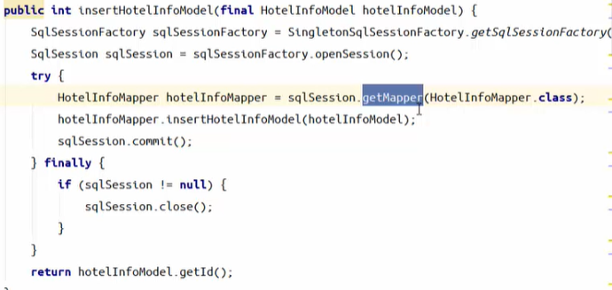
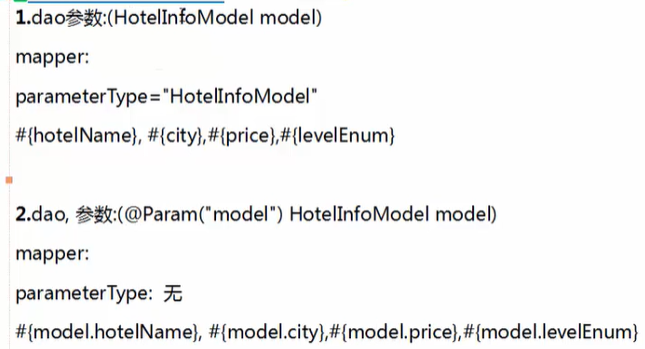
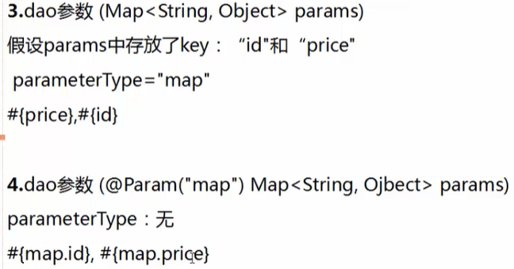
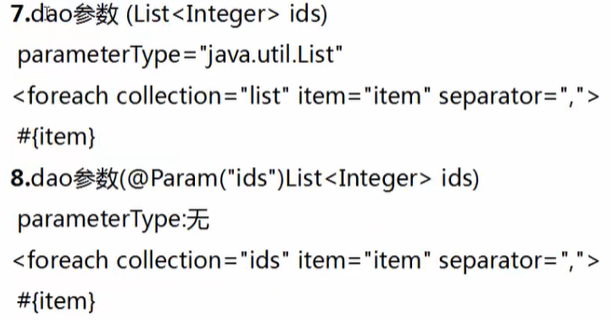
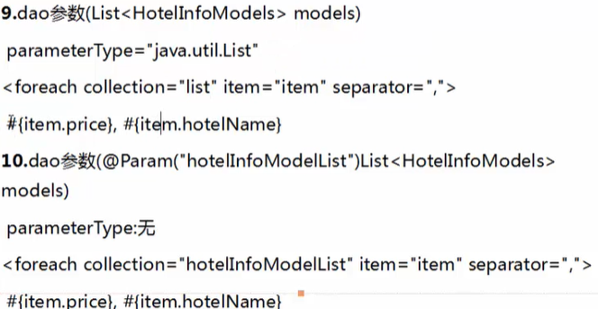
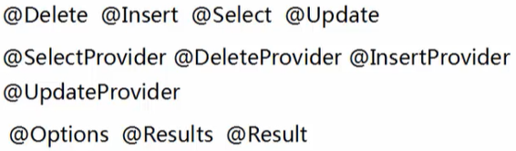
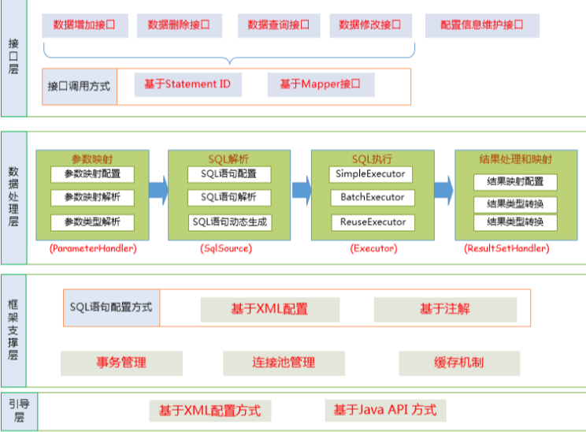
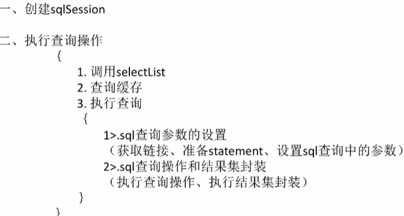

# Mybatis Notes

## Site

https://mybatis.org/mybatis-3/zh/index.html

## Basic

- mybatis-config.xml
- 定义mapper
- 通过config得到SQLSessionFactory
- 得到sqlSession, 和数据库交互

### SqlSession SqlSessionFactory

通过SqlSessionFactory获取SqlSession，




### \<sql>

用于将SQL的公共部分提取出来，便于其他SQL使用


### 传参










### 注解




### 动态SQL 

if  

choose

where

set

trim: prefix, prefixOverrides(删除前缀，suffix)


### type

#### typeHandler

自定义两种方式：

- 实现TypeHandler接口
- 继承BaseTypeHandler

比如对象和Json字符串

#### 什么时候应该使用jdbcType

Mybatis中什么时候应该声明jdbcType？

当Mybatis不能自动识别你传入对象的类型时

you need to specify the `jdbcType` when passing null values for parameters.

Some databases need to know the value's type even if the value itself is NULL. 

The JDBC type is only required for nullable columns upon insert, update or delete. This is a JDBC requirement, not a MyBatis one. So even if you were coding JDBC directly, you'd need to specify this type – but only for nullable values.

Most of the times you don't need to specify the `jdbcType` as MyBatis is smart enough to figure out the type from the objects you are working with. But if you send your parameters to the MyBatis statement inside a `HashMap`, for example, and one of the parameters is null, MyBatis won't be able to determine the type of the parameter by looking at the `HashMap` because the `HashMap` is just a generic container and `null` itself carries no type information. At that point it would be o good idea to provide the `jdbcType` so that switching the database implementation later on does not cause any issues with null values.


### plugins

拦截器


可以拦截： 参数、结果集、批处理

- 


如何实现？

- 实现interceptor接口，指定拦截的方法签名
- 注册到配置文件

TODO 自己实现一下，类型处理器也是

### 表关联

association

collection


### \$ \# #

\$直接替换​

#防止SQL注入 

表明列明使用\$


### 全局配置文件

如果不使用SpringBoot集成，需要使用mybatis-config.xml配置

需要配置那些东西


1. type-aliases-package: 指定entity包的路径，在mapper中就不用使用全路径，直接使用类名即可。
2. 


```yml
mybatis:
  type-aliases-package: cn.edw.ems.entity
  # 定义mapper的路径
  mapper-locations: classpath:mapper/*.xml
  configuration:
  	# underscore：下划线，下划线映射到驼峰
    map-underscore-to-camel-case: true
```


### 分页

逻辑分页 Vs. 物理分页

**物理分页（后端分页）：**每次只从[数据库](_images/https://cloud.tencent.com/solution/database?from=10680)查出当前页的数据，并查出总条数，前端显示页码和数据

**逻辑分页（前端分页）：**数据一次性查询到前端，由前端根据总数据，来设置分页页码和当前页数据


- 物理分页适用于数据量大、更新频繁的场景
- 逻辑分页适用于数据量少、更新不频繁的场景


Mybatis实现分页的方法

- 使用RowBounds对象进行逻辑（逻辑内存中）分页，它是针对ResultSet结果集执行的内存分页。
- 使用pageHelper插件进行物理分页（其实是依赖物理数据库实体）


mybatis-plus是物理分页？


### 缓存

一级缓存：默认打开

二级缓存：默认关闭


### 转义

> \&lt; -- <
>
> \&gt; -- 
>
> 


### 和Spring的整合

#### @MapperScan

@Mapper注解：作用：在接口类上添加了@Mapper，在编译之后会生成相应的接口实现类

如果想要每个接口都要变成实现类，那么需要在每个接口类上加上@Mapper注解，比较麻烦，解决这个问题用@MapperScan。指定要变成实现类的接口所在的包，然后包下面的所有接口在编译之后都会生成相应的实现类


## 原理

### 架构




### 执行




### 插件 拦截器

TODO mybatis-plus这个配置要好好理解一下

```java
package cn.edw.ems.config;

import com.baomidou.mybatisplus.annotation.DbType;
import com.baomidou.mybatisplus.autoconfigure.ConfigurationCustomizer;
import com.baomidou.mybatisplus.core.MybatisConfiguration;
import com.baomidou.mybatisplus.extension.plugins.MybatisPlusInterceptor;
import com.baomidou.mybatisplus.extension.plugins.inner.PaginationInnerInterceptor;
import com.baomidou.mybatisplus.extension.spring.MybatisSqlSessionFactoryBean;
import org.apache.ibatis.session.SqlSessionFactory;
import org.springframework.beans.factory.annotation.Autowired;
import org.springframework.beans.factory.annotation.Qualifier;
import org.springframework.context.annotation.Bean;
import org.springframework.context.annotation.Configuration;
import org.springframework.context.annotation.Primary;

import javax.sql.DataSource;
import java.util.Properties;

/**
 * @author Edwin Xu
 * @date 3/7/2021 9:19 PM.
 *
 * MyBatis-Plus 配置
 */
@Configuration
public class MybatisPlusConfig {

    /**
     * 分页插件，其实就是添加一个拦截器
     * */
    @Bean
    public MybatisPlusInterceptor mybatisPlusInterceptor() {
        MybatisPlusInterceptor interceptor = new MybatisPlusInterceptor();
        interceptor.addInnerInterceptor(new PaginationInnerInterceptor(DbType.MYSQL));
        return interceptor;
    }

    @Bean
    public ConfigurationCustomizer configurationCustomizer() {
        return new ConfigurationCustomizer() {
            @Override
            public void customize(MybatisConfiguration configuration) {
                configuration.setUseGeneratedKeys(true);
            }
        };
    }


    /**
     * SqlSessionFactory不要使用原生的，使用MybatisSqlSessionFactory。
     * https://mp.baomidou.com/guide/faq.html#%E5%87%BA%E7%8E%B0-invalid-bound-statement-not-found-%E5%BC%82%E5%B8%B8
     * https://www.cnblogs.com/zeyfra/p/ZeyFra-MyBatis-Plus-01.html
     * */
    @Bean("sqlSessionFactory")
    @Primary
    public SqlSessionFactory sqlSessionFactory(@Autowired @Qualifier("dataSource") DataSource dataSource) throws Exception {
        // MybatisPlus内部过滤器
        // 为自动分页插件设置DB类型
        MybatisPlusInterceptor mybatisPlusInterceptor = new MybatisPlusInterceptor();
        PaginationInnerInterceptor paginationInnerInterceptor= new PaginationInnerInterceptor(DbType.MYSQL);
        paginationInnerInterceptor.setOptimizeJoin(true);
        mybatisPlusInterceptor.addInnerInterceptor(paginationInnerInterceptor);

        Properties properties = new Properties();
        properties.setProperty("reasonable", "true");
        mybatisPlusInterceptor.setProperties(properties);
        // MybatisConfiguration
        MybatisConfiguration mybatisConfiguration = new MybatisConfiguration();
        // 添加自定义拦截器
        mybatisConfiguration.addInterceptor(mybatisPlusInterceptor);

        // 这里被我删了，是什么拦截器？
        // mybatisConfiguration.addInterceptor(new UpdateInterceptor());

        // 使用MybatisSqlSessionFactoryBean
        MybatisSqlSessionFactoryBean sqlSessionFactoryBean = new MybatisSqlSessionFactoryBean();

        // 设置数据源
        sqlSessionFactoryBean.setDataSource(dataSource);

        // 添加设置
        sqlSessionFactoryBean.setConfiguration(mybatisConfiguration);

        // 设置xml路径
//        sqlSessionFactoryBean.setMapperLocations(new PathMatchingResourcePatternResolver()
//                .getResources("classpath:/mapper/*Mapper.xml"));


        //其他配置
//        Properties properties = new Properties();

        //设置方言：oracle,mysql,mariadb,sqlite,hsqldb,postgresql,db2,sqlserver,informix,h2,sqlserver2012,derby
        //properties.setProperty("helperDialect", "sqlserver");

        //默认值为false，当该参数设置为 true 时，会将 RowBounds 中的 offset 参数当成 pageNum 使用，可以用页码和页面大小两个参数进行分页。
        //properties.setProperty("offsetAsPageNum", "true");

        //默认值为false，该参数对使用 RowBounds 作为分页参数时有效。 当该参数设置为true时，使用 RowBounds 分页会进行 count 查询。
        //properties.setProperty("rowBoundsWithCount", "true");

        //分页合理化参数，默认值为false。当该参数设置为 true 时，pageNum<=0 时会查询第一页， pageNum>pages（超过总数时），会查询最后一页。默认false 时，直接根据参数进行查询。
//        properties.setProperty("reasonable", "true");

        //添加设置
//        interceptor.setProperties(properties);

        //也可直接通过以下方式直接添加拦截器或Interceptor数组
//        sqlSessionFactoryBean.setPlugins(new Interceptor[] {interceptor});

        return sqlSessionFactoryBean.getObject();
    }


```


## 常见问题

### 插入后返回自增ID

- 方式一: @Options分别设置参数useGeneratedKeys，keyProperty，keyColumn值

  ```java
  // 返回主键字段id值
  @Options(useGeneratedKeys = true, keyProperty = "id", keyColumn = "id")
  @Insert("insert into t_person(name,sex,age,create_time,update_time) values(#{name},#{sex},#{age},now(),now())")
  Integer insertPerson(Person person);
  ```

- 方式二：添加单一记录时返回主键ID

  ```xml
  # keyProperty：表示将返回的值设置到某一列，此处为id；
  <insert id="insertPerson" parameterType="cn.mybatis.mydemo.domain.Person">
      <selectKey resultType="INTEGER" order="AFTER" keyProperty="id">
        SELECT LAST_INSERT_ID()
      </selectKey>
      insert into t_person(name,sex,age,create_time,update_time) 
      values(#{name},#{sex},#{age},now(),now())
    </insert>
  ```

-  批量增加记录时返回主键ID

  ```xml
  <mapper namespace="cn.mybatis.mydemo.mapper">
      <!-- 插入数据：返回记录主键id值 -->
      <insert id="insertPerson" parameterType="java.util.List" useGeneratedKeys="true" keyProperty="id" keyColumn="id" >
          insert into t_person(name,sex,age,create_time,update_time) 
          values
          <foreach collection="list" item="item" index="index" separator="," >
              (
              #{item.name},
              #{item.sex},
              #{item.age},
              now(),
              now()    
              )
          </foreach>
      </insert>
  </mapper>
  ```


## 注意事项

### 返回list

在没有指定limit 1的情况下，默认就是返回list，所以不要指定

```sql
resultType="java.util.List"
```

而是要指定list中的类型


### ''

把<if test="takeWay == '1' and workday != null ">

改为<if test='takeWay == "1" and workday != null '>

或改为<if test="takeWay == '1'.toString() and workday != null ">即可。

原因是：mybatis是用OGNL表达式来解析的，在OGNL的表达式中，’1’会被解析成字符，java是强类型的，char 和 一个string 会导致不等，所以if标签中的sql不会被解析。

总结下使用方法：单个的字符要写到双引号里面或者使用.toString()才行！


## MybatisPlus

https://wiki.corp.qunar.com/confluence/pages/viewpage.action?pageId=370275901

