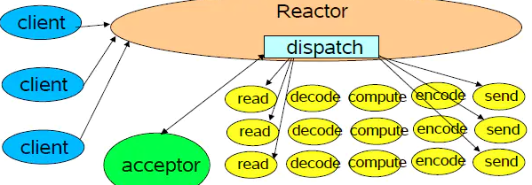
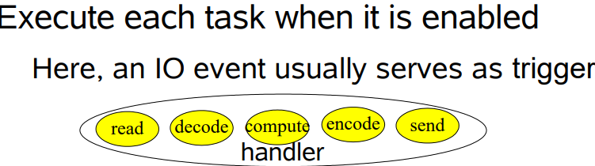
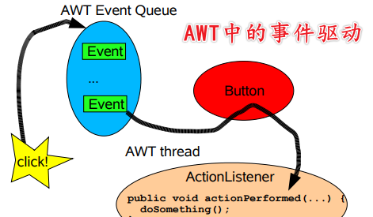
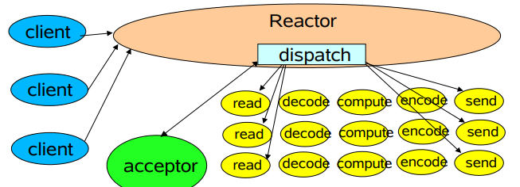
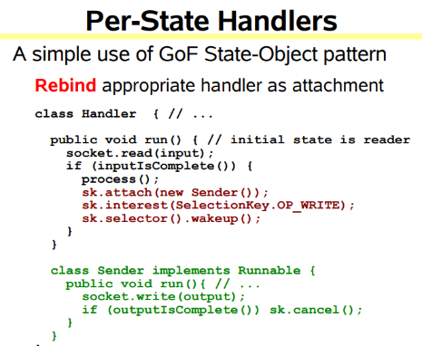
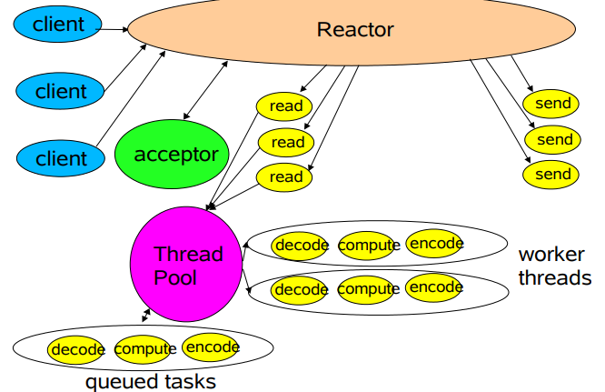
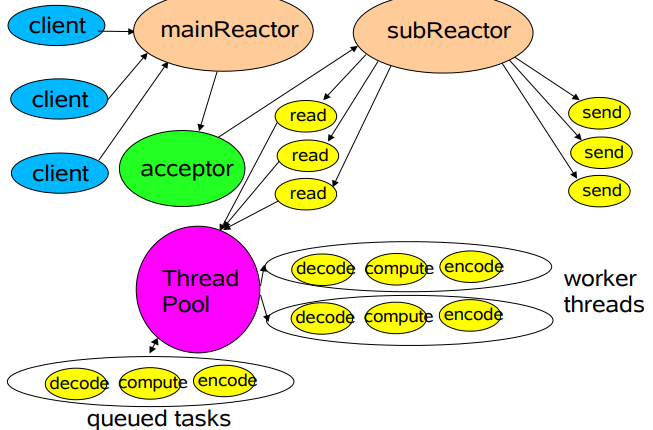

# Netty Notes

## BASIC

### Web请求处理的两种体系结构

在处理web请求时，通常有两种体系结构，分别为：

- **thread-based architecture（基于线程）**

  使用多线程来处理客户端的请求，每当接收到一个请求，便开启一个独立的线程来处理。这种方式虽然是直观的，但是仅适用于并发访问量不大的场景，因为线程需要占用一定的内存资源，且操作系统在线程之间的切换也需要一定的开销，当线程数过多时显然会降低web服务器的性能。并且，当线程在处理I/O操作，在等待输入的这段时间线程处于空闲的状态，同样也会造成cpu资源的浪费。

  

- **event-driven architecture（事件驱动）**

  事件驱动体系结构是目前比较广泛使用的一种。这种方式会定义一系列的**事件处理器**来**响应事件的发生**，并且将**服务端接受连接与对事件的处理分离**。其中，**事件是一种状态的改变**。比如，tcp中socket的new incoming connection、ready for read、ready for write。

### Reactor模式

reactor设计模式是**event-driven** architecture的一种实现方式，处理多个客户端并发的向服务端请求服务的场景。每种服务在服务端可能由多个方法组成。reactor会解耦并发请求的服务并分发给对应的事件处理器来处理。目前，许多流行的开源框架都用到了reactor模式，如：netty、node.js等，包括java的nio。



reactor主要由以下几个角色构成：**handle、Synchronous Event Demultiplexer、Initiation Dispatcher、Event Handler、Concrete Event Handler**

- Handle: Linux中叫文件描述符，windows中称为句柄。两者的含义一样。**handle是事件的发源地**。比如一个网络socket、磁盘文件等。而发生在handle上的事件可以有**connection、ready for read、ready for write**等。

- #### Synchronous Event Demultiplexer

  同步事件分离器，本质上是系统调用。**比如linux中的select、poll、epoll等**。比如，select方法会一直阻塞直到handle上有事件发生时才会返回。

- Event Handler

  事件处理器，其会定义一些**回调方法或者称为钩子函数**，当handle上有事件发生时，回调方法便会执行，一种事件处理机制。

- #### Initiation Dispatcher

  初始分发器，也是reactor角色，提供了注册、删除与转发event handler的方法。当Synchronous Event Demultiplexer检测到handle上有事件发生时，便会通知initiation dispatcher调用特定的event handler的回调方法。

  

- 


## Book Reading Notes

### Scalable IO in Java

> http://gee.cs.oswego.edu/dl/cpjslides/nio.pdf

author: Doug Lea

#### Scalable network services

Web网络服务通用的结构：

- Read equest
- Decode request
- Process service
- Encode reply
- Send reply

典型的服务设计：


每一个handler在自己的线程运行

```java
class Server implements Runnable {
    public void run() {
        try {
            ServerSocket ss = new ServerSocket(PORT);
            while (!Thread.interrupted())
                new Thread(new Handler(ss.accept())).start();
            // or, single-threaded, or a thread pool
        } catch (IOException ex) { /* ... */ }
    }

    static class Handler implements Runnable {
        final Socket socket;

        Handler(Socket s) {
            socket = s;
        }

        public void run() {
            try {
                byte[] input = new byte[MAX_INPUT];
                socket.getInputStream().read(input);
                byte[] output = process(input);
                socket.getOutputStream().write(output);
            } catch (IOException ex) { /* ... */ }
        }

        private byte[] process(byte[] cmd) { /* ... */ }
    }
}

```


可扩展性目标：

- Graceful degradation：优雅地降级，当负载增加时
- Continuous improvement with increasing resources (CPU, memory, disk, bandwidth)
- Also meet availability and performance goals 可用性 和 性能
  - Short latencies 低延迟
  - Meeting peak demand 满足峰值时的需求
  - 可调节的服务质量

**Divide-and-conquer**分而治之是一种很好的方式

##### Divide and Conquer

把流程划分为多个小任务，每一个小任务非阻塞地执行



Basic mechanisms supported in java.nio ：

​	**Non-blocking reads and writes** 

​	**Dispatch** tasks associated with sensed IO events

#### Event-driven Designs

特点：

- 更加高效
  - 更少的资源
  - 更少的开销：线程切换等
  - 但是分发会更慢：必须手动绑定回调到event
- 编写更难
  - 非阻塞
  - 但是不能消除所有的阻塞：GC、缺页异常
  - 必须要跟踪逻辑状态



事件驱动IO使用相同的ideas但是不同的设计


#### Reactor pattern

Reactor通过分发合适的handler来响应io events

handler使用非阻塞操作

handler绑定到event


##### **单Reactor单线程**




java.nio 支持：

- Channels: 连接文件、socket等，支持非阻塞读
- Buffers: 底层数组，能够被channel读写
- Selectors: Tell which of a set of Channels have IO events， 告知那些Channel有事件发生
- SelectionKeys： 维持io事件的状态和绑定


单selector单线程：

```java
package cn.edw.mynetty.reactor.v1;

import java.io.IOException;
import java.net.InetSocketAddress;
import java.nio.ByteBuffer;
import java.nio.channels.SelectionKey;
import java.nio.channels.Selector;
import java.nio.channels.ServerSocketChannel;
import java.nio.channels.SocketChannel;
import java.util.Iterator;
import java.util.Set;

/**
 * @author taoxu.xu
 * @date 8/26/2021 5:41 PM
 */
class Reactor implements Runnable {
    /**
     * selector，用于接收请求
     * */
    final Selector selector;
    /**
     * 启动一个socket，使用channel连接
     * */
    final ServerSocketChannel serverSocket;

    Reactor(int port) throws IOException {
        selector = Selector.open();
        serverSocket = ServerSocketChannel.open();
        serverSocket.socket().bind(new InetSocketAddress(port));
        serverSocket.configureBlocking(false);
        // SelectionKey 用于获取在socket上有那些事件发生
        SelectionKey sk = serverSocket.register(selector, SelectionKey.OP_ACCEPT);
        // SelectionKey 需要一个Acceptor来接收这些事件
        sk.attach(new Acceptor());
    }

    /**
    * Alternatively, use explicit SPI provider:
    * SelectorProvider p = SelectorProvider.provider();
    * selector = p.openSelector();
    * serverSocket = p.openServerSocketChannel();
    */
    @Override
    public void run() { // normally in a new Thread
        try {
            while (!Thread.interrupted()) {
                // 进行一次select， 获取到事件
                selector.select();
                // 遍历目前获取到的事件
                Set<SelectionKey> selected = selector.selectedKeys();
                Iterator<SelectionKey> it = selected.iterator();
                while (it.hasNext()) {
                    // 分发到具体的handler，谁来分发？ 当然是Acceptor
                    dispatch(it.next());
                }
                selected.clear();
            }
        } catch (IOException ex) {
            ex.printStackTrace();
        }
    }

    /**
     * 分发事件
     * */
    void dispatch(SelectionKey k) {
        // 获取 SelectionKey 绑定的 Acceptor
        Runnable r = (Runnable) (k.attachment());
        if (r != null) {
            // 直接run？ 是阻塞的 TODO
            r.run();
        }
    }


    /**
     * Acceptor 用于接收请求
     * */
    class Acceptor implements Runnable { // inner
        @Override
        public void run() {
            try {
                // 接收一个请求
                SocketChannel c = serverSocket.accept();
                System.out.println("Acceptor " + hashCode() +" accept a request.");
                if (c != null) {
                    // 接收请求后使用对应的handler处理
                    new Handler(selector, c);
                }
            } catch (IOException ex) {
                ex.printStackTrace();
            }
        }
    }
}

/**
 * Handler事件处理器。 Handler是运行在具体的线程上的，SocketChannel和线程之间交互，必须通过Buffer
 * */
final class Handler implements Runnable {
    private static final int MAXIN = 1024;
    private static final int MAXOUT = 1024;

    final SocketChannel socket;
    final SelectionKey sk;
    ByteBuffer input = ByteBuffer.allocate(MAXIN);
    ByteBuffer output = ByteBuffer.allocate(MAXOUT);
    static final int READING = 0, SENDING = 1;
    int state = READING;

    Handler(Selector sel, SocketChannel c) throws IOException {
        socket = c;
        c.configureBlocking(false);
        // Optionally try first read now  TODO
        sk = socket.register(sel, 0);
        sk.attach(this);
        sk.interestOps(SelectionKey.OP_READ);
        sel.wakeup();
    }

    boolean inputIsComplete() {
        return input.array().length > 50;
    }

    boolean outputIsComplete() {
        return output.array().length > 50;
    }

    void process() {
        System.out.println("handler "+ hashCode() +" processing");
        output.put(input.array());
    }

    @Override
    public void run() {
        try {
            if (state == READING) {
                read();
            } else if (state == SENDING) {
                send();
            }
        } catch (IOException ex) {
            ex.printStackTrace();
        }
    }

    /**
     * 读取
     * */
    void read() throws IOException {
        System.out.println("reading");
        socket.read(input);
        System.out.println(new String(input.array()));
        if (inputIsComplete()) {
            process();
            state = SENDING;
            // Normally also do first write now
            sk.interestOps(SelectionKey.OP_WRITE);
        }
    }

    /**
     * 发送
     * */
    void send() throws IOException {
        System.out.println("sending");

        socket.write(output);
        if (outputIsComplete()) {
            sk.cancel();
        }
    }

    public static void main(String[] args) throws IOException {
        final Reactor reactor = new Reactor(6666);
        final Thread thread = new Thread(reactor);
        thread.start();
    }
}
```





##### 单Reactor多线程

单线程不能发挥多核的性能

- Worker线程
- Reactor线程



##### 多Reactor多线程




利用其他java NIO特性：

- 一个reactor多个selector
- 文件传输：sendfile， file-to-net, net-to-file
- Memory-mapped files: mmap
- direct buffers: zero-copy的建立和销毁有开销，更适合长连接


#### Reactor Code

```java
package cn.edw.mynetty.nio.reactor.singlereactormultithread;

import java.io.IOException;
import java.net.InetSocketAddress;
import java.nio.ByteBuffer;
import java.nio.channels.SelectionKey;
import java.nio.channels.Selector;
import java.nio.channels.ServerSocketChannel;
import java.nio.channels.SocketChannel;
import java.util.Iterator;
import java.util.LinkedList;
import java.util.Queue;
import java.util.Set;

/**
 * ReactorServer: 单Reactor单线程模式
 * @author taoxu.xu
 * @date 8/26/2021 5:41 PM
 */
class Reactor implements Runnable {
    /**
     * selector，用于接收请求
     * */
    final Selector selector;
    /**
     * 启动一个socket，使用channel连接
     * */
    final ServerSocketChannel serverSocket;

    Reactor(int port) throws IOException {
        selector = Selector.open();
        serverSocket = ServerSocketChannel.open();
        serverSocket.socket().bind(new InetSocketAddress(port));
        serverSocket.configureBlocking(false);
        // SelectionKey 用于获取在socket上有那些事件发生
        SelectionKey sk = serverSocket.register(selector, SelectionKey.OP_ACCEPT);
        System.out.println("register： "+ sk.hashCode());
        // SelectionKey 需要一个Acceptor来接收这些事件。
        // 之所以把Acceptor作为attachment绑定到register返回的SelectionKey上，是因为对于该ServerSocket，
        // 所有的accept事件都是该SelectionKey。
        sk.attach(new Acceptor());
    }

    /**
    * Alternatively, use explicit SPI provider:
    * SelectorProvider p = SelectorProvider.provider();
    * selector = p.openSelector();
    * serverSocket = p.openServerSocketChannel();
    */
    @Override
    public void run() { // normally in a new Thread
        try {
            while (!Thread.interrupted()) {
                // 进行一次select， 获取到事件
                selector.select();
                // 遍历目前获取到的事件
                Set<SelectionKey> selected = selector.selectedKeys();
                Iterator<SelectionKey> it = selected.iterator();
                while (it.hasNext()) {
                    // 分发到具体的handler，谁来分发？ 当然是Acceptor
                    dispatch(it.next());
                }
                selected.clear();
            }
        } catch (IOException ex) {
            ex.printStackTrace();
        }
    }

    /**
     * 分发事件
     * */
    void dispatch(SelectionKey k) {
        System.out.println("dispatch: "+ k.hashCode()+" which interest in "
                + (k.isAcceptable()?"accept":(k.isReadable()?"read":"write")));
        // 获取 SelectionKey 绑定的 Acceptor
        // 因为所有的accept事件获取的SelectionKey都是之前绑定的那个SelectionKey
        Runnable r = (Runnable) (k.attachment());
        if (r != null) {
            // 直接run，是阻塞的
            r.run();
        }
    }


    /**
     * Acceptor 用于接收请求
     * */
    class Acceptor implements Runnable { // inner
        @Override
        public void run() {
            try {
                // 接收一个请求
                SocketChannel c = serverSocket.accept();
                System.out.println("Acceptor " + hashCode() +" accept a request.");
                if (c != null) {
                    // 接收请求后使用对应的handler处理，这里才会是读写任务的处理
                    new Handler(selector, c);
                }
            } catch (IOException ex) {
                ex.printStackTrace();
            }
        }
    }
}

/**
 * Handler事件处理器。 Handler是运行在具体的线程上的，SocketChannel和线程之间交互，必须通过Buffer
 * */
final class Handler implements Runnable {
    private static final int MAXIN = 1024;
    private static final int MAXOUT = 1024;

    final SocketChannel socket;
    final SelectionKey sk;
    ByteBuffer input = ByteBuffer.allocate(MAXIN);
    ByteBuffer output = ByteBuffer.allocate(MAXOUT);
    static final int READING = 0, SENDING = 1;
    int state = READING;

    Handler(Selector sel, SocketChannel c) throws IOException {
        socket = c;
        c.configureBlocking(false);
        // Optionally try first read now
        // TODO 这里是干嘛？ ops=0表示什么？ 0表示NOTHING？即不listening任何事件，这里只是为了获取SelectionKey
        sk = socket.register(sel, 0);
        // TODO 把这个handler本生作为attachment？
        sk.attach(this);
        // TODO 这里才是真正的interest事件
        sk.interestOps(SelectionKey.OP_READ);
        // TODO ??? 唤醒selector？  为何需要唤醒
        sel.wakeup();
    }

    boolean inputIsComplete() {
        return true;
    }

    boolean outputIsComplete() {
        return true;
    }


    @Override
    public void run() {
        try {
            // 这里state主要是用来控制状态的，先读后写
            if (state == READING) {
                read();
            } else if (state == SENDING) {
                write();
            }
        } catch (IOException ex) {
            ex.printStackTrace();
        }
    }


    private Queue<String> messageQueue = new LinkedList<>();
    /**
     * 读取
     * */
    void read() throws IOException {
        input.clear();
        final int read = socket.read(input);
        if (read>0){
            System.out.println("read:"+new String(input.array()));
        }
        if (inputIsComplete()) {
            state = SENDING;
            // Normally also do first write now
            sk.interestOps(SelectionKey.OP_WRITE);
        }
    }

    /**
     * 发送
     * */
    void write() throws IOException {
        output.clear();
        output.put("got it!".getBytes());
        output.flip();
        socket.write(output);
        if (outputIsComplete()) {
            // TODO 这是为何？ 只读写一次
            // sk.cancel();
        }
    }

    public static void main(String[] args) throws IOException {
        final Reactor reactor = new Reactor(6666);
        final Thread thread = new Thread(reactor);
        thread.start();
    }
}
```


NIO通信案例：

```java
package cn.edw.mynetty.nio.reactor.singlereactorsignlethread;

import java.io.IOException;
import java.net.InetSocketAddress;
import java.nio.ByteBuffer;
import java.nio.channels.ClosedChannelException;
import java.nio.channels.SelectionKey;
import java.nio.channels.Selector;
import java.nio.channels.SocketChannel;
import java.util.Deque;
import java.util.Iterator;
import java.util.LinkedList;
import java.util.Scanner;

/**
 * @author taoxu.xu
 * @date 8/27/2021 2:37 PM
 */
public class ReactorClient {
    private SocketChannel socketChannel = null;
    private Selector selector = null;
    private final ByteBuffer input = ByteBuffer.allocate(1024);
    private final ByteBuffer output = ByteBuffer.allocate(1024);

    public ReactorClient(String host, int port) throws IOException {
        selector = Selector.open();

        socketChannel = SocketChannel.open();
        socketChannel.configureBlocking(false);
        // 注册到Selector上，注意监听的事件类型是Connect，即连接事件，而服务端是Accept
        socketChannel.register(selector, SelectionKey.OP_CONNECT);
        socketChannel.connect(new InetSocketAddress(host, port));

        // finishConnect在连接成功时会消耗一次OP_CONNECT事件, 所以在连接时如果调用消耗了，后面就会select不到

        System.out.println("client is connected to server");
    }

    public void listen() throws IOException {
        while (true){
            // finishConnect在连接成功时会消耗一次OP_CONNECT事件
            try {
                selector.select();

                final Iterator<SelectionKey> iterator = selector.selectedKeys().iterator();
                while (iterator.hasNext()) {
                    final SelectionKey key = iterator.next();
                    process(key);
                    // 移除key
                    iterator.remove();
                }
            } catch (IOException e) {
                System.out.println(e.getMessage());
            }
        }
    }


    private void process(SelectionKey key) throws IOException {
        if (key.isConnectable()){
            doConnect(key);
        }else if (key.isReadable()){
            doRead(key);
        }else if (key.isWritable()){
            doWrite(key);
        }
    }


    private void doConnect(SelectionKey key) throws IOException {
        // 获取连接
        final SocketChannel channel = (SocketChannel) key.channel();
        // 如果正在连接，finishConnect，消耗CONNECT事件()
        if (channel.isConnectionPending()){
            channel.finishConnect();
        }

        // 确认连接后注册读写监听到selector
        channel.register(selector, SelectionKey.OP_READ | SelectionKey.OP_WRITE);
    }
    private void doRead(SelectionKey key) {
        final SocketChannel channel = (SocketChannel) key.channel();
        try {
            int read = 0;
            do {
                // 先清空buffer
                input.clear();
                // 从Channel中写到buffer
                read = channel.read(input);
                // 客户端主动关闭了, 服务端也应该关闭掉
                if (read == -1){
                    throw new ClosedChannelException();
                }else if (read == 0) {
                    // 3种情况：1.数据读完了，2.buffer满了，3.客户端数据发送完毕了
                    break;
                }else{
                    final byte[] array = input.array();
                    System.out.println("read " + read + ":" + new String(array, 0, read));
                }
            } while (true);
        } catch (Exception e) {
            System.out.println("Channel Closed Because "+e.getMessage());
            try {
                if (channel != null){
                    channel.close();
                }
            } catch (IOException ioException) {
                ioException.printStackTrace();
            }
        }
    }

    /**
     * 待发送的消息
     * */
    private final Deque<String> queue = new LinkedList<>();

    private void doWrite(SelectionKey key) {
        // 如果有数据，则发送之
        if (queue.size()>0){
            final String msg = queue.removeFirst();
            final SocketChannel channel = (SocketChannel) key.channel();
            final ByteBuffer buffer = ByteBuffer.wrap(msg.getBytes());
            try {
                channel.write(buffer);
            } catch (IOException e) {
                System.out.println("Channel Closed Because "+e.getMessage());
                try {
                    channel.close();
                } catch (IOException ioException) {
                    ioException.printStackTrace();
                }
            }
        }
    }

    /**
     * 添加信息，会自动发送
     * */
    public void putMessage(String msg) {
        queue.add(msg);
    }

    public static class MsgTask implements Runnable {
        private ReactorClient client;
        public MsgTask(ReactorClient client){
            this.client = client;
        }
        @Override
        public void run() {
            final Scanner scanner = new Scanner(System.in);
            String cmd = "";
            while (!"q".equals(cmd = scanner.nextLine())){
                if (cmd.startsWith("send ")){
                    client.putMessage(cmd.substring(5));
                }
            }
        }
    }


    public static void main(String[] args) {
        try {
            final ReactorClient client = new ReactorClient("localhost", 6666);
            new Thread(new MsgTask(client)).start();
            client.listen();
        } catch (IOException e) {
            e.printStackTrace();
        }
    }
}


package cn.edw.mynetty.nio.reactor.singlereactorsignlethread;

import java.io.IOException;
import java.net.InetSocketAddress;
import java.nio.ByteBuffer;
import java.nio.channels.*;
import java.util.Deque;
import java.util.Iterator;
import java.util.LinkedList;
import java.util.Scanner;

/**
 * @author taoxu.xu
 * @date 8/26/2021 3:26 PM
 */
public class ReactorServer {
    private ServerSocketChannel server = null;
    private Selector selector = null;

    /**
     * buffer 默认情况下是写模式吧，读之前需要先flip
     * */
    final ByteBuffer input = ByteBuffer.allocate(1024);
    final ByteBuffer output = ByteBuffer.allocate(1024);

    public ReactorServer(int port) throws IOException {
        server = ServerSocketChannel.open();
        server.bind(new InetSocketAddress(port));
        server.configureBlocking(false);

        selector = Selector.open();
        server.register(selector, SelectionKey.OP_ACCEPT);
        System.out.println("sever is running");
    }

    private void listen() throws IOException {
        System.out.println("listening");
        while (true) {
            try {
                selector.select();

                final Iterator<SelectionKey> iterator = selector.selectedKeys().iterator();
                while (iterator.hasNext()) {
                    final SelectionKey key = iterator.next();
                    process(key);
                    // 移除key
                    iterator.remove();
                }
            } catch (IOException e) {
                System.out.println(e.getMessage());
            }
        }
    }

    private void process(SelectionKey key) {
        if (key.isAcceptable()) {
            doAccept(key);
        } else if (key.isReadable()) {
            doRead(key);
        } else if (key.isWritable()) {
            doWrite(key);
        }
    }

    private void doAccept(SelectionKey key) {
        System.out.println("accepted " + key.hashCode());
        // 注意：如果是Accept，必须要处理掉，不然这个SelectionKey一直存在，删不掉的
        SocketChannel socketChannel = null;
        try {
            // 获取Channel
            socketChannel = server.accept();
            socketChannel.configureBlocking(false);
            // 读写都监听
            socketChannel.register(selector, SelectionKey.OP_READ | SelectionKey.OP_WRITE);
        } catch (IOException e) {
            // 如果异常，则关闭socket
            System.out.println(e.getMessage());
            try {
                if (socketChannel != null) {
                    socketChannel.close();
                }
            } catch (IOException ioException) {
                ioException.printStackTrace();
            }
        }
    }

    /**
     * 读的异常不要处理，抛出 TODO
     */
    private void doRead(SelectionKey key) {
        final SocketChannel channel = (SocketChannel) key.channel();

        try {
            int read = 0;
            do {
                // 先清空buffer
                input.clear();
                // 从Channel中写到buffer
                read = channel.read(input);
                // 客户端主动关闭了, 服务端也应该关闭掉
                if (read == -1){
                    throw new ClosedChannelException();
                }else if (read == 0) {
                     // 3种情况：1.数据读完了，2.buffer满了，3.客户端数据发送完毕了
                    break;
                }else{
                    final byte[] array = input.array();
                    System.out.println("read " + read + ":" + new String(array, 0, read));
                }
            } while (true);
        } catch (Exception e) {
            System.out.println("Channel Closed Because "+e.getMessage());
            try {
                if (channel != null){
                    channel.close();
                }
            } catch (IOException ioException) {
                ioException.printStackTrace();
            }
        }
        // TODO 正常情况下应该是不能把Channel关闭的
    }

    /**
     * 待发送的消息
     * */
    private final Deque<String> queue = new LinkedList<>();

    private void doWrite(SelectionKey key)  {
        // 如果有数据，则发送之
        if (queue.size()>0){
            final String msg = queue.removeFirst();
            final SocketChannel channel = (SocketChannel) key.channel();
            final ByteBuffer buffer = ByteBuffer.wrap(msg.getBytes());
            try {
                channel.write(buffer);
            } catch (IOException e) {
                System.out.println("Channel Closed Because "+e.getMessage());
                try {
                    channel.close();
                } catch (IOException ioException) {
                    ioException.printStackTrace();
                }
            }
        }
    }

    /**
     * 添加信息，会自动发送
     * */
    public void putMessage(String msg) {
        queue.add(msg);
    }


    public static class MsgTask implements Runnable {
        private ReactorServer server;
        public MsgTask(ReactorServer server){
            this.server = server;
        }
        @Override
        public void run() {
            final Scanner scanner = new Scanner(System.in);
            String cmd = "";
            while (!"q".equals(cmd = scanner.nextLine())){
                if (cmd.startsWith("send ")){
                    server.putMessage(cmd.substring(5));
                }
            }
        }
    }

    public static void main(String[] args) {
        try {
            final ReactorServer reactorServer = new ReactorServer(6666);
            // 单独一个线程用来添加消息
            new Thread(new MsgTask(reactorServer)).start();
            reactorServer.listen();


        } catch (IOException e) {
            e.printStackTrace();
        }
    }
}
```


```java
package cn.edw.mynetty.nio;


import java.io.IOException;
import java.net.InetSocketAddress;
import java.nio.ByteBuffer;
import java.nio.channels.SelectionKey;
import java.nio.channels.Selector;
import java.nio.channels.ServerSocketChannel;
import java.nio.channels.SocketChannel;
import java.nio.charset.StandardCharsets;
import java.util.Iterator;
import java.util.Set;


/**
 * @author taoxu.xu
 * @date 8/29/2021 3:34 PM
 */
public class NioServer {

    private int port;

    private static Selector selector = null;

    /**
     * 指定端口号启动服务
     * */
    public boolean startServer(int port){
        try {
            this.port = port;
            selector = Selector.open();
            //打开监听通道
            ServerSocketChannel server = ServerSocketChannel.open();
            //绑定端口
            server.bind(new InetSocketAddress(this.port));
            //默认configureBlocking为true,如果为 true,此通道将被置于阻塞模式；如果为 false.则此通道将被置于非阻塞模式
            server.configureBlocking(false);
            //创建选择器
            selector = Selector.open();
            //监听客户端连接请求
            server.register(selector, SelectionKey.OP_ACCEPT);
            System.out.println("服务端启动成功，监听端口：" + port);
        }catch (Exception e){
            System.out.println("服务器启动失败");
            return  false;
        }
        return  true;
    }

    public void listen() throws IOException {
        while(true){
            //阻塞方法，轮询注册的channel,当至少一个channel就绪的时候才会继续往下执行
            int keyCount = selector.select();
            System.out.println("当前有 "+keyCount+" 个channel有事件就绪");
            //获取就绪的SelectionKey
            Set<SelectionKey> keys = selector.selectedKeys();
            Iterator<SelectionKey> it = keys.iterator();
            SelectionKey key = null;
            //迭代就绪的key
            while(it.hasNext()){
                key = it.next();
                it.remove();
                //SelectionKey相当于是一个Channel的表示，标记当前channel处于什么状态
                // 按照channel的不同状态处理数据
                process(key);
            }
        }
    }

    private void process(SelectionKey key) throws IOException {
        //该channel已就绪，可接收消息
        if(key.isAcceptable()){
            System.out.println("accept事件就绪...");
            doAccept(key);
        }else if(key.isReadable()){
            System.out.println("read事件就绪...");
            doRead(key);
        }else if(key.isWritable()){
            System.out.println("write事件就绪...");
            doWrite(key);
        }
    }

    private void doWrite(SelectionKey key) throws IOException {
        //获取对应的socket
        SocketChannel socket = (SocketChannel)key.channel();
        //获取key上的附件
        String content = (String)key.attachment();
        System.out.println("write:" + content);
        socket.write(ByteBuffer.wrap(content.getBytes()));
        socket.close();
    }

    private void doRead(SelectionKey key) throws IOException {
        //获取对应的socket
        SocketChannel socket = (SocketChannel)key.channel();
        //设置一个读取数据的Buffer 大小为1024
        ByteBuffer buff = ByteBuffer.allocate(1024);
        StringBuilder content = new StringBuilder();

        // 和-1没关系，-1表示没有连接上
        while(socket.read(buff) > 0) {
            // read 是写到buff中，buff.array()是读的方式返回？所以需要flip
            buff.flip();
            content.append(new String(buff.array(), StandardCharsets.UTF_8));
        }
        //注册selector，并设置为可写模式
        key = socket.register(selector,SelectionKey.OP_WRITE);
        //在key上携带一个附件(附近就是之后要写的内容)
        key.attach("服务端已收到:"+content);
        System.out.println("读取内容：" + content);
    }

    private void doAccept(SelectionKey key) throws IOException {
        //获取对应的channel
        ServerSocketChannel server = (ServerSocketChannel)key.channel();
        //从channel中获取socket信息
        SocketChannel socket = server.accept();
        //设置为非阻塞模式
        socket.configureBlocking(false);
        //注册selector，并设置为可读模式
        socket.register(selector, SelectionKey.OP_READ);
    }


    public static void main(String[] args) throws IOException {
        NioServer nioServer = new NioServer();
        nioServer.startServer(6666);
        nioServer.listen();
    }
}

package cn.edw.mynetty.nio;


import java.io.IOException;
import java.net.InetSocketAddress;
import java.nio.ByteBuffer;
import java.nio.channels.SelectionKey;
import java.nio.channels.Selector;
import java.nio.channels.SocketChannel;
import java.nio.charset.StandardCharsets;
import java.util.Iterator;
import java.util.Set;
import java.util.UUID;

/**
 * @author taoxu.xu
 * @date 8/29/2021 3:35 PM
 */
public class NioClient {


    private static Selector selector = null;


    public void start(String ip, int port) throws IOException {
        //创建选择器
        selector = Selector.open();
        //打开监听通道
        SocketChannel socketChannel = SocketChannel.open();
        socketChannel.configureBlocking(false);

        //注册select为连接状态
        socketChannel.register(selector, SelectionKey.OP_CONNECT);

        //连接对应的服务器 ip , port
        final boolean connect = socketChannel.connect(new InetSocketAddress(ip, port));
        System.out.println(socketChannel.isOpen());
        System.out.println(socketChannel.isConnected());
        System.out.println(socketChannel.isRegistered());
        System.out.println(socketChannel.isBlocking());
        if (connect) {
            System.out.println("客户端，启动成功...");
        }
    }

    public void listen() throws IOException {
        while (true) {
            //阻塞方法，轮询注册的channel,当至少一个channel就绪的时候才会继续往下执行
            selector.select();
            //获取就绪的SelectionKey
            Set<SelectionKey> keys = selector.selectedKeys();
            Iterator<SelectionKey> it = keys.iterator();
            SelectionKey key = null;
            //迭代就绪的key
            while (it.hasNext()) {
                key = it.next();
                it.remove();
                //SelectionKey相当于是一个Channel的表示，标记当前channel处于什么状态
                // 按照channel的不同状态处理数据
                process(key);
            }
        }
    }

    private void process(SelectionKey key) throws IOException {
        //channel处于可连接状态，发送消息给服务端

        if (key.isConnectable()) {
            System.out.println("connect事件就绪 ....");
            SocketChannel clientChannel = (SocketChannel) key.channel();
            if (clientChannel.isConnectionPending()) {
                clientChannel.finishConnect();
            }
            clientChannel.configureBlocking(false);
            String name = UUID.randomUUID().toString();
            System.out.println("客户端发送数据：{}" + name);
            ByteBuffer buffer = ByteBuffer.wrap(name.getBytes());
            clientChannel.write(buffer);
            clientChannel.register(key.selector(), SelectionKey.OP_READ);
        } else if (key.isReadable()) {
            //获取对应的socket
            System.out.println("read事件就绪 ....");
            SocketChannel socket = (SocketChannel) key.channel();
            //设置一个读取数据的Buffer 大小为1024
            ByteBuffer buff = ByteBuffer.allocate(1024);
            StringBuilder content = new StringBuilder();
            int len = socket.read(buff);
            if (len > 0) {
                buff.flip();
                content.append(new String(buff.array(), StandardCharsets.UTF_8));
                //让客户端读取下一次read
                System.out.println("客户端收到反馈：" + content);
                key.interestOps(SelectionKey.OP_READ);
            }else {
                key.cancel();
                socket.close();
            }
        }
    }

    public static void main(String[] args) throws IOException {
        NioClient client = new NioClient();
        client.start("localhost",6666);
        client.listen();
    }
}
```
