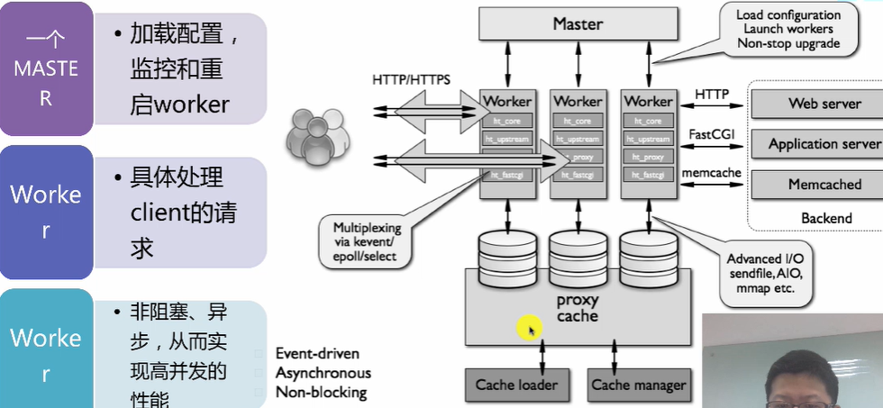
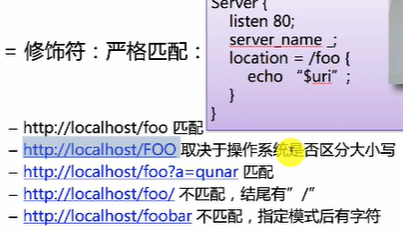
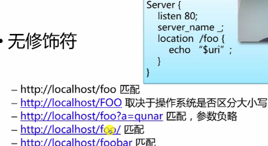
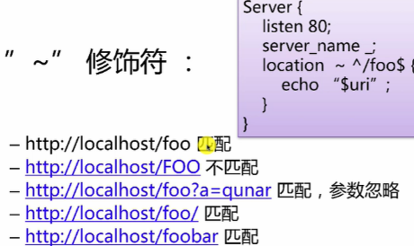
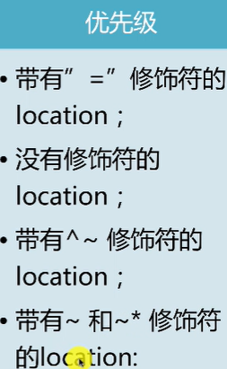
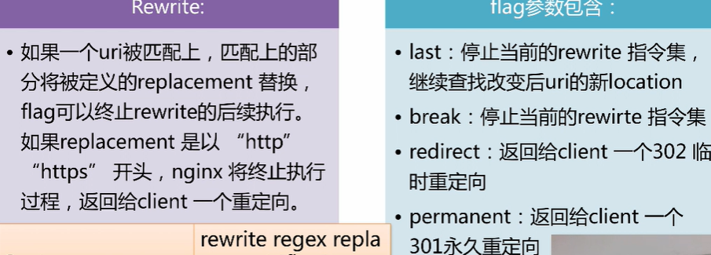
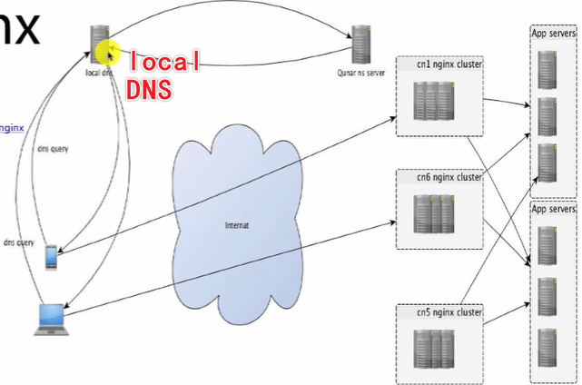
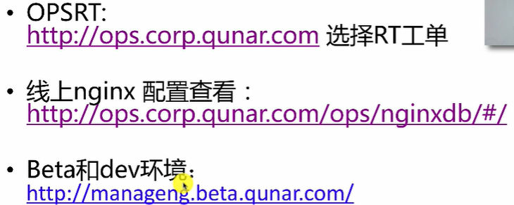

# Nginx Notes

## 概况

- 对标Apache，是一款高性能http server
- 反向代理服务器 IMAP/POP3/STMP/HTTP/HTTPS

### 代理

- 正向代理：为我服务，访问的服务只知道代理，不知道真正的访问者
- 反向代理：为服务提供方服务，服务方把请求代理到不同的地方，用户不知道具体放到到那个服务

### 常用分支

- Nginx source ，Nginx plus
- Tengine，淘宝维护
- OpenResty: 基于Nginx开发，拥有丰富的module，尤其是lua
- 


## 架构




模块：

- handlers
- Filters
- Upstreams
- load balance


## 基本控制

### 安装

```bash
#centos
yum install q-nginx
# q-nginx是QUNAR自己的NG
```

默认路径

- 安装路径 /home/q/nginx
- 配置文件路径 /home/q/nginx/conf
- 静态内容防止目录 /home/q/nginx/html
- 日志 /home/q/nginx/logs

### 常用命令

通过-s 后面添加参数

- stop 退出
- quit 优雅退出：等没有用户请求了才关闭worker、master
- 热重启sudo nginx -s reload，是重启worker，原来的worker退出
- reopen 重新打开日志文件
- 


-t可以检查语法


## 配置文件

#### demo

```
user root;
worker_processes auto;
pid /run/nginx.pid;
include /etc/nginx/modules-enabled/*.conf;

events {
        worker_connections 768;
        # multi_accept on;
}

http {

        ##
        # Basic Settings
        ##

        sendfile on;
        tcp_nopush on;
        tcp_nodelay on;
        keepalive_timeout 65;
        types_hash_max_size 2048;
        # server_tokens off;

        # server_names_hash_bucket_size 64;
        # server_name_in_redirect off;

        include /etc/nginx/mime.types;
        default_type application/octet-stream;

        ##
        # SSL Settings
        ##

        ssl_protocols TLSv1 TLSv1.1 TLSv1.2; # Dropping SSLv3, ref: POODLE
        ssl_prefer_server_ciphers on;


        # ------------ EDWIN BEGIN -------------
        server {
                # listen 443 ssl;
                listen  8082;
                server_name     localhost;
                location / {
                        # alias /home/ubuntu/EdwinXu/scratch-cms/front_end;
                        index index.html;
                        root /home/ubuntu/EdwinXu/scratch-cms/front_end;
                        try_files $uri $uri/ /index.html;
                }
        
}


server {
                # listen 443 ssl;
                listen  5200;
                server_name     localhost;
                location / {
                        # alias /home/ubuntu/EdwinXu/scratch-cms/front_end;
                        index index.html;
                        root /home/ubuntu/EdwinXu/502;
                        try_files $uri $uri/ /index.html;
                }
     }

        # ------------ EDWIN   END -------------


        # 这是NG直接运行的email-sender前端， https方式
        server{
                listen  9999 ssl;
                server_name  edwinxu.xyz;
                ssl_certificate /home/ubuntu/EdwinXu/ssl/nginx/1_edwinxu.xyz_bundle.crt;
                ssl_certificate_key /home/ubuntu/EdwinXu/ssl/nginx/2_edwinxu.xyz.key; 
                ssl_session_timeout 5m;
                ssl_protocols TLSv1 TLSv1.1 TLSv1.2; 
                ssl_ciphers ECDHE-RSA-AES128-GCM-SHA256:HIGH:!aNULL:!MD5:!RC4:!DHE; 
                ssl_prefer_server_ciphers on;
                
                location / {
                        index index.html;
                        root /home/ubuntu/EdwinXu/email-sender/frontend;
                        try_files $uri $uri/ /index.html;

                        # 加了这个就是反向代理，会把所有请求都转发给下面这个服务
                #        proxy_pass http://localhost:8888;

                }
        }


       server{
                listen  80 ssl;
                server_name  edwinxu.xyz;
                ssl_certificate /home/ubuntu/EdwinXu/ssl/nginx/1_edwinxu.xyz_bundle.crt;
                ssl_certificate_key /home/ubuntu/EdwinXu/ssl/nginx/2_edwinxu.xyz.key;
                ssl_session_timeout 5m;
                ssl_protocols TLSv1 TLSv1.1 TLSv1.2;
                ssl_ciphers ECDHE-RSA-AES128-GCM-SHA256:HIGH:!aNULL:!MD5:!RC4:!DHE;
                ssl_prefer_server_ciphers on;

                location / {
                        index index.html;
                        root /home/ubuntu/EdwinXu/email-sender/frontend;
                        try_files $uri $uri/ /index.html;

                }
        }


        #反向代理，把
        server{
                listen  7777  ssl;
                server_name  edwinxu.xyz;
                ssl_certificate /home/ubuntu/EdwinXu/ssl/nginx/1_edwinxu.xyz_bundle.crt;
                ssl_certificate_key /home/ubuntu/EdwinXu/ssl/nginx/2_edwinxu.xyz.key;
                ssl_session_timeout 5m;
                ssl_protocols TLSv1 TLSv1.1 TLSv1.2;
                ssl_ciphers ECDHE-RSA-AES128-GCM-SHA256:HIGH:!aNULL:!MD5:!RC4:!DHE;
                ssl_prefer_server_ciphers on;

                location / {   
                        # 加了这个就是反向代理，会把所有请求都转发给下面这个服务
                        proxy_pass http://edwinxu.xyz:8888;

                }
        }


        # UMS
         server{
                listen 4444  ssl;
                server_name  edwinxu.xyz;
                ssl_certificate /home/ubuntu/EdwinXu/ssl/nginx/1_edwinxu.xyz_bundle.crt;
                ssl_certificate_key /home/ubuntu/EdwinXu/ssl/nginx/2_edwinxu.xyz.key; 
                ssl_session_timeout 5m;
                ssl_protocols TLSv1 TLSv1.1 TLSv1.2; 
                ssl_ciphers ECDHE-RSA-AES128-GCM-SHA256:HIGH:!aNULL:!MD5:!RC4:!DHE; 
                ssl_prefer_server_ciphers on;

                location / {
                        index index.html;
                        root /home/ubuntu/ctrip-work/ums/frontend;
                        try_files $uri $uri/ /index.html;

                        # 加了这个就是反向代理，会把所有请求都转发给下面这个服务
                #        proxy_pass http://localhost:8888;

                }
        }       


        #反向代理，把
        server{
                listen 8090  ssl;
                server_name  edwinxu.xyz;
                ssl_certificate /home/ubuntu/EdwinXu/ssl/nginx/1_edwinxu.xyz_bundle.crt;
                ssl_certificate_key /home/ubuntu/EdwinXu/ssl/nginx/2_edwinxu.xyz.key;
                ssl_session_timeout 5m;
                ssl_protocols TLSv1 TLSv1.1 TLSv1.2;
                ssl_ciphers ECDHE-RSA-AES128-GCM-SHA256:HIGH:!aNULL:!MD5:!RC4:!DHE;
                ssl_prefer_server_ciphers on;

                location / {   
                        # 加了这个就是反向代理，会把所有请求都转发给下面这个服务

                        proxy_pass http://edwinxu.xyz:8088;

                }
        }       


        # user lal system
         server{
                listen 5555  ssl;
                server_name  edwinxu.xyz;
                ssl_certificate /home/ubuntu/EdwinXu/ssl/nginx/1_edwinxu.xyz_bundle.crt;
                ssl_certificate_key /home/ubuntu/EdwinXu/ssl/nginx/2_edwinxu.xyz.key;
                ssl_session_timeout 5m;
                ssl_protocols TLSv1 TLSv1.1 TLSv1.2;
                ssl_ciphers ECDHE-RSA-AES128-GCM-SHA256:HIGH:!aNULL:!MD5:!RC4:!DHE;
                ssl_prefer_server_ciphers on;

                location / {
                        index index.html;
                        root /home/ubuntu/ctrip-work/user-lal-sys/frontend;
                        try_files $uri $uri/ /index.html;
                }
        }


        #反向代理，把
        server{
                listen 8020  ssl;
                server_name  edwinxu.xyz;
                ssl_certificate /home/ubuntu/EdwinXu/ssl/nginx/1_edwinxu.xyz_bundle.crt;
                ssl_certificate_key /home/ubuntu/EdwinXu/ssl/nginx/2_edwinxu.xyz.key;
                ssl_session_timeout 5m;
                ssl_protocols TLSv1 TLSv1.1 TLSv1.2;
                ssl_ciphers ECDHE-RSA-AES128-GCM-SHA256:HIGH:!aNULL:!MD5:!RC4:!DHE;
                ssl_prefer_server_ciphers on;

                location / {
                        proxy_pass http://edwinxu.xyz:8001;
                }
        }


        ##
        # Logging Settings
        ##

        access_log /var/log/nginx/access.log;
        error_log /var/log/nginx/error.log;

        ##
        # Gzip Settings
        ##

        gzip on;

        # gzip_vary on;
        # gzip_proxied any;
        # gzip_comp_level 6;
        # gzip_buffers 16 8k;
        # gzip_http_version 1.1;
        # gzip_types text/plain text/css application/json application/javascript text/xml application/xml application/xml+rss text/javascript;

        ##
        # Virtual Host Configs
        ##

        # include /etc/nginx/conf.d/*.conf;
        # include /etc/nginx/sites-enabled/*;
}


#mail {
#       # See sample authentication script at:
#       # http://wiki.nginx.org/ImapAuthenticateWithApachePhpScript
# 
#       # auth_http localhost/auth.php;
#       # pop3_capabilities "TOP" "USER";
#       # imap_capabilities "IMAP4rev1" "UIDPLUS";
# 
#       server {
#               listen     localhost:110;
#               protocol   pop3;
#               proxy      on;
#       }
# 
#       server {
#               listen     localhost:143;
#               protocol   imap;
#               proxy      on;
#       }
#}

```


### 指令

- 简单指令：当行
- 指令块：{}


### include

引入其他配置文件

```text
include mime.types;
include vhosts/*.conf;
include fastvgi_params;
```

nginx.conf:基本配置文件

mime.types: 文件扩展列表文件，与MIME类型关联

fastcgi.conf:与FASTCGI相关的配置文件


### 配置文件结构

- main context 包含一些系统级设置、运行用户等
- event context 包含对连接做处理的配置
- http context 包含upstream、server、location等


### server配置

sudo ss -nlp 


#### listen:

设置监听的ip、port

```bash
listen 122.122.122.121:80; 监听了ip和端口。
listen 80;只指定端口，监听所有IP
listen 111.111.11.111:80 ssl; 监听了ip和端口，并且使用SSL
```


#### server_name

设置虚拟主机的名称

```
server_name 域名
```


#### Gzip

请求数据压缩


#### location

对具体的URL配置

语法：

##### =



##### /

检查包含性，如果请求路径包含，则通过




##### ~

正则




##### ~*

正则，但是不区分大小写

##### ^~

如果最大匹配前缀以^~开始，则停止正则匹配

##### @

定义命名location区段，这些区段客户访问不到，只能由内部的请求访问



### rewrite

根据正则表达式修改URI

return redirect 或者按照条件配置




#### set

定义边浪

set \$var value;


### proxy

允许将请求转发到其他服务器上


### upstream


loadbalance

- round-robin
- hash
- least connection
- weight


## Qunar-Nginx

q-nginx




限制用户访问的模块，比如防爬取




## REF

https://tengine.taobao.org/

