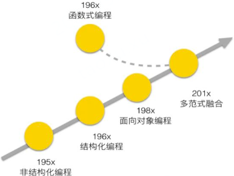
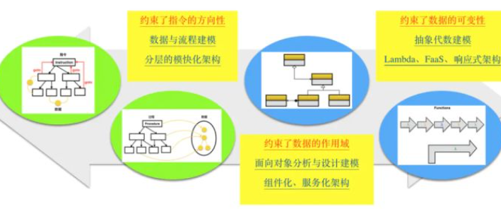

# Programming Thinking

## My Notes

### 编程范式

编程范式一词最早来自 Robert Floyd 在 1979 年图灵奖的颁奖演说，是程序员看待程序应该具有的观点，代表了程序设计者认为程序应该如何被构建和执行的看法，与软件建模方式和架构风格有紧密关系。
现在主流的编程范式有三种：

- 结构化编程（structured programming）
- 面向对象编程（object-oriented programming）
- 函数式编程（functional programming）

问题域 --- 解系统 --- 图灵模型机

编程语言的发展就是一个逐步远离计算机硬件，向着待解决的领域问题靠近的过程。所以，编程语言后续的发展方向就是探索怎么更好的解决领域问题。

#### 结构化编程

也称作**过程式编程，或面向过程编程**。

在使用低级语言编程的年代，程序员站在直接使用指令的角度去思考，习惯按照自己的逻辑去写，指令之间可能共享数据，这其中最方便的写法就是需要用到哪块逻辑就 goto 过去执行一段代码，然后再 goto 到另外一个地方。当代码规模比较大时，就难以维护了，这种编程方式便是**<u>非结构化编程</u>**。

结构化编程主要表现在以下三个方面：

- 自顶向下，逐步求精。将编写程序看成是一个逐步演化的过程，将分析问题的过程划分成若干个层次，每一个新的层次都是上一个层次的细化。
- 模块化。将系统分解成若干个模块，每个模块实现特定的功能，最终的系统由这些模块组装而成，模块之间通过接口传递信息。
- 语句结构化。在每个模块中只允许出现顺序、选择和循环三种流程结构的语句。

结构化程序设计是用计算机的思维方式去处理问题，将数据结构和算法分离**<u>（程序 = 数据结构 + 算法）</u>**

结构化编程一般偏底层，一般适用于追求确定性和性能的系统软件。这类软件偏静态规划，需求变化也不频繁，适合多人并行协作开发。将软件先分完层和模块，然后再确定模块间的 API，接着各组就可以同时启动开发。各组进行数据结构设计和算法流程设计，并在规定的时间内进行集成交付。分层模块化架构支撑了软件的大规模并行开发，且偏静态规划式开发交付。层与层之间限定了依赖方向，即层只能向下依赖，但同层内模块之间的依赖却无法约束，经常会出现模块之间互相依赖的情况，导致可裁剪性和可复用性过粗，响应变化能力较弱。

**结构化编程的优点：**

- 贴近图灵机模型，可以充分调动硬件，控制性强。从硬件到 OS，都是从图灵机模型层累上来的。结构化编程离硬图灵机模型比较近，可以充分挖掘底下的能力，尽量变得可控。
- 流程清晰。从 main 函数看代码，可以一路看下去，直到结束。

**结构化编程的缺点：**

- 数据的全局访问性带来较高的耦合复杂度，局部可复用性及响应变化能力差，模块可测试性差。想单独复用一个 Procedure 比较困难，需要将该过程函数相关的全局数据及与全局数据相关的其他过程函数（生命周期关联）及其他数据（指针变量关联）一起拎出来复用，但这个过程是隐式的，必须追着代码一点点看才能做到。同理，想要单独修改一个 Procedure 也比较困难，经常需要将关联的所有 Procedure 进行同步修改才能做到，即散弹式修改。还有一点，就是模块之间可能有数据耦合，打桩复杂度高，很难单独测试。
- 随着软件规模的不断膨胀，结构化编程组织程序的方式显得比较僵硬。结构化编程贴近图灵机模型，恰恰说明结构化编程抽象能力差，离领域问题的距离比较远，在代码中找不到领域概念的直接映射，难以组织管理大规模软件。

#### 面向对象编程

将全局数据拆开，并将数据与其紧密耦合的方法放在一个逻辑边界内，这个逻辑边界就是对象。用户只能访问对象的 public 方法，而看不到对象内部的数据。对象将数据和方法天然的封装在一个逻辑边界内，可以整体直接复用而不用做任何裁剪或隐式关联。

人们将领域问题又开始映射成实体及关系**<u>（程序 = 实体 + 关系）</u>**，而不再是数据结构和算法（过程）了，这就是面向对象编程，核心特点是**<u>封装、继承和多态</u>**。

继承分为两种，即**实现继承和接口继承**。**实现继承是站在子类的视角看问题，而接口继承是站在父类的视角看问题**。**很多程序员把实现继承当作一种代码复用的方式，但这并不是一种好的代码复用方式，推荐使用组合**。

UML：

- 类图是静态视图，体现类和结构
- 序列图是动态视图，体现对象和交互

面向对象建模一般分为四个步骤：

- 需求分析建模
- 面向对象分析（OOA）
- 面向对象设计（OOD）
- 面向对象编码（OOP）

Eric Evans 在 2004 年出版了 DDD（领域驱动设计, Domain-Driven Design）的开山之作《领域驱动设计——软件核心复杂性应对之道》，**抛弃将分析模型与设计模型分离的做法，寻找单个模型来满足两方面的要求，这就是领域模型**。许多系统的真正复杂之处不在于技术，而在于领域本身，在于业务用户及其执行的业务活动。如果在设计时没有获得对领域的深刻理解，没有将复杂的领域逻辑以模型的形式清晰地表达出来，那么无论我们使用多么先进多么流行的平台和基础设施，都难以保证项目的真正成功。

**DDD 的精髓是对边界的划分和控制**，共有四重边界：

- 第一重边界是在问题空间分离子域，包括核心域，支撑域和通用域
- 第二重边界是在解决方案空间拆分 BC（限界上下文，Bounded Context），BC 之间的协作关系通过 Context Mapping（上下文映射） 来表达
- 第三重边界是在 BC 内部分离业务复杂度和技术复杂度，形成分层架构，包括用户界面层，应用层，领域层和基础设施层
- 第四重边界是在领域层引入聚合这一最小的设计单元，它从完整性与一致性对领域模型进行了有效的隔离，聚合内部包括实体、值对象、领域服务、工厂和仓储等设计元素

SOLID：

DDD 的精髓是对边界的划分和控制，共有四重边界：

- 第一重边界是在问题空间分离子域，包括核心域，支撑域和通用域
- 第二重边界是在解决方案空间拆分 BC（限界上下文，Bounded Context），BC 之间的协作关系通过 Context Mapping（上下文映射） 来表达
- 第三重边界是在 BC 内部分离业务复杂度和技术复杂度，形成分层架构，包括用户界面层，应用层，领域层和基础设施层
- 第四重边界是在领域层引入聚合这一最小的设计单元，它从完整性与一致性对领域模型进行了有效的隔离，聚合内部包括实体、值对象、领域服务、工厂和仓储等设计元素

**<u>守破离</u>**是武术中一种渐进的学习方法：

- 第一步——守，遵守规则直到充分理解规则并将其视为习惯性的事
- 第二步——破，对规则进行反思，寻找规则的例外并“打破”规则
- 第三步——离，在精通规则之后就会基本脱离规则，抓住其精髓和深层能量

设计模式的学习也是一个守破离的过程：

- 第一步——守，在设计和应用中模仿既有设计模式，在模仿中要学会思考
- 第二步——破，熟练使用基本设计模式后，创造新的设计模式
- 第三步——离，忘记所有设计模式，在设计中潜移默化的使用

**面向对象编程的优点：**

- 对象自封装数据和行为，利于理解和复用。
- 对象作为“稳定的设计质料”，适合广域使用。
- 多态提高了响应变化的能力，进一步提升了软件规模。
- 对设计的理解和演进优先是对模型和结构的理解和调整。不要一上来就看代码，面向对象的代码看着看着很容易断，比如遇到虚接口，就跟不下去了。通常是先掌握模型和结构，然后在结构中打开某个点的代码进行查看和修改。请记住，先模型，再接口，后实现。

**面向对象编程的缺点：**

- 业务逻辑碎片化，散落在离散的对象内。类的设计遵循单一职责原则，为了完成一个业务流程，需要在多个类中跳来跳去。
- 行为和数据的不匹配协调，即所谓的贫血模型和充血模型之争。后来发现可通过 DCI（Data、Context 和 Interactive）架构来解决该问题。
- 面向对象建模依赖工程经验，缺乏严格的理论支撑。面向对象建模回答了从领域问题如何映射到对象模型，但一般只是讲 OOA 和 OOD 的典型案例或最佳实践，属于归纳法范畴，并没有严格的数学推导和证明。

#### 函数式编程

函数式编程中的函数不是结构化编程中的函数，**而是数学中的函数，结构化编程中的函数是一个过程（Procedure）**。

函数式编程的起源是数学家 Alonzo Church 发明的 Lambda 演算（Lambda calculus，也写作 λ-calculus）。所以，Lambda 这个词在函数式编程中经常出现，你可以把它简单地理解成匿名函数。

**函数式编程有很多特点：**

- **函数是一等公民**。一等公民的含义：（1）它可以按需创建；（2）它可以存储在数据结构中；（3）它可以当作参数传给另一个函数；（4）它可以当作另一个函数的返回值。
- **纯函数**。所谓纯函数，是符合下面两点的函数：（1）对于相同的输入，返回相同的输出；（2）没有副作用。
- **惰性求值**。惰性求值是一种求值策略，它将求值的过程延迟到真正需要这个值的时候。
- **<u>不可变数据</u>**。函数式编程的不变性主要体现在值和纯函数上。值类似于 DDD 中的值对象，一旦创建，就不能修改，除非重新创建。值保证不会显式修改一个数据，纯函数保证不会隐式修改一个数据。当你深入学习函数式编程时，会遇到无副作用、无状态和引用透明等说法，其实都是在讨论不变性。
- **递归**。函数式编程用递归作为流程控制的机制，一般为尾递归。

函数式编程还有两个重要概念：高阶函数和闭包。所谓高阶函数，是指一种比较特殊的函数，它们可以接收函数作为输入，或者返回一个函数作为输出。**闭包是由函数及其相关的引用环境组合而成的实体**，即**<u>闭包 = 函数 + 引用环境</u>**。

**闭包有独立生命周期，能捕获上下文（环境）**。站在面向对象编程的角度，闭包就是只有一个接口（方法）的对象，即将单一职责原则做到了极致。可见，闭包的设计粒度更小，创建成本更低，很容易做组合式设计。在面向对象编程中，设计粒度是一个 Object，它可能还需要拆，但你可能已经没有意识再去拆，那么上帝类大对象就会存在了，创建成本高。在函数式编程中，闭包给你一个更精细化设计的能力，一次就可以设计出单一接口的有独立生命周期的可以捕获上下文的原子对象，天然就是易于组合易于重用的，并且是易于应对变化的。
有一句话说的很好：闭包是穷人的对象，对象是穷人的闭包。有的语言没有闭包，你没有办法，只能拿对象去模拟闭包。又有一些语言没有对象，但单一接口不能完整表达一个业务概念，你没有办法，只能将多个闭包组合在一起当作对象用。

**<u>对于函数式编程，数据是不可变的</u>**，所以一般只能通过模式匹配和递归来完成图灵计算。当程序员选择将函数式编程作为思维底座时，就需要解决如何将领域问题映射到数据和函数（**<u>程序 = 数据 + 函数）</u>**。

**函数式编程的优点：**

- 高度的抽象，易于扩展。函数式编程是数据化表达，非常抽象，在表达范围内是易于扩展的。
- 声明式表达，易于理解。
- 形式化验证，易于自证。
- 不可变状态，易于并发。数据不可变不是并发的必要条件，不共享数据才是，但不可变使得并发更加容易。

**函数式编程的缺点：**

- 对问题域的代数化建模门槛高，适用域受限。现实是复杂的，不是在每个方面都是自洽的，要找到一套完整的规则映射是非常困难的。在一些狭窄的领域，可能找得到，而一旦扩展一下，就会破坏该狭窄领域，你发现以前找到的抽象代数建模方式就不再适用了。
- 在图灵机上性能较差。函数式编程增加了很多中间层，它的规则描述和惰性求值等使得优化变得困难。
- 不可变的约束造成了数据泥团耦合。领域对象是有状态的，这些状态只能通过函数来传递，导致很多函数有相同的入参和返回值。
- 闭包接口粒度过细，往往需要再组合才能构成业务概念。

## 

面试问我：两个机器之间发一个人40mb的文件，咋样用tcp发最快。我只能想到开多个tcp链接并行传。。。。。

**提高效率在于找到瓶颈，解决瓶颈**。提高硬件利用率。所以有以下方面可以优化:
1、机器间带宽是多少？如果只能百兆，千兆，并且不可提升，则这个就是最大瓶颈。达到最大带宽，再优化对速度而言已经无效。
2、执行效率，可以从多个维度来考虑。如果考察的是从程序启动，到发送完成。那么最简单首先要减少拷贝次数，如果只是考察单文件发送，不需要考虑多次重复，则需要提高tcp发送效率。提高tcp发送效率，需要考虑开启巨帧，但要看有没有经过路由器。如果不考虑丢包的情况，则需要考虑滑动窗口扩大的机制。考虑丢包则比较复杂了，这里略过。对tcp而言，延迟是一个关键变量，可以通过延迟和每个包的最大大小，来计算出需要几个线程来占满带宽。对于文件的读写，也可能需要考虑是否采用内存映射来提高效率。
总之，不同场景下需要考虑或者关注的因素是有很大差别的，简单的方案是开足够多的线程，占满带宽，减少拷贝次数。

是的，这种思维方式才是最重要的。有一句话说得很好：**如果无法评估，则无法优化**。评估是非常非常重要的，你说好，你说改进了，那么怎么去证明呢？很多时候，**比起毫无头绪，更可怕的是意淫**[坏笑]

