# QUNAR NOTES

## 项目流程

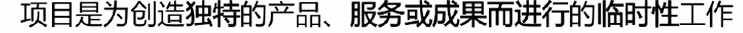

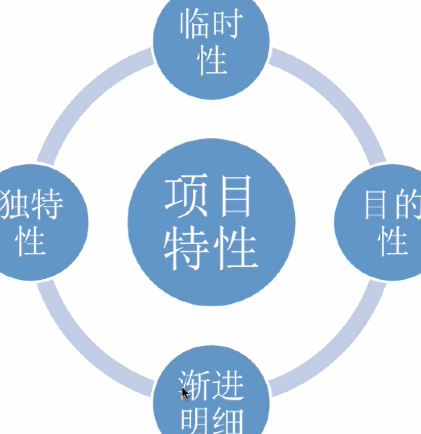

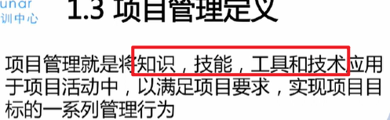

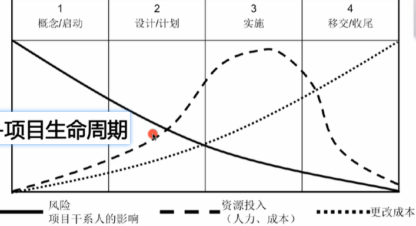

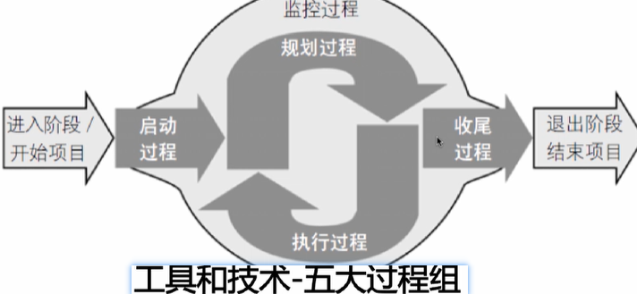

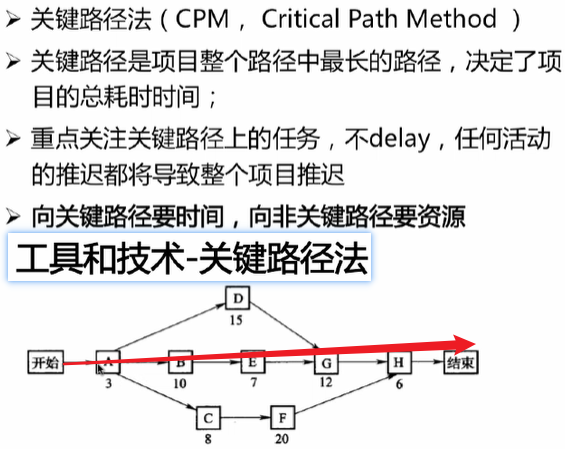

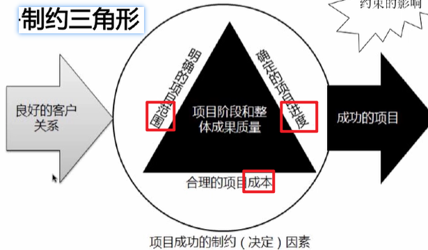

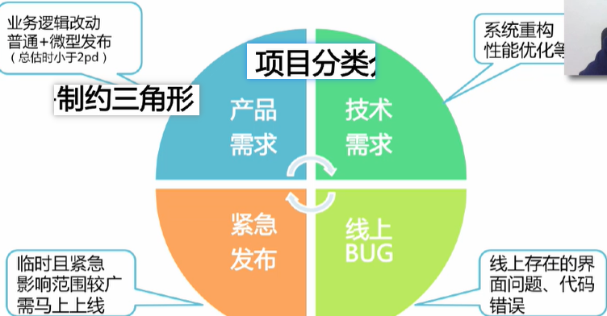

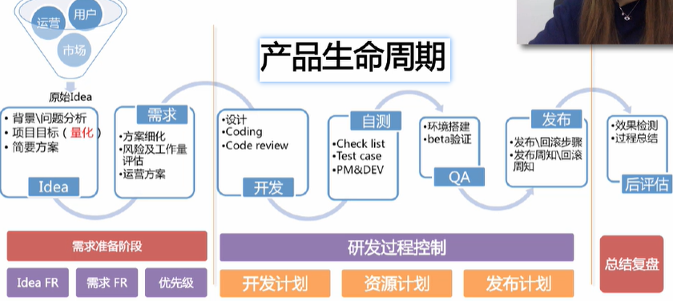

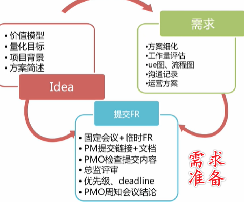

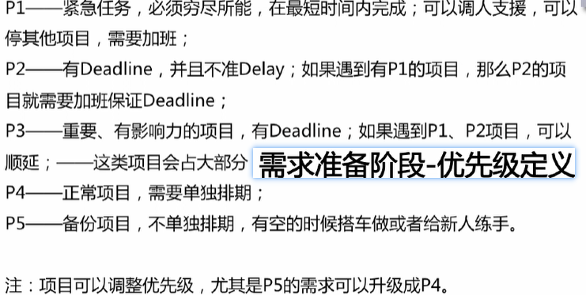

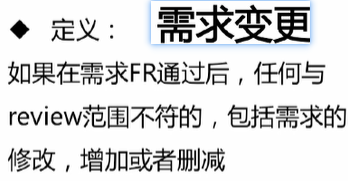

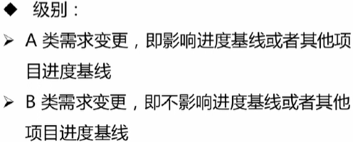

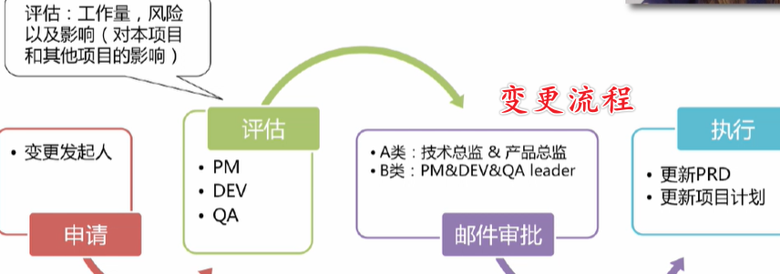

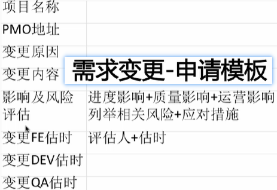

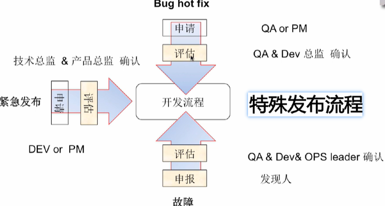

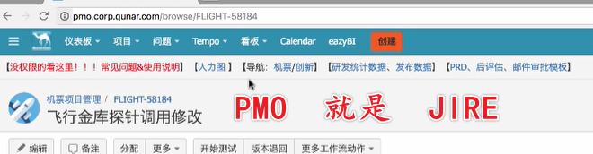

## 故障处理

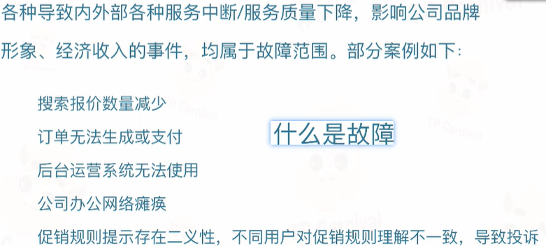

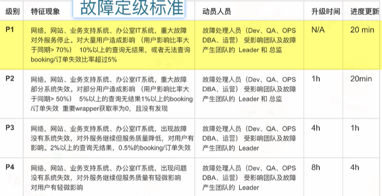

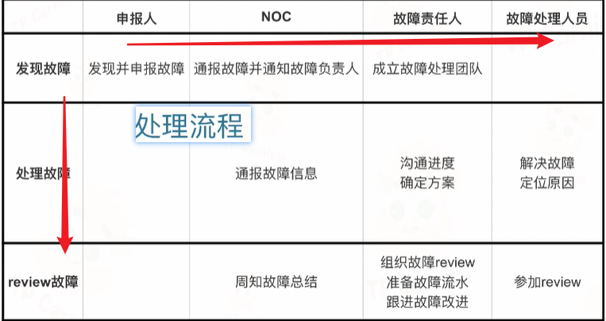

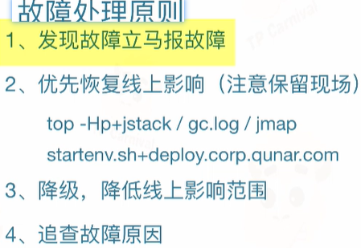

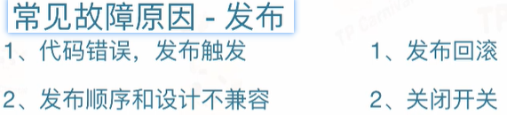

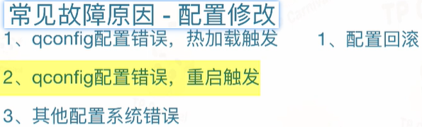

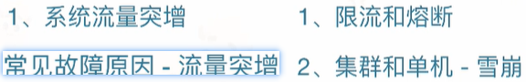

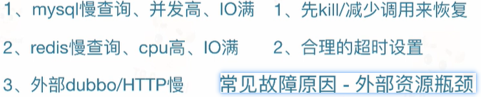

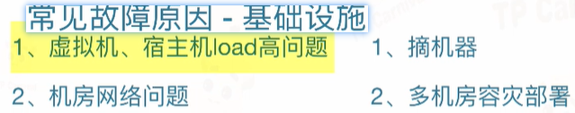

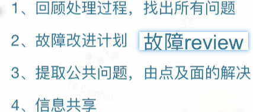

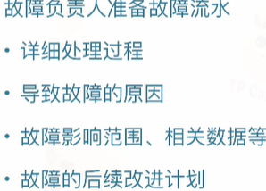

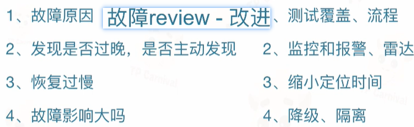

## 工程效率

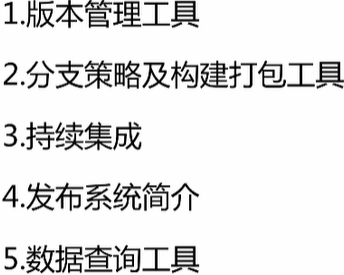

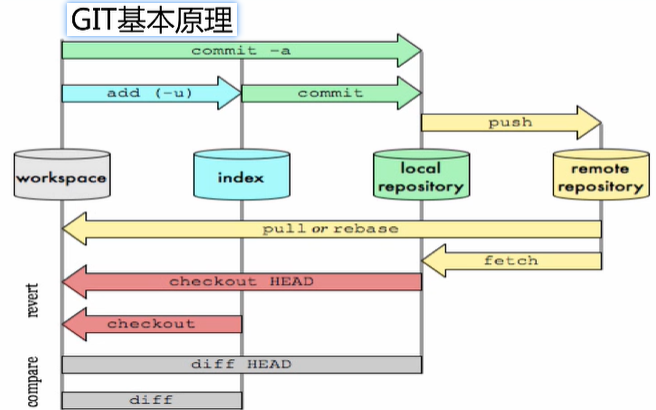

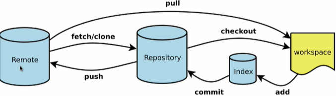

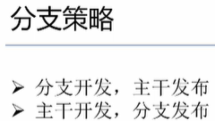

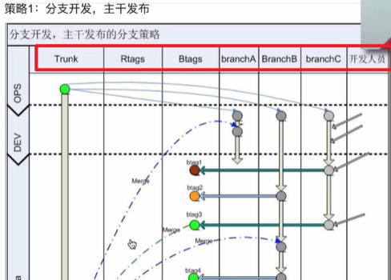

master发布，适用于多个需求

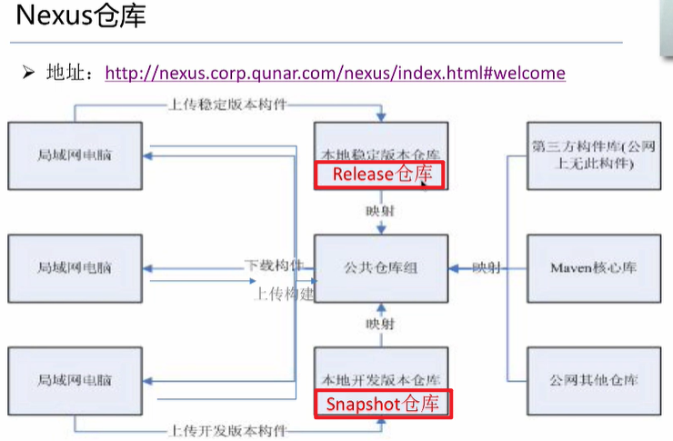

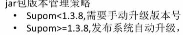

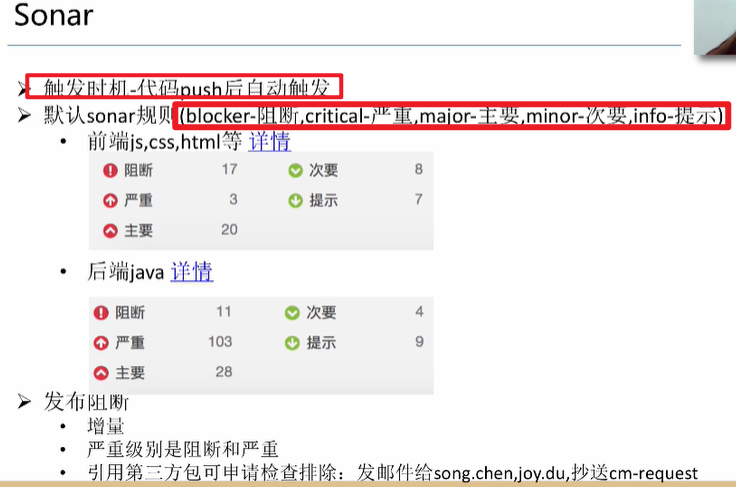

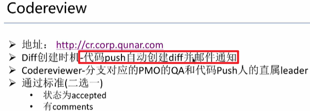

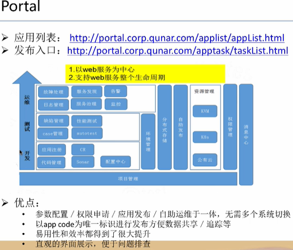

CM：各种工具地址集合

## 项目流程

## 开发安全

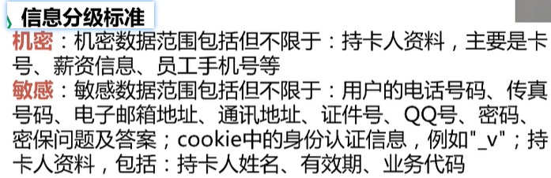

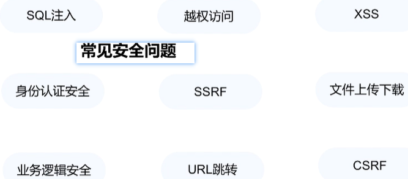

**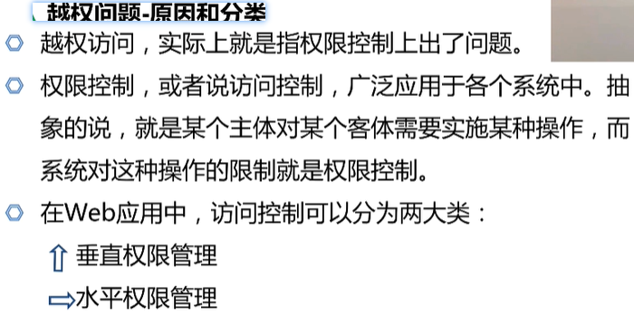**

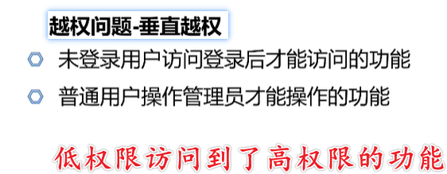

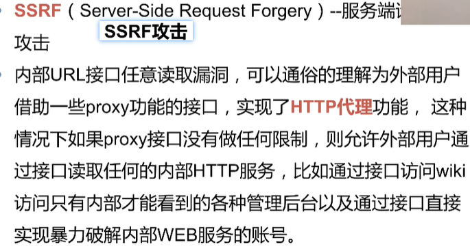

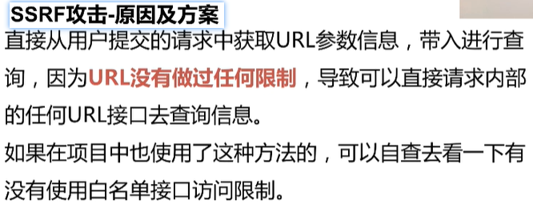

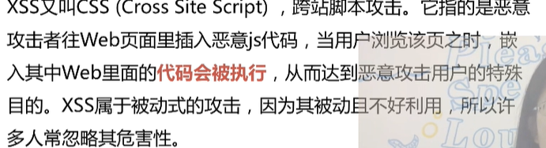

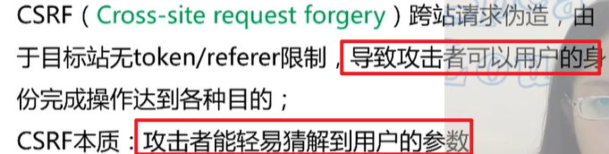

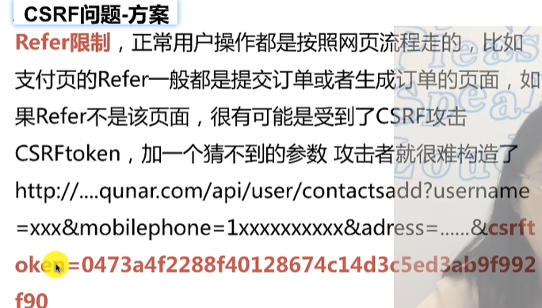

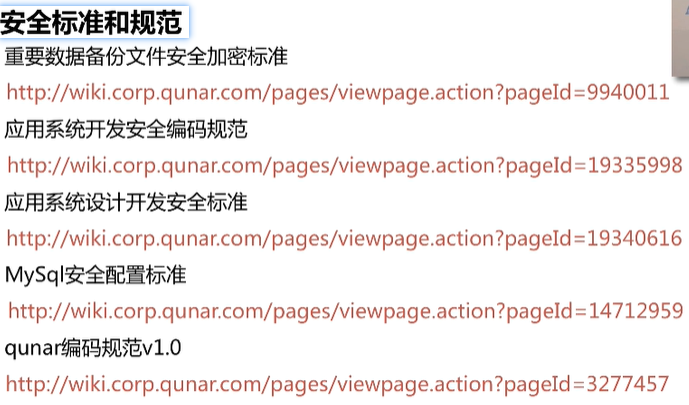

## MySQL

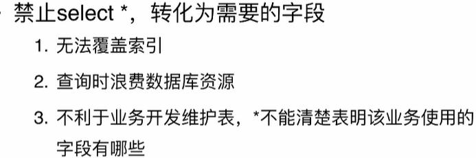

