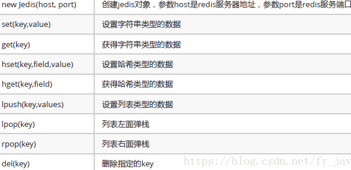

# Redis Notes


## 简介

- 高性能
- 高可用
- 高扩展
- 类型丰富


## 基本知识

### Jedis

Redis不仅是使用命令来操作，现在基本上主流的语言都有**客户端支持**，比如java、C、C#、C++、php、Node.js、Go等。 在官方网站里列一些Java的客户端，有**Jedis**、Redisson、**Jredis**、JDBC-Redis、等其中官方推荐使用**Jedis**和**Redisson**。


Jedis API:




Jedis连接池：

jedis连接资源的创建与销毁是很消耗程序性能，所以jedis为我们提供了jedis的池化技术，jedisPool在创建时初始化一些连接资源存储到连接池中，使用jedis连接资源时不需要创建，而是从连接池中获取一个资源进行redis的操作，使用完毕后，不需要销毁该jedis连接资源，而是将该资源归还给连接池，供其他请求使用。


```java
package com.itheima.utils;
 
import redis.clients.jedis.Jedis;
import redis.clients.jedis.JedisPool;
import redis.clients.jedis.JedisPoolConfig;
 
public class JedisPoolUtils {
    被volatile修饰的变量不会被本地线程缓存，对该变量的读写都是直接操作共享内存。
    private static volatile JedisPool jedisPool;
    private JedisPoolUtils() {
    }
    //获得连接池对象
    public static JedisPool getJedisPoolInstance(){
        if(jedisPool==null){
            synchronized (JedisPoolUtils.class){
                if(jedisPool==null){
                    JedisPoolConfig config = new JedisPoolConfig();
                    config.setMaxActive(30);
                    config.setMaxIdle(10);
                    jedisPool=new JedisPool(config,"127.0.0.1",6379);
                }
            }
        }
        return jedisPool;
    }
    //归还连接
    public static void  release(JedisPool jedisPool,Jedis jedis){
        if(jedis!=null){
        jedisPool.returnResource(jedis);
        }
    }
}
```


JedisPoolConfig的配置参数
（1）maxActive：控制一个pool可分配多少个jedis实例，通过pool.getResource()来获取；如果赋值为-1，则表示不限制；如果pool已经分配了maxActive个jedis实例，则此时pool的状态为exhausted。
（2）maxIdle：控制一个pool最多有多少个状态为idle(空闲)的jedis实例；
（3）whenExhaustedAction：表示当pool中的jedis实例都被allocated完时，pool要采取的操作；默认有三种。
（4）maxWait：表示当borrow一个jedis实例时，最大的等待时间，如果超过等待时间，则直接抛JedisConnectionException；
（5）testOnBorrow：获得一个jedis实例的时候是否检查连接可用性（ping()）；如果为true，则得到的jedis实例均是可用的；
（6）testOnReturn：return 一个jedis实例给pool时，是否检查连接可用性（ping()）；
（7）testWhileIdle：如果为true，表示有一个idle object evitor线程对idle object进行扫描，如果validate失败，此object会被从pool中drop掉；这一项只有在timeBetweenEvictionRunsMillis大于0时才有意义；
（8）timeBetweenEvictionRunsMillis：表示idle object evitor两次扫描之间要sleep的毫秒数；
（9）numTestsPerEvictionRun：表示idle object evitor每次扫描的最多的对象数；
（10）minEvictableIdleTimeMillis：表示一个对象至少停留在idle状态的最短时间，然后才能被idle object evitor扫描并驱逐；这一项只有在timeBetweenEvictionRunsMillis大于0时才有意义；
（11）softMinEvictableIdleTimeMillis：在minEvictableIdleTimeMillis基础上，加入了至少minIdle个对象已经在pool里面了。如果为-1，evicted不会根据idle time驱逐任何对象。如果minEvictableIdleTimeMillis>0，则此项设置无意义，且只有在timeBetweenEvictionRunsMillis大于0时才有意义；
（12）lifo：borrowObject返回对象时，是采用DEFAULT_LIFO（last in first out，即类似cache的最频繁使用队列），如果为False，则表示FIFO队列；

### Lettuce

Spring-data-redis 现在好像默认使用 Lettuce 作为默认的客户端

Lettuce是一个高性能基于Java编写的Redis驱动框架，底层集成了Project Reactor提供天然的反应式编程，通信框架集成了Netty使用了非阻塞IO，5.x版本之后融合了JDK1.8的异步编程特性，在保证高性能的同时提供了十分丰富易用的API

`5.1`版本的新特性如下：

- 支持`Redis`的新增命令`ZPOPMIN, ZPOPMAX, BZPOPMIN, BZPOPMAX`。
- 支持通过`Brave`模块跟踪`Redis`命令执行。
- 支持`Redis Streams`。
- 支持异步的主从连接。
- 支持异步连接池。
- 新增命令最多执行一次模式（禁止自动重连）。
- 全局命令超时设置（对异步和反应式命令也有效）。

```sql
<dependency>
    <groupId>io.lettuce</groupId>
    <artifactId>lettuce-core</artifactId>
    <version>5.1.8.RELEASE</version>
</dependency>
```


`Lettuce`主要提供三种`API`：

- 同步（`sync`）：`RedisCommands`。
- 异步（`async`）：`RedisAsyncCommands`。
- 反应式（`reactive`）：`RedisReactiveCommands`。


## 官网学习

https://redis.com.cn/


### 命令

#### key

```shell
# del
del key1 key2

# dump 序列化key
127.0.0.1:6379> dump a
"\x00\xc0{\n\x00H\xe2S\xe1\x00zg\xb9"
127.0.0.1:6379>

# exists 存在性
127.0.0.1:6379> exists a b
(integer) 1
127.0.0.1:6379> exists a
(integer) 1


# expire
设置 key 的过期时间（seconds）。 设置的时间过期后，key 会被自动删除。带有超时时间的 key 通常被称为易失的(volatile)。
超时时间只能使用删除 key 或者覆盖 key 的命令清除，包括 DEL, SET, GETSET 和所有的 *STORE 命令。 对于修改 key 中存储的值，而不是用新值替换旧值的命令，不会修改超时时间。例如，自增 key 中存储的值的 INCR , 向list中新增一个值 LPUSH, 或者修改 hash 域的值 HSET ，这些都不会修改 key 的过期时间。

通过使用 PERSIST 命令把 key 改回持久的(persistent) key，这样 key 的过期时间也可以被清除。

key使用 RENAME 改名后，过期时间被转移到新 key 上。
已存在的旧 key 使用 RENAME 改名，那么新 key 会继承所有旧 key 的属性。例如，一个名为 KeyA 的 key 使用命令 RENAME Key_B Key_A 改名，新的 KeyA 会继承包括超时时间在内的所有 Key_B 的属性。

特别注意，使用负值调用 EXPIRE/PEXPIRE 或使用过去的时间调用 EXPIREAT/PEXPIREAT ，那么 key 会被删除 deleted 而不是过期。 (因为, 触发的key event 将是 del, 而不是 expired).
已经设置过期的key，可以调用 EXPIRE 重新设置。在这种情况下 key 的生存时间被更新为新值。

key 的过期时间以绝对 Unix 时间戳的方式存储。这意味无论 Redis 是否运行，过期时间都会流逝。

服务器的时间必须稳定准确，这样过期时间才能更准确。如果在两个时间相差较多的机器之间移动 RDB 文件，那么可能会出现所有的 key 在加载的时候都过期了。

运行的 Redis 也会不停的检查服务器的时间，如果你设置一个带有 1000 秒过期时间的key，然后你把服务器的时间向前调了 2000 秒，那么这个 key 会立刻过期，不是等 1000 秒后过期。


# EXPIREAT
EXPIREAT 与 EXPIRE 有相同的作用和语义, 不同的是 EXPIREAT 使用绝对 Unix 时间戳 (自1970年1月1日以来的秒数)代替表示过期时间的秒数。使用过去的时间戳将会立即删除该 key。
EXPIREAT 引入的目的是为了把 AOF 持久化模式的相对时间转换为绝对时间。当然，也可以直接指明某个 key 在未来某个时间过期。

# keys

```


## Jredis

## Redisson

## Luc...


