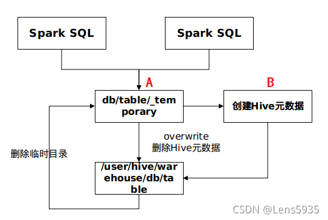

# Spark Notes

## 参数

```shell
!/usr/local/nvidia/bin/spark-sql --conf spark.driver.memory=20g -e "select * from tmp_cf_model.data_product_jd_mart_credit_unsucc_label_20231129_training_total_feature" > cx.csv
```


# 尚硅谷Spark

## SparkCore

### Spark概述

#### Spark是什么

Apache Spark 是**基于内存的快速、通用、可扩展的大数据分析流程**。

#### spark and hadoop

Hadoop

 ⚫ 2006 年 1 月，Doug Cutting 加入 Yahoo，领导 Hadoop 的开发

 ⚫ 2008 年 1 月，Hadoop 成为 Apache 顶级项目

 ⚫ 2011 年 1.0 正式发布

 ⚫ 2012 年 3 月稳定版发布

 ⚫ 2013 年 10 月发布 2.X (Yarn)版本

Spark

 ⚫ 2009 年，Spark 诞生于伯克利大学的 AMPLab 实验室

 ⚫ 2010 年，伯克利大学正式开源了 Spark 项目

 ⚫ 2013 年 6 月，Spark 成为了 Apache 基金会下的项目

 ⚫ 2014 年 2 月，Spark 以飞快的速度成为了 Apache 的顶级项目

 ⚫ 2015 年至今，Spark 变得愈发火爆，大量的国内公司开始重点部署或者使用 Spark


从功能上：

Hadoop：

- java编写
- 作为hadoop分布式文件系统，源于Google的TheGoogleFileSystem这篇论文
- MR
- HBASE是Google的Bigtable的开源实现，但是和bigtable有许多不同之处。HBASE是一个基于HDFS的分布式数据库，擅长实时读/写超大规模的数据集，是hadoop非常重要的组件

Spark：

- Spark是一种由Scala开发的 通用快速可扩展的 **大数据分析引擎**
- Spark Core提供最基础的功能
- Spark SQL是用来操作结构化数据的组件。用户可以通过SQL或者HQL来查询数据
- Spark Streaming是Spark平台上针对实时数据进行流式计算的组件，提供了丰富的处理数据流的API

Spark一直被认为是hadoop的升级版


hadoop比较慢，但是可以处理非常大的数据量

spark很快，但是处理的数据量有限

#### Spark OR Hadoop

MR和Spark都是处理数据的框架，该如何选择？

MR不满足数据的迭代循环计算，在一些数据可复用场景中不适用。

Spark则是可以**重复利用数据计算**

Spark就是在传统的MR计算框架基础上，利用其计算过程的优化，从而大大加快了数据分析、挖掘和读写速度

并将计算单元缩小到了更适合并行运算和重复使用的**RDD**计算模型

Spark**是一个分布式数据快速分析项目**，它的核心计算使 **弹性分布式数据集 Resilient Distributed Datasets**，提供比MR更加丰富的模型，可以在内存中对数据集进行多次的的迭代，来支持复杂的数据挖掘算法和图形计算算法。

Spark和hadoop的根本差异是多个作业之间的数据通信问题，**spark是基于内存，而hadoop是基于磁盘**

spark task启动时间快，**spark采用fork线程的方式，而hadoop采用创建新的进程的方式**。

#### Spark核心模块


Spark Core 中提供了 Spark 最基础与最核心的功能

Spark SQL 是 Spark 用来操作结构化数据的组件。

Spark Streaming 是 Spark 平台上针对实时数据进行流式计算的组件

MLlib 是 Spark 提供的一个机器学习算法库。MLlib 不仅提供了模型评估、数据导入等 额外的功能，还提供了一些更底层的机器学习原语。

GraphX 是 Spark 面向图计算提供的框架与算法库。


弹性分布式数据集

Resilient Distributed Datasets


### 快速上手

#### 插件与依赖

IDEA安装Scala插件

```xml
<dependencies>
    <dependency>
        <groupId>org.apache.spark</groupId>
        <artifactId>spark-core_2.12</artifactId>
        <version>3.0.0</version>
    </dependency>
</dependencies>
<build>
    <plugins>
        <!-- 该插件用于将 Scala 代码编译成 class 文件 -->
        <plugin>
            <groupId>net.alchim31.maven</groupId>
            <artifactId>scala-maven-plugin</artifactId>
            <version>3.2.2</version>
            <executions>
                <execution>
                    <!-- 声明绑定到 maven 的 compile 阶段 -->
                    <goals>
                        <goal>testCompile</goal>
                    </goals>
                </execution>
            </executions>
        </plugin>
        <plugin>
            <groupId>org.apache.maven.plugins</groupId>
            <artifactId>maven-assembly-plugin</artifactId>
            <version>3.1.0</version>
            <configuration>
                <descriptorRefs>
                    <descriptorRef>jar-with-dependencies</descriptorRef>
                </descriptorRefs>
            </configuration>
            <executions>
                <execution>
                    <id>make-assembly</id>
                    <phase>package</phase>
                    <goals>
                        <goal>single</goal>
                    </goals>
                </execution>
            </executions>
        </plugin>
    </plugins>
</build>
```


#### HelloWorld

```scala
object WordCount {
  def main(args: Array[String]): Unit = {
    val path:String = "D:\\tmp\\log.txt"

    // 创建运行配置
    val sparkConf = new SparkConf()
      .setMaster("local[*]")
      .setAppName("WordCount")
    // 创建上下文环境对象
    val sc:SparkContext = new SparkContext(sparkConf);
    // 读取文件数据
    val fileRDD:RDD[String] = sc.textFile(path);
    // 分词
    val wordRDD :RDD[String] = fileRDD.flatMap(_.split(" "))
    // 转map
    val word2OneRDD:RDD[(String, Int)] = wordRDD.map((_,1))
    // 分组聚合
    val word2CountRDD:RDD[(String, Int)] = word2OneRDD.reduceByKey(_+_);
    // 将数据聚合结果采集到内存中
    val word2Count:Array[(String, Int)] = word2CountRDD.collect()
    // 打印
    word2Count.foreach(println)
    // 关闭spark连接
    sc.stop()
  }
}
```

#### 日志

正常情况下会打印很多INFO日志，在resources下建立log4j.properties:

```sql
log4j.rootCategory=ERROR, console
log4j.appender.console=org.apache.log4j.ConsoleAppender
log4j.appender.console.target=System.err
log4j.appender.console.layout=org.apache.log4j.PatternLayout
log4j.appender.console.layout.ConversionPattern=%d{yy/MM/dd
HH:mm:ss} %p %c{1}: %m%n
# Set the default spark-shell log level to ERROR. When running the spark-shell,
the
# log level for this class is used to overwrite the root logger's log level, so
that
# the user can have different defaults for the shell and regular Spark apps.
log4j.logger.org.apache.spark.repl.Main=ERROR
# Settings to quiet third party logs that are too verbose
log4j.logger.org.spark_project.jetty=ERROR
log4j.logger.org.spark_project.jetty.util.component.AbstractLifeCycle=ERROR
log4j.logger.org.apache.spark.repl.SparkIMain$exprTyper=ERROR
log4j.logger.org.apache.spark.repl.SparkILoop$SparkILoopInterpreter=ERROR
log4j.logger.org.apache.parquet=ERROR
log4j.logger.parquet=ERROR
# SPARK-9183: Settings to avoid annoying messages when looking up nonexistent
UDFs in SparkSQL with Hive support
log4j.logger.org.apache.hadoop.hive.metastore.RetryingHMSHandler=FATAL
log4j.logger.org.apache.hadoop.hive.ql.exec.FunctionRegistry=ERROR

```

只打印ERROR日志


### Spark运行环境

Spark作为一个 **数据处理框架和计算引擎**，可以在所有常见的集群环境中运行，国内主流环境为Yarn，不过容器环境也主流起来


#### Local模式

 Local 模式，就是**不需要其他任何节点资源就可以在本地执行 Spark 代码的环境**，一般用于教学，调试，演示等

提交应用：

```bash
bin/spark-submit \
--class org.apache.spark.examples.SparkPi \
--master local[2] \
./examples/jars/spark-examples_2.12-3.0.0.jar \
10
```

**--class** **表示要执行程序的主类**，此处可以更换为咱们自己写的应用程序

**--master local[2] 部署模式，默认为本地模式，数字表示分配的虚拟 CPU 核数量**

spark-examples_2.12-3.0.0.jar **运行的应用类所在的 jar 包**，实际使用时，可以设定为咱 们自己打的 jar 包

数字 10 表示程序的入口参数，用于设定当前应用的任务数量

```scala
// 创建运行配置
val sparkConf = new SparkConf()
  .setMaster("local[*]")
  // 这里 * 应该表示任意虚拟CPU核数？？？
  .setAppName("WordCount")
```


#### Standalone模式

> Standalone 模式通常是指一个分布式应用程序在单个节点上运行，而不依赖于任何集群管理器。以下是 Standalone 模式的一些特点：
>
> 1. **简单易用：** Standalone 模式通常非常简单，无需复杂的配置或设置，只需要在单个节点上运行应用即可。
> 2. **无需集群管理器：** 与在 YARN, Mesos 或 Kubernetes 等集群管理器上运行的模式相比，Standalone 模式不需要额外的集群管理器。
> 3. **适用于小规模应用：** 对于小规模的应用或者测试和开发环境，Standalone 模式是一个很好的选择。
> 4. **可移植性：** Standalone 模式的应用程序通常更易于移植，因为它们不依赖于特定的集群环境或配置。
> 5. **资源利用率低：** 相比于集群模式，Standalone 模式的资源利用率通常较低。
> 6. **扩展性限制：** Standalone 模式的应用程序通常难以处理大规模的数据或任务，因为它们不能利用集群的计算资源。
>
> 总的来说，Standalone 模式适合在单个节点上运行小规模的应用程序，但对于需要处理大数据或高并发的应用，通常需要使用基于集群的运行模式。


local 本地模式毕竟只是用来进行练习演示的，真实工作中还是要将应用提交到对应的 **集群**中去执行，这里我们来看看**只使用 Spark 自身节点运行的集群模式**，也就是我们所谓的 **独立部署（Standalone）**模式。Spark 的 Standalone 模式体现了经典的 **master-slave** 模式。

```shell
bin/spark-submit \
--class org.apache.spark.examples.SparkPi \
--master spark://linux1:7077 \
## master指定集群中的地址
./examples/jars/spark-examples_2.12-3.0.0.jar \
10
```


##### 配置历史服务

由于 spark-shell 停止掉后，集群监控 linux1:4040 页面就看不到历史任务的运行情况，所以 开发时都配置历史服务器记录任务运行情况

##### 配置高可用（HA）

所谓的高可用是因为当前集群中的 Master 节点只有一个，所以会存在单点故障问题。所以 为了解决单点故障问题，**需要在集群中配置多个 Master 节点**，一旦处于活动状态的 Master 发生故障时，由备用 Master 提供服务，保证作业可以继续执行。这里的高可用一般采用 Zookeeper 设置


#### Yarn模式

**独立部署（Standalone）模式由 Spark 自身提供计算资源，无需其他框架提供资源**。这 种方式降低了和其他第三方资源框架的耦合性，独立性非常强。但是你也要记住，**Spark 主 要是计算框架，而不是资源调度框架**，所以本身提供的资源调度并不是它的强项，所以还是 和其他专业的资源调度框架集成会更靠谱一些。所以接下来我们来学习在强大的 Yarn 环境 下 Spark 是如何工作的（其实是因为在国内工作中，Yarn 使用的非常多）

#### K8S & Mesos 模式

Mesos 是 Apache 下的开源分布式资源管理框架，它被称为是分布式系统的内核,在 Twitter 得到广泛使用,管理着 Twitter 超过 30,0000 台服务器上的应用部署，但是在国内，依 然使用着传统的 Hadoop 大数据框架，所以国内使用 Mesos 框架的并不多，但是原理其实都 差不多

容器化部署是目前业界很流行的一项技术，基于 Docker 镜像运行能够让用户更加方便 地对应用进行管理和运维。容器管理工具中最为流行的就是 Kubernetes（k8s），而 Spark 也在最近的版本中支持了 k8s 部署模式


#### 对比


####端口号

- Spark 查看当前 Spark-shell 运行任务情况端口号：4040（计算） 
- Spark Master 内部通信服务端口号：7077 
- Standalone 模式下，Spark Master Web 端口号：8080（资源） 
- Spark 历史服务器端口号：18080 
- Hadoop YARN 任务运行情况查看端口号：8088


### Spark运行架构

#### 运行架构

Spark 框架的核心是一个计算引擎，整体来说，它采用了标准 master-slave 的结构


可以看到有两个核心组件：

Driver：

Spark 驱动器节点，用于执行 Spark 任务中的 main 方法，负责实际代码的执行工作。 Driver 在 Spark 作业执行时主要负责： 

➢ 将用户程序转化为作业（job） 

➢ 在 Executor 之间调度任务(task) 

➢ 跟踪 Executor 的执行情况 

➢ 通过 UI 展示查询运行情况


Executor：

Spark Executor 是集群中工作节点（Worker）中的一个 JVM 进程，负责在 Spark 作业 中运行具体任务（Task），任务彼此之间相互独立。Spark 应用启动时，Executor 节点被同时启动，并且始终伴随着整个 Spark 应用的生命周期而存在。如果有 Executor 节点发生了 故障或崩溃，Spark 应用也可以继续执行，会将出错节点上的任务调度到其他 Executor 节点 上继续运行。

Executor 有两个核心功能： 

➢ 负责运行组成 Spark 应用的任务，并将结果返回给驱动器进程 

➢ 它们通过自身的**块管理器（Block Manager）**为用户程序中要求缓存的 **RDD 提供内存式存储**。RDD 是直接缓存在 Executor 进程内的，因此任务可以在运行时充分利用缓存 数据加速运算


 Master & Worker Spark 

集群的独立部署环境中，不需要依赖其他的资源调度框架，自身就实现了资源调 度的功能，所以环境中还有其他两个核心组件：Master 和 Worker，这里的 Master 是一个进 程，主要负责资源的调度和分配，并进行集群的监控等职责，类似于 Yarn 环境中的 RM, 而 Worker 呢，也是进程，一个 Worker 运行在集群中的一台服务器上，由 Master 分配资源对 数据进行并行的处理和计算，类似于 Yarn 环境中 NM。


ApplicationMaster

Hadoop 用户向 YARN 集群提交应用程序时,提交程序中应该包含 ApplicationMaster，用 于向资源调度器申请执行任务的资源容器 Container，运行用户自己的程序任务 job，监控整 个任务的执行，跟踪整个任务的状态，处理任务失败等异常情况。 说的简单点就是，ResourceManager（资源）和 Driver（计算）之间的解耦合靠的就是 ApplicationMaster。


#### 核心概念

##### Executor

Spark Executor 是集群中运行在工作节点（Worker）中的一个 JVM 进程，是整个集群中 的专门用于计算的节点。在提交应用中，可以提供参数指定计算节点的个数，以及对应的资 源。这里的资源一般指的是工作节点 Executor 的内存大小和使用的虚拟 CPU 核（Core）数 量


应用程序相关启动参数如下：

**--num-executors 配置 Executor 的数量**

**--executor-memory 配置每个 Executor 的内存大小** 

**--executor-cores 配置每个 Executor 的虚拟 CPU core 数量**

##### 并行度 Parallelism

在分布式计算框架中一般都是多个任务同时执行，由于任务分布在不同的计算节点进行 计算，所以能够真正地实现多任务并行执行，记住，这里是并行，而不是并发。这里我们将 整个集群并行执行任务的数量称之为并行度

##### DAG有向无环图

根据使用方式的不同，大数据引擎框架一般分为四类：

第一类就是 Hadoop 所承载的 MapReduce,它将计算分为两个阶段，分别为 Map 阶段 和 Reduce 阶段。 对于上层应用来说，就不得不想方设法去拆分算法，甚至于不得不在上层应用实现多个 Job 的串联，以完成一个完整的算法，例如迭代计算。 由于这样的弊端，催生了支持 DAG 框 架的产生。

因此，支持 DAG 的框架被划分为第二代计算引擎。如 Tez 以及更上层的 Oozie。这里我们不去细究各种 DAG 实现之间的区别，不过对于当时的 Tez 和 Oozie 来 说，大多还是批处理的任务。

接下来就是以 Spark 为代表的第三代的计算引擎。第三代计 算引擎的特点主要是 **Job 内部的 DAG 支持**（不跨越 Job），以及实时计算


DAG主要表明Spark程序的执行抽象


#### 提交流程

YARN提交流程：


Spark 应用程序提交到 Yarn 环境中执行的时候，一般会有两种部署执行的方式：Client 和 Cluster。两种模式主要区别在于：Driver 程序的运行节点位置。

##### YARN Client模式

Client 模式将用于监控和调度的 Driver 模块在客户端执行，而不是在 Yarn 中，所以一 般用于测试。

##### YARN Cluster模式

Cluster 模式将用于监控和调度的 Driver 模块启动在 Yarn 集群资源中执行。一般应用于 实际生产环境。

➢ 在 YARN Cluster 模式下，任务提交后会和 ResourceManager 通讯申请启动 ApplicationMaster， 

➢ 随后 ResourceManager 分配 container，在合适的 NodeManager 上启动 ApplicationMaster， 此时的 ApplicationMaster 就是 Driver。 ➢ Driver 启动后向 ResourceManager 申请 Executor 内存，ResourceManager 接到 ApplicationMaster 的资源申请后会分配 container，然后在合适的 NodeManager 上启动 Executor 进程 ➢ Executor 进程启动后会向 Driver 反向注册，Executor 全部注册完成后 Driver 开始执行 main 函数， ➢ 之后执行到 Action 算子时，触发一个 Job，并根据宽依赖开始划分 stage，每个 stage 生 成对应的 TaskSet，之后将 task 分发到各个 Executor 上执行。

### Spark核心编程

Spark 计算框架为了能够进行**高并发和高吞吐**的数据处理，封装了三大数据结构，用于处理不同的应用场景：

**➢ RDD : 弹性分布式数据集** 

**➢ 累加器：分布式共享只写变量** 

**➢ 广播变量：分布式共享只读变量**

#### RDD

RDD（Resilient Distributed Dataset）叫做弹性分布式数据集，是 Spark 中最基本的数据 处理模型。代码中是一个抽象类，它代表一个**弹性的、不可变、可分区、里面的元素可并行计算的集合**。


**➢ 弹性** 

- **存储的弹性：内存与磁盘的自动切换；** 
- **容错的弹性：数据丢失可以自动恢复；** 
- **计算的弹性：计算出错重试机制；** 
- **分片的弹性：可根据需要重新分片。** 

**➢ 分布式：数据存储在大数据集群不同节点上** 
**➢ 数据集：RDD 封装了计算逻辑，并不保存数据** 
**➢ 数据抽象：RDD 是一个抽象类，需要子类具体实现** 
**➢ 不可变：RDD 封装了计算逻辑，是不可以改变的，想要改变，只能产生新的 RDD，在 新的 RDD 里面封装计算逻辑** 
**➢ 可分区、并行计算**

##### 核心属性

```
Internally, each RDD is characterized by five main properties:
A list of partitions
A function for computing each split
A list of dependencies on other RDDs
Optionally, a Partitioner for key-value RDDs (e.g. to say that the RDD is hash-partitioned)
Optionally, a list of preferred locations to compute each split on (e.g. block locations for an HDFS file)
```

1.分区列表

RDD 数据结构中存在分区列表，用于执行任务时并行计算，是实现分布式计算的重要属性

```
protected def getPartitions: Array[Partition]
```


2.分区计算函数

Spark 在计算时，是使用分区函数对每一个分区进行计算

```
def compute(split: Partition, context: TaskContext): Iterator[T]
```


3.RDD 之间的依赖关系

RDD 是计算模型的封装，当需求中需要将多个计算模型进行组合时，就需要将多个 RDD 建 立依赖关系

```
protected def getDependencies: Seq[Dependency[_]] = deps
```


4.分区器（可选）

当数据为 KV 类型数据时，可以通过设定分区器自定义数据的分区

```
@transient val partitioner: Option[Partitioner] = None
```


5.首选位置（可选）

计算数据时，可以根据计算节点的状态选择不同的节点位置进行计算

```
protected def getPreferredLocations(split: Partition): Seq[String] = Nil
```

##### 执行原理

数据处理过程中需要计算资源（内存 & CPU）和计算模型（逻辑）。 执行时，需要将计算资源和计算模型进行协调和整合。

Spark 框架在执行时，先申请资源，然后将应用程序的数据处理逻辑分解成一个一个的 计算任务。然后将任务发到已经分配资源的计算节点上, 按照指定的计算模型进行数据计 算。最后得到计算结果

在 Yarn 环境中，RDD 的工作原理:

1. 启动 Yarn 集群环境: 一个RM，多个NM
2. Spark 通过申请资源创建调度节点和计算节点：DM/Driver--NM/Executor
3. Spark 框架根据需求将计算逻辑根据分区划分成不同的任务
4. 调度节点将任务根据计算节点状态发送到对应的计算节点进行计算

RDD 在整个流程中主要用于将逻辑进行封装，并生成 Task 发送给 Executor 节点执行计算

##### 基础编程

###### RDD 创建

四种方式：

1.从集合（内存）中创建 RDD

```scala
  def main(array: Array[String]): Unit = {
    println("RDDCreateMethod01 starting")
    val conf = new SparkConf().setMaster("local[*]").setAppName("RDDCreateMethod01")
    val sc  = new SparkContext(conf)
    val rdd1 = sc.parallelize(List(1, 2, 3, 4, 5, 6, 7, 8, 9, 10))
    // makeRDD 方法其实就是 parallelize 方法
    val rdd2 = sc.makeRDD(List(1, 2, 3, 4, 5, 6, 7, 8, 9, 10))

    rdd1.foreach(println)
    println("----------")
    rdd2.foreach(println)
    sc.stop()
  }
```

2.从外部存储（文件）创建 RDD:本地的文件系统，所有 Hadoop 支持的数据集， 比如 HDFS、HBase 等。

```
val fileRDD: RDD[String] = sparkContext.textFile("input")
```

3.从其他 RDD 创建

4.直接创建 RDD（new）:使用 new 的方式直接构造 RDD，一般由 Spark 框架自身使用。

###### 并行度和分区

Spark 可以将一个作业切分多个任务后，发送给 Executor 节点并行计算，而能 够并行计算的任务数量我们称之为并行度

这个数量可以在构建 RDD 时指定。记住，这里 的并行执行的任务数量，并不是指的切分任务的数量

```
val rdd1 = sc.parallelize(List(1, 2, 3, 4, 5, 6, 7, 8, 9, 10), 1) // 并行度1
val rdd2 = sc.makeRDD(List(1, 2, 3, 4, 5, 6, 7, 8, 9, 10), 2) // 并行度2
```

读取内存数据时，数据可以按照并行度的设定进行**数据的分区**操作，数据分区规则：

```
def positions(length: Long, numSlices: Int): Iterator[(Int, Int)] = {
 (0 until numSlices).iterator.map { i =>
 val start = ((i * length) / numSlices).toInt
 val end = (((i + 1) * length) / numSlices).toInt
 (start, end)
 }
 }
```

读取文件数据时，数据是按照 Hadoop 文件读取的规则进行切片分区，而切片规则和数 据读取的规则有些差异

###### RDD转换算子

RDD 根据数据处理方式的不同将算子整体上分为 

1. Value 类型

   1. map()

   2. mapPartitions():将待处理的数据**以分区为单位**发送到计算节点进行处理，这里的处理是指可以进行任意的处 理，哪怕是过滤数据

   3. mapPartitionsWithIndex:同上，在处理时同时可以获取当前分区索引。

   4. flatMap：将处理的数据进行扁平化后再进行映射处理，所以算子也称之为扁平映射

   5. ```
          val rdd1 = sc.parallelize(List(List(1, 2), 3, List(4, 5)), 1)
          rdd1.flatMap {
            case list: List[Int] => list
            case i: Int => List(i)
          }.foreach(print)
      ```

   6. glom:将同一个分区的数据直接转换为相同类型的内存数组进行处理，分区不变

   7. groupBy: 将数据根据指定的规则进行分组, 分区默认不变，但是数据会被打乱重新组合，我们将这样 的操作称之为 **shuffle**。

   8. filter

   9. sample:根据指定的规则从数据集中抽取数据

   10. distinct:将数据集中重复的数据去重

   11. coalesce:根据数据量缩减分区，用于大数据集过滤后，提高小数据集的执行效率. 当 spark 程序中，存在过多的小任务的时候，可以通过 coalesce 方法，收缩合并分区，减少 分区的个数，减小任务调度成本

   12. repartition:该操作内部其实执行的是 coalesce 操作，参数 shuffle 的默认值为 true。无论是将分区数多的 RDD 转换为分区数少的 RDD，还是将分区数少的 RDD 转换为分区数多的 RDD，repartition 操作都可以完成，因为无论如何都会经 shuffle 过程。

   13. sortBy

2. 双 Value 类型
   1. intersection 交集
   2. union
   3. subtract：以一个 RDD 元素为主，去除两个 RDD 中重复元素，将其他元素保留下来。求差集
   4. zip：将两个 RDD 中的元素，以键值对的形式进行合并。其中，键值对中的 Key 为第 1 个 RDD 中的元素，Value 为第 2 个 RDD 中的相同位置的元素
   5. 
3.  Key-Value 类型
   1. partitionBy：将数据按照指定 Partitioner 重新进行分区。Spark 默认的分区器是 HashPartitioner
   2. reduceByKey：可以将数据按照相同的 Key 对 Value 进行聚合
   3. groupByKey：将数据源的数据根据 key 对 value 进行分组
   4. aggregateByKey：将数据根据不同的规则进行分区内计算和分区间计算
   5. foldByKey：当分区内计算规则和分区间计算规则相同时，aggregateByKey 就可以简化为 foldByKey
   6. combineByKey：最通用的对 key-value 型 rdd 进行聚集操作的聚集函数（aggregation function）。类似于 aggregate()，combineByKey()允许用户返回值的类型与输入不一致
   7. sortByKey：在一个(K,V)的 RDD 上调用，K 必须实现 Ordered 接口(特质)，返回一个按照 key 进行排序 的
   8. join：在类型为(K,V)和(K,W)的 RDD 上调用，返回一个相同 key 对应的所有元素连接在一起的 (K,(V,W))的 RDD
   9. leftOuterJoin：类似于 SQL 语句的左外连接
   10. cogroup：在类型为(K,V)和(K,W)的 RDD 上调用，返回一个(K,(Iterable,Iterable))类型的 RDD

###### RDD行动算子

ACTION

1.reduce：聚集 RDD 中的所有元素，先聚合分区内数据，再聚合分区间数据

2.collect：在驱动程序中，以数组 Array 的形式返回数据集的所有元素

3.count

4.first

5.take：返回一个由 RDD 的前 n 个元素组成的数组

6.takeOrdered：返回该 RDD 排序后的前 n 个元素组成的数组

7.aggregate：分区的数据通过初始值和分区内的数据进行聚合，然后再和初始值进行分区间的数据聚合

8.fold：折叠操作，aggregate 的简化版操作

9.countByKey：统计每种 key 的个数

10.save 相关算子：saveAsTextFile、saveAsObjectFile、saveAsSequenceFile

11.foreach

###### RDD序列化

闭包检查：

从计算的角度, 算子以外的代码都是在 Driver 端执行, 算子里面的代码都是在 Executor 端执行。

那么在 scala 的函数式编程中，就会导致算子内经常会用到算子外的数据，这样就 形成了闭包的效果，如果使用的算子外的数据无法序列化，就意味着无法传值给 Executor 端执行，就会发生错误，所以需要在执行任务计算前，检测闭包内的对象是否可以进行序列 化，这个操作我们称之为闭包检测

Kryo 序列化框架

###### RDD依赖关系

RDD 血缘关系：

RDD 只支持粗粒度转换，即在大量记录上执行的单个操作。将创建 RDD 的一系列 Lineage （血统）记录下来，以便恢复丢失的分区。RDD 的 Lineage 会记录 RDD 的元信息和转 换行为，当该 RDD 的部分分区数据丢失时，它可以根据这些信息来重新运算和恢复丢失的 数据分区。

RDD 依赖关系：

这里所谓的依赖关系，其实就是两个相邻 RDD 之间的关系


RDD 窄依赖：

窄依赖表示每一个父(上游)RDD 的 Partition 最多被子（下游）RDD 的一个 Partition 使用， 窄依赖我们形象的比喻为独生子女。

```
class OneToOneDependency[T](rdd: RDD[T]) extends NarrowDependency[T](rdd)
```


RDD宽依赖

宽依赖表示同一个父（上游）RDD 的 Partition 被多个子（下游）RDD 的 Partition 依赖，会 引起 Shuffle，总结：宽依赖我们形象的比喻为多生。

###### RDD阶段划分

DAG 记录了 RDD 的转换过程和任务的阶段


RDD 任务划分：

1. <u>**Application：初始化一个 SparkContext 即生成一个 Application；**</u> 
2. <u>**Job：一个 Action 算子就会生成一个 Job；**</u> 
3. <u>**Stage：Stage 等于宽依赖(ShuffleDependency)的个数加 1**</u>
4. <u>**Task：一个 Stage 阶段中，最后一个 RDD 的分区个数就是 Task 的个数。**</u>

**Application->Job->Stage->Task 每一层都是 1 对 n 的关系。**


###### RDD持久化

RDD Cache 缓存

RDD 通过 Cache 或者 Persist 方法将前面的计算结果缓存，默认情况下会把数据以缓存 在 JVM 的堆内存中。但是并不是这两个方法被调用时立即缓存，而是触发后面的 action 算 子时，该 RDD 将会被缓存在计算节点的内存中，并供后面重用。

```
// cache 操作会增加血缘关系，不改变原有的血缘关系
println(wordToOneRdd.toDebugString)
// 数据缓存。
wordToOneRdd.cache()
// 可以更改存储级别
//mapRdd.persist(StorageLevel.MEMORY_AND_DISK_2)
```


###### CheckPoint 检查点

所谓的检查点其实就是通过将 RDD 中间结果写入磁盘 由于血缘依赖过长会造成容错成本过高，这样就不如在中间阶段做检查点容错，如果检查点 之后有节点出现问题，可以从检查点开始重做血缘，减少了开销。

对 RDD 进行 checkpoint 操作并不会马上被执行，必须执行 Action 操作才能触发

// 设置检查点路径 sc.setCheckpointDir("./checkpoint1")


#### 累加器

累加器用来把 Executor 端变量信息聚合到 Driver 端。在 Driver 程序中定义的变量，在 Executor 端的每个 Task 都会得到这个变量的一份新的副本，每个 task 更新这些副本的值后， 传回 Driver 端进行 merge。

##### 系统累加器

```
val rdd = sc.makeRDD(List(1,2,3,4,5))
// 声明累加器
var sum = sc.longAccumulator("sum");
rdd.foreach(
 num => {
 // 使用累加器
 sum.add(num)
 }
)
// 获取累加器的值
println("sum = " + sum.value)
```

##### 自定义累加器

继承 AccumulatorV2，并设定泛型

#### 广播变量

广播变量用来高效分发较大的对象。向所有工作节点发送一个较大的只读值，以供一个 或多个 Spark 操作使用。比如，如果你的应用需要向所有节点发送一个较大的只读查询表， 广播变量用起来都很顺手。在多个并行操作中使用同一个变量，但是 Spark 会为每个任务 分别发送。

```
// 声明广播变量
val broadcast: Broadcast[List[(String, Int)]] = sc.broadcast(list)
val resultRDD: RDD[(String, (Int, Int))] = rdd1.map {
 case (key, num) => {
 var num2 = 0
 // 使用广播变量
 for ((k, v) <- broadcast.value) {
 if (k == key) {
 num2 = v
 }
 }
 (key, (num, num2))
 }
}
```


### Spark SQL

#### Spark SQL概述

Spark SQL 是 Spark 用于`结构化数据(structured data)`处理的 Spark 模块。

SparkSQL 的前身是 **Shark**，给熟悉 RDBMS 但又不理解 MapReduce 的技术人员提供快 速上手的工具

Hive 是早期唯一运行在 Hadoop 上的 SQL-on-Hadoop 工具, 为了提高MR的效率，为了提高 SQL-on-Hadoop 的效率，大量的 SQL-on-Hadoop 工具开始产生：

- Drill

- Impala

- Shark:伯克利实验室 Spark 生态环境的组件之一，是基于 Hive 所开发的工具，它修 改了下图所示的右下角的内存管理、物理计划、执行三个模块，并使之能运行在 Spark 引擎 上。

  

​    Shark 的出现，使得 SQL-on-Hadoop 的性能比 Hive 有了 10-100 倍的提高

但是，随着 Spark 的发展，对于野心勃勃的 Spark 团队来说，Shark 对于 Hive 的太多依 赖（如采用 Hive 的语法解析器、查询优化器等等），制约了 Spark 的 **One Stack Rule Them A**ll 的既定方针，制约了 Spark 各个组件的相互集成，所以提出了 SparkSQL 项目。SparkSQL 抛弃原有 Shark 的代码，汲取了 Shark 的一些优点，如内存列存储（In-Memory Columnar Storage）、Hive兼容性等，重新开发了SparkSQL代码；由于摆脱了对Hive的依赖性，SparkSQL 无论在数据兼容、性能优化、组件扩展方面都得到了极大的方便，真可谓“退一步，海阔天 空”。

 ➢ 数据兼容方面 SparkSQL 不但兼容 Hive，还可以从 RDD、parquet 文件、JSON 文件中 获取数据，未来版本甚至支持获取 RDBMS 数据以及 cassandra 等 NOSQL 数据；

 ➢ 性能优化方面 除了采取 In-Memory Columnar Storage、byte-code generation 等优化技术 外、将会引进 Cost Model 对查询进行动态评估、获取最佳物理计划等等； 

 ➢ 组件扩展方面 无论是 SQL 的语法解析器、分析器还是优化器都可以重新定义，进行扩 展。

14年团队停止对Shark的开发，全身心投入SparkSQL，发展出了两个支线：

- SparkSQL： A new SQL engine designed from group-up for Spark，不受限与hive，兼容hive
- Hive on Spark: Help existing Hive users migrate to Spark。将Spark作为hive底层的引擎之一，就是说hive下面可以采用MR、Tez、Spark等Engine


SparkSQL简化了RDD的开发，提高效率。他提供两个编程抽象，类似Spark Core中的RDD：

- DataFrame
- DataSet

#### SparkSQL 特点

- 易整合：无缝整合了SQL查询和Spark编程
- 统一的数据访问：相同方式连接不同的数据源
- 兼容Hive
- 标准数据连接：JDBC、ODBC

#### DataFrame


# 文章阅读

## Spark吐血整理

https://mp.weixin.qq.com/s/NcYpa20vuOzboZXMaoWcEA


### 一·Spark 基础
### 二·Spark Core
### 三·Spark SQL
### 四·Spark Streaming
### 五·Structured Streaming
### 六·Spark 两种核心 Shuffle
### 七·Spark 底层执行原理
#### Spark运行流程

##### 流程


具体运行流程如下：

1. SparkContext 向资源管理器注册并向资源管理器申请运行 Executor
2. 资源管理器分配 Executor，然后资源管理器启动 Executor
3. Executor 发送心跳至资源管理器
4. **SparkContext 构建 DAG 有向无环图**
5. **将 DAG 分解成 Stage（TaskSet）**
6. **把 Stage 发送给 TaskScheduler**
7. **Executor 向 SparkContext 申请 Task**
8. **TaskScheduler 将 Task 发送给 Executor 运行**
9. **同时 SparkContext 将应用程序代码发放给 Executor**
10. Task 在 Executor 上运行，运行完毕释放所有资源

**Spark 的计算发生在 RDD 的 Action 操作，而对 Action 之前的所有 Transformation，Spark 只是记录下 RDD 生成的轨迹，而不会触发真正的计算**。

##### DAG Stage划分

Spark Application 中可以因为不同的 Action 触发众多的 job，一个 Application 中可以有很多的 job，每个 job 是由一个或者多个 Stage 构成的，后面的 Stage 依赖于前面的 Stage，也就是说只有前面依赖的 Stage 计算完毕后，后面的 Stage 才会运行。

**Stage 划分的依据就是宽依赖**，像 reduceByKey，groupByKey 等算子，会导致宽依赖的产生。

**核心算法：回溯算法**

**从后往前回溯/反向解析，遇到窄依赖加入本 Stage，遇见宽依赖进行 Stage 切分。**

Spark 内核会从触发 Action 操作的那个 RDD 开始**从后往前推**，首先会为最后一个 RDD 创建一个 Stage，然后继续倒推，如果发现对某个 RDD 是宽依赖，那么就会将宽依赖的那个 RDD 创建一个新的 Stage，那个 RDD 就是新的 Stage 的最后一个 RDD。然后依次类推，继续倒推，根据窄依赖或者宽依赖进行 Stage 的划分，直到所有的 RDD 全部遍历完成为止。

**窄依赖**：父 RDD 的一个分区只会被子 RDD 的一个分区依赖。即一对一或者多对一的关系，可理解为独生子女。常见的窄依赖有：map、filter、union、mapPartitions、mapValues、join（父 RDD 是 hash-partitioned）等。
**宽依赖**：父 RDD 的一个分区会被子 RDD 的多个分区依赖(涉及到 shuffle)。即一对多的关系，可理解为超生。常见的宽依赖有 groupByKey、partitionBy、reduceByKey、join（父 RDD 不是 hash-partitioned）等。


**一个 Spark 程序可以有多个 DAG，有几个 Action，就有几个 DAG**，一个DAG可以有多个Stage(根据宽窄依赖划分), 一个Stage可以有多个Task并行执行，task数=分区数


##### Stage的提交


### 八·Spark 数据倾斜

### 九·Spark 性能调优

### 十·Spark 故障排除

### 十一·、Spark大厂面试真题


## My Notes

### Hive 兼容

https://zhuanlan.zhihu.com/p/149013623

UDAF

注意不是所有的Hive UDF/UDTF/UDAF在spark sql中都支持，下面是一些不支持的api：

- getRequiredJars 和 getRequiredFiles 方法用于在UDF中自动加载jar包
- initialize(StructObjectInspector) 目前暂不支持， spark目前仅适用一个已经标记为弃用的接口 initialize(ObjectInspector[])
- configure 用于初始化 MapredContext，在Spark中不支持
- close 用于释放资源，spark sql执行的时候不会调用该方法
- reset 用于在重用UDAF时，重新进行初始化；spark目前不支持udaf的重用
- getWindowingEvaluator 在聚合的时候基于固定的窗口进行优化，spark不支持

### 下划线常见用法

https://www.jianshu.com/p/0497583ec538

### spark-submit

spark-submit 用户打包 Spark 应用程序并部署到 Spark 支持的集群管理气上

```sql
spark-submit [options] <python file> [app arguments]
```

– master: 设置主节点 URL 的参数。支持：
  local： 本地机器。
  spark://host:port：远程 Spark 单机集群。
  yarn：yarn 集群
–deploy-mode：允许选择是否在本地（使用 client 选项）启动 Spark 驱动程序，或者在集群内（使用 cluster 选项）的其中一台工作机器上启动。默认值是 client。
–name：应用程序名称，也可在程序内设置。
–py-files：.py, .egg 或者 .zip 文件的逗号分隔列表，包括 Python 应用程序。这些文件将分发给每个执行节点。
–files：逗号分隔的文件列表，这些文件将分发给每个执行节点。
–conf：动态地改变应用程序的配置。
–driver-memory：指定应用程序在驱动节点上分配多少内存的参数，类似与 10000M， 2G。默认值是 1024M。
–executor-memory：指定每个执行节点上为应用程序分配的内存，默认 1G。
–num-executors：指定执行器节点数。
–help：展示帮助信息和退出。

```sql
spark-submit \
--master local \
--name sync_hive_to_doris \
--deploy-mode client  \
--num-executors 8  \
--executor-memory 5g \
--executor-cores  4  \
--conf spark.dynamicAllocation.enabled=false \
--jars mysql-connector-java-5.1.12.jar,doris-spark-1.0.0-SNAPSHOT.jar \
--conf spark.custom.doris.mysql_ip="$mysql_ip" \
--conf spark.custom.doris.mysql_port="$mysql_fe_port" \
--conf spark.custom.doris.db="$db" \
--conf spark.custom.doris.user="$user" \
--conf spark.custom.doris.password="$password" \
--conf spark.custom.target_table="$target_table" \
--conf spark.custom.doris.http_port="$mysql_be_port" \
--conf spark.custom.batchSize="$batchSize" \
--conf spark.custom.fieldSeparator="$fieldSeparator" \
--conf spark.custom.spark_sql="$spark_sql" \
--conf spark.custom.serviceTime="$datetime" \
--conf spark.custom.sql="$sql" \
--class com.qunar.fintech.doris.tools.IvToolsDataSyncDoris  \
   my.jar 
```

### IDEA WSL/DOCKER运行


## Problems

### overwrite数据翻倍问题

两个任务同时overwrite，数据翻倍

使用[Spark](https://so.csdn.net/so/search?q=Spark&spm=1001.2101.3001.7020) SQL采用overwrite写法写入Hive（非分区表，），全量覆盖，因为人为原因脚本定时设置重复，SparkSql计算任务被短时间内调起两次，结果发现任务正常运行，造成写入表中数据结果存在同一张表有重复的行，数据翻倍。

spark overwrite流程：



（1）Spark写入Hive会先生成一个**临时的_temporary目录**用于存储生成的数据文件，**全部生成完毕后全部移动到输出目录**，**然后删除_temporary目录，最后创建Hive元数据**
（2）**多个Spark写入数据任务使用了同一个_temporary目录，导致其中一个完成数据生成和移动到Hive路径之后删除_temporary目录失败（因为还有其他Spark任务在往里面写），进一步导致数据已经到了但是元数据没有创建**
（3）上一个任务虽然生成了数据文件但是没有元数据，则后一个任务的overwrite找不到元数据因此无法删除Hive路径下的数据文件
（4）当最后一个执行完成的Spark插入任务结束后，此时Hive路径下已经移动过来多个任务的数据文件，由于已经没有正在执行的Spark写任务，因此删除_temporary目录成功，创建元数据成功，结果就是这个元数据对应了该Hive路径下所有版本的数据文件。

https://blog.csdn.net/weixin_40983094/article/details/121160404


