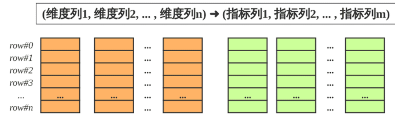
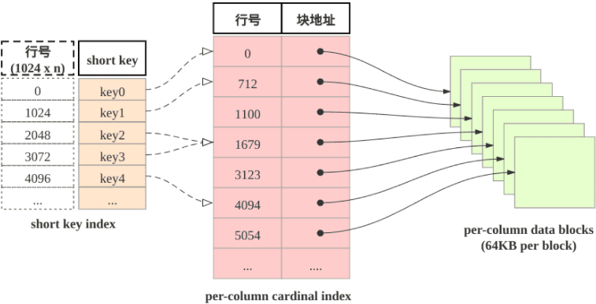
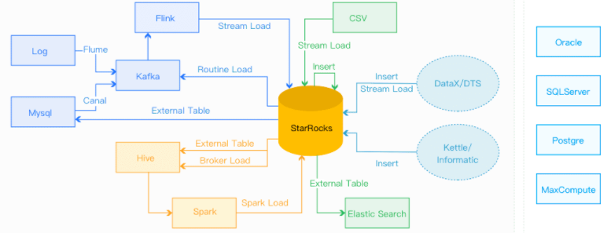
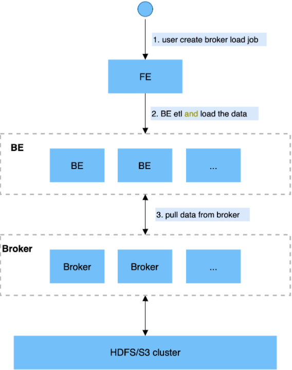
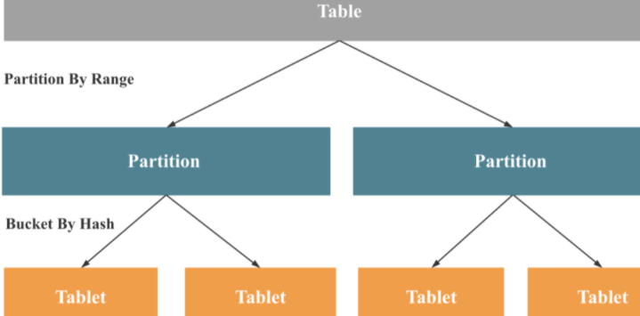
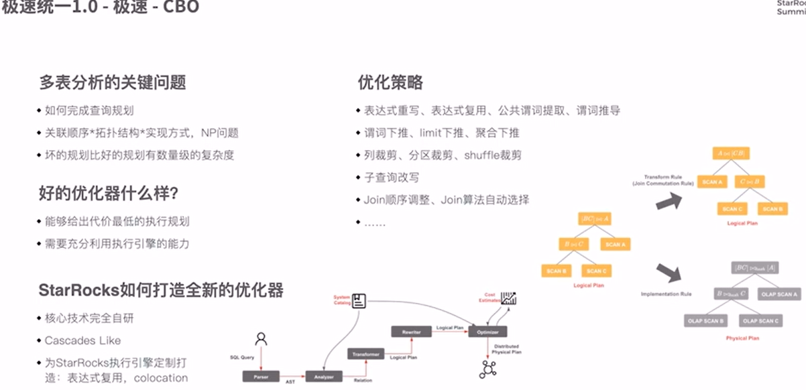

# StarRocks

## Official Docs

### 概述

#### What's StarRocks

- 新一代极速全场景MPP数据库
- StarRocks充分吸收`关系型OLAP数据库`和`分布式存储系统`在大数据时代的优秀研究成果，在业界实践的基础上，进一步改进优化、升级架构，并增添了众多全新功能，形成了全新的企业级产品
- StarRocks致力于构建**极速统一**分析体验，满足企业用户的多种数据分析场景，支持多种数据模型(明细模型、聚合模型、更新模型)，多种导入方式（批量和实时），可整合和接入多种现有系统(Spark、Flink、Hive、 ElasticSearch)。
- 兼容MySQL协议，可使用MySQL客户端和常用BI工具对接StarRocks来进行数据分析
- StarRocks采用`分布式架构`，对数据表进行`水平划分`并以`多副本存储`。集群规模可以灵活伸缩，能够支持10PB级别的数据分析; 支持MPP框架，并行加速计算; 支持多副本，具有`弹性容错`能力
- StarRocks采用`关系模型`，使用严格的数据类型和`列式存储引擎`，通过`编码和压缩技术`，降低读写放大；使用`向量化`执行方式，充分挖掘**多核CPU**的并行计算能力，从而显著提升查询性能

#### 特性

- 架构精简：StarRocks内部通过MPP计算框架完成SQL的具体执行工作。MPP框架本身能够充分的利用多节点的计算能力，整个查询并行执行，从而实现良好的交互式分析体验。 StarRocks集群不需要依赖任何其他组件，易部署、易维护，极简的架构设计，降低了StarRocks系统的复杂度和维护成本，同时也提升了系统的可靠性和扩展性。 管理员只需要专注于StarRocks系统，无需学习和管理任何其他外部系统。

- 全面向量化引擎：StarRocks的计算层全面采用了向量化技术，将所有算子、函数、扫描过滤和导入导出模块进行了系统性优化。通过列式的内存布局、适配CPU的SIMD指令集等手段，充分发挥了现代CPU的并行计算能力，从而实现亚秒级别的多维分析能力。

- 智能查询优化：StarRocks通过`CBO优化器(Cost Based Optimizer)`可以对复杂查询自动优化。无需人工干预，就可以通过统计信息合理估算执行成本，生成更优的执行计划，大大提高了Adhoc和ETL场景的数据分析效率。

- 联邦查询：StarRocks支持使用外表的方式进行联邦查询，当前可以支持Hive、MySQL、Elasticsearch三种类型的外表，用户无需通过数据导入，可以直接进行数据查询加速

- 高效更新：StarRocks支持多种数据模型，其中更新模型可以按照主键进行`upsert`/`delete`操作，通过存储和索引的优化可以在并发更新的同时实现高效的查询优化，更好的服务实时数仓的场景。

- 智能物化视图：StarRocks支持智能的`物化视图`。用户可以通过创建物化视图，预先计算生成预聚合表用于加速聚合类查询请求。StarRocks的物化视图能够在数据导入时自动完成汇聚，与原始表数据保持一致。并且在查询的时候，用户无需指定物化视图，StarRocks能够自动选择最优的物化视图来满足查询请求。

- 标准SQL：StarRocks支持标准的SQL语法，包括聚合、JOIN、排序、窗口函数和自定义函数等功能。StarRocks可以完整支持TPC-H的22个SQL和TPC-DS的99个SQL。此外，StarRocks还兼容MySQL协议语法，可使用现有的各种客户端工具、BI软件访问StarRocks，对StarRocks中的数据进行拖拽式分析。

- 流批一体：StarRocks支持`实时和批量`两种数据导入方式，支持的数据源有Kafka、HDFS、本地文件，支持的数据格式有ORC、Parquet和CSV等，StarRocks可以实时消费Kafka数据来完成数据导入，保证数据不丢不重（exactly once）。StarRocks也可以从本地或者远程（HDFS）批量导入数据。

- 高可用和易扩展：StarRocks的元数据和数据都是多副本存储，并且集群中服务有热备，多实例部署，避免了单点故障。集群具有自愈能力，可弹性恢复，节点的宕机、下线、异常都不会影响StarRocks集群服务的整体稳定性。 StarRocks采用分布式架构，存储容量和计算能力可近乎线性水平扩展。StarRocks单集群的节点规模可扩展到数百节点，数据规模可达到10PB级别。 扩缩容期间无需停服，可以正常提供查询服务。 另外StarRocks中表模式热变更，可通过一条简单SQL命令动态地修改表的定义，例如增加列、减少列、新建物化视图等。同时，处于模式变更中的表也可也正常导入和查询数据。

#### 适用场景

- OLAP多维分析
  - 用户行为分析
  - 用户画像、标签分析、圈人
  - 高维业务指标报表
  - 自助式报表平台
  - 业务问题探查分析
  - 跨主题业务分析
  - 财务报表
  - 系统监控分析
- 实时数据分析
  - 电商大促数据分析
  - 教育行业的直播质量分析
  - 物流行业的运单分析
  - 金融行业绩效分析、指标计算
  - 广告投放分析
  - 管理驾驶舱
  - 探针分析APM（Application Performance Management）
- 高并发查询
  - 广告主报表分析
  - 零售行业渠道人员分析
  - SaaS行业面向用户分析报表
  - Dashbroad多页面分析
- 统一分析
  - 通过使用一套系统解决多维分析、高并发查询、预计算、实时分析、Adhoc查询等场景，降低系统复杂度和多技术栈开发与维护成本。

### 表设计

#### 理解SR表设计

##### 列式存储



StarRocks的表`和关系型数据相同`, 由行和列构成. 每行数据对应用户一条记录, 每列数据有相同数据类型. 所有数据行的列数相同, 可以动态增删列

StarRocks中, 一张表的列可以分为`维度列`(也称为`key列`)和`指标列(value列)`, 维度列用于`分组和排序`, 指标列可通过聚合函数SUM, COUNT, MIN, MAX, REPLACE, HLL_UNION, BITMAP_UNION等累加起来. 因此, `StarRocks的表也可以认为是多维的key到多维指标的映射`。

在StarRocks中, 表中数据`按列存储`, 物理上, 一列数据会经过`分块编码压缩`等操作, 然后持久化于非易失设备, 但在逻辑上, `一列数据可以看成由相同类型的元素构成的数组`.  一行数据的所有列在各自的列数组中保持对齐, 即拥有相同的数组下标, 该下标称之为`序号或者行号`. 该序号是隐式, 不需要存储的, 表中的所有行按照维度列, 做多重排序, 排序后的位置就是该行的行号。

查询时, 如果指定了维度列的等值条件或者范围条件, 并且这些条件中维度列可构成表维度列的前缀, 则可以利用数据的有序性, 使用range-scan快速锁定目标行. 例如: 对于表table1: (event_day, siteid, citycode, username)➜(pv); 当查询条件为event_day > 2020-09-18 and siteid = 2, 则可以使用范围查找; 如果指定条件为citycode = 4 and username in ["Andy", "Boby", "Christian", "StarRocks"], 则无法使用范围查找

##### 稀疏索引

当范围查找时, 如何快速地找到起始的目标行呢? 答案是shortkey index. 如下图所示: shortkey索引为稀疏索引,



表中数据组织有主要由三部分构成:

1. shortkey index表:  表中数据每`1024`行, 构成一个`逻辑block`. 每个逻辑block在shortkey index表中存储`一项索引`, 内容为`表的维度列的前缀`, 并且不超过`36字节`.  shortkey index为`稀疏索引`, `用数据行的维度列的前缀查找索引表`, 可以确定该行数据所在`逻辑块的起始行号`。
2. Per-column data block: 表中`每一列数据按64KB分块存储`,  数据块作为一个单位单独编码压缩, 也作为IO单位, 整体写回设备或者读出。
3. Per-column cardinal index:  表中的每列数据有各自的行号索引表,  列的数据块和行号索引项一一对应, 索引项由数据块的起始行号和数据块的位置和长度信息构成, 用数据行的行号查找行号索引表, 可以获取包含该行号的数据块所在位置, 读取目标数据块后, 可以进一步查找数据。

由此可见, 查找维度列的前缀的查找过程为:  先查找shortkey index, 获得`逻辑块的起始行号`, 查找`维度列的行号索引`, 获得`目标列的数据块`, 读取数据块, 然后解压解码, 从数据块中找到维度列前缀对应的数据项

##### 加速数据处理

1. 预先聚合:  StarRocks支持聚合模型, 维度列取值相同数据行可合并一行, 合并后数据行的维度列取值不变, 指标列的取值为这些数据行的聚合结果, 用户需要给指标列指定聚合函数.  通过预先聚合, 可以加速聚合操作。
2. 分区分桶:  事实上StarRocks的表被划分成tablet, 每个tablet多副本冗余存储在BE上, BE和tablet的数量可以根据计算资源和数据规模而弹性伸缩. 查询时, 多台BE可并行地查找tablet快速获取数据. 此外, tablet的副本可复制和迁移, 增强了数据的可靠性, 避免了数据倾斜. 总之, 分区分桶保证了数据访问的高效性和稳定性。
3. RollUp表索引: shortkey index可加速数据查找, 然后shortkey index依赖维度列排列次序. 如果使用非前缀的维度列构造查找谓词, 则无法使用shortkey index. 用户可以为数据表创建若干RollUp表索引, RollUp表索引的数据组织和存储和数据表相同, 但RollUp表拥有自身的shortkey index. 用户创建RollUp表索引时, 可选择聚合的粒度, 列的数量, 维度列的次序; 使频繁使用的查询条件能够命中相应的RollUp表索引。
4. 列级别的索引技术:  Bloomfilter可快速判断数据块中不含所查找值, ZoneMap通过数据范围快速过滤待查找值, Bitmap索引可快速计算出枚举类型的列满足一定条件的行。

#### 数据模型

目前，StarRocks根据摄入数据和实际存储数据之间的`映射关系`, 其中`明细表对应明细模型（Duplicate Key）`，`聚合表对应聚合模型（Aggregate Key）`，`更新表对应更新模型（Unique Key）和主键模型（Primary Key）`。

- **明细模型：Duplicate Key**
- **聚合模型：Aggregate Key**
- **更新模型：Unique Key**
- **主键模型：Primary Key**


为了描述方便, 我们借鉴关系模式中的主键概念, 称StarRocks表的`维度列的取值`构成数据表的`排序键`, StarRocks的排序键对比传统的主键具有:

- 数据表所有`维度列构成排序键`, 所以后文中提及的排序列, key列本质上都是维度列。
- 排序键`可重复`, 不必满足唯一性约束。
- 数据表的``每一列`, 以排序键的顺序, 聚簇存储`。
- 排序键使用``稀疏索引``。


对于摄入(ingest)的`主键重复的多行数据`, 填充于(populate)数据表中时, 按照三种处理方式划分:

- 明细模型:  表中存在主键重复的数据行, 和摄入数据行一一对应, 用户可以召回所摄入的全部历史数据。
- 聚合模型:  表中`不存在主键重复`的数据行, 摄入的主键重复的数据行`合并为一行`, 这些数据行的指标列通过聚合函数合并, 用户可以召回所摄入的全部历史数据的累积结果, 但无法召回全部历史数据。
- 更新模型&主键模型:  聚合模型的特殊情形, 主键满足唯一性约束, 最近导入的数据行, 替换掉其他主键重复的数据行. 相当于在聚合模型中, 为数据表的指标列指定的聚合函数为REPLACE, REPLACE函数返回一组数据中的最新数据。


需要注意:

- 建表语句, 排序列的定义必须出现在指标列定义之前。
- 排序列在建表语句中的出现次序为数据行的多重排序的次序。
- 排序键的稀疏索引(Shortkey Index)会选择排序键的若干前缀列

##### 明细模型

StarRocks建表的`默认模型`是明细模型（Duplicate Key）

一般用明细模型来处理的场景有如下特点：

1. 需要保留原始的数据（例如原始日志，原始操作记录等）来进行分析；
2. 查询方式灵活, 不局限于预先定义的分析方式, 传统的预聚合方式难以命中;
3. 数据`更新不频繁`。导入数据的来源一般为日志数据或者是时序数据,  以追加写为主要特点, 数据产生后就不会发生太多变化。


用户可以`指定数据表的排序列`, 没有明确指定的情况下, 那么StarRocks会为表`选择默认的几个列`作为排序列。这样，在查询中，有相关排序列的过滤条件时，StarRocks能够快速地过滤数据，降低整个查询的时延。

注意：在向StarRocks明细模型表中导入完全相同的两行数据时，StarRocks会认为是两行数据。


数据表默认采用明细模型. 排序列使用shortkey index, 可快速过滤数据. 用户可以考虑`将过滤条件中频繁使用的维度列的定义放置其他列的定义之前`. 例如用户经常查看某时间范围的某一类事件的数据，可以将事件时间和事件类型作为排序键。


例子：

```sql
CREATE TABLE IF NOT EXISTS detail (
    event_time DATETIME NOT NULL COMMENT "datetime of event",
    event_type INT NOT NULL COMMENT "type of event",
    user_id INT COMMENT "id of user",
    device_code INT COMMENT "device of ",
    channel INT COMMENT ""
)
DUPLICATE KEY(event_time, event_type)
DISTRIBUTED BY HASH(user_id) BUCKETS 8
```

其中`DUPLICATE KEY(event_time, event_type)`说明采用明细模型, 并且指定了`排序键`, 并且`排序列的定义在其他列定义之前`。


注意：

1. 充分利用排序列，在建表时将经常在查询中用于过滤的列放在表的前面，这样能够提升查询速度。
2. 明细模型中, 可以指定部分的维度列为排序键; 而聚合模型和更新模型中, 排序键只能是全体维度列。


##### 聚合模型

在数据分析领域，有很多需要对数据进行统计和汇总操作的场景，就需要使用聚合模型（Aggregate Key）。比如:

- 分析网站或APP访问流量，统计用户的访问总时长、访问总次数;
- 广告厂商为广告主提供的广告点击总量、展示总量、消费统计等;
- 分析电商的全年的交易数据, 获得某指定季度或者月份的, 各人口分类(geographic)的爆款商品。

适合采用聚合模型来分析的场景具有如下特点：

1. 业务方进行的查询为`汇总类查询`，比如sum、count、max等类型的查询；
2. `不需要召回原始的明细数据`；
3. 老数据`不会被频繁更新`，`只会追加新数据`


StarRocks会将指标列按照相同维度列进行聚合。当多条数据具有`相同的维度`时，StarRocks会`把指标进行聚合`。从而能够减少查询时所需要的处理的数据量，进而提升查询的效率。

以下面的原始数据为例：

| Date       | Country | PV   |
| :--------- | :------ | :--- |
| 2020.05.01 | CHN     | 1    |
| 2020.05.01 | CHN     | 2    |
| 2020.05.01 | USA     | 3    |
| 2020.05.01 | USA     | 4    |

在StarRocks聚合模型的表中，存储内容会从四条数据变为两条数据。这样在后续查询处理的时候，处理的数据量就会显著降低：

| Date       | Country | PV   |
| :--------- | :------ | :--- |
| 2020.05.01 | CHN     | 3    |
| 2020.05.01 | USA     | 7    |


在建表时, 只要给指标列的定义`指明聚合函数`, `就会启用聚合模型`; 用户可以使用`AGGREGATE KEY`显示地定义排序建。


以下是一个使用聚合模型创建数据表的例子：

- site_id, date, city_code为排序键; (没有使用DUPLICATE KEY则自动使用前几个字段作为排序键)
- pv为指标列, 使用聚合函数SUM。

```sql
CREATE TABLE IF NOT EXISTS example_db.aggregate_tbl (
    site_id LARGEINT NOT NULL COMMENT "id of site",
    date DATE NOT NULL COMMENT "time of event",
    city_code VARCHAR(20) COMMENT "city_code of user",
    pv BIGINT SUM DEFAULT "0" COMMENT "total page views"
)
DISTRIBUTED BY HASH(site_id) BUCKETS 8;
```


注意：

1. 聚合表中数据会分批次多次导入, `每次导入会形成一个版本`. 相同排序键的数据行聚合有三种触发方式: 1. 数据导入时, 数据落盘前的聚合; 2. 数据落盘后, 后台的多版本异步聚合; 3. 数据查询时, 多版本多路归并聚合。
2. 数据查询时, 指标列采用先聚合后过滤的方式, 把没必有做指标的列存储为维度列。
3. 聚合模型所支持的聚合函数列表请参考《Create Table语句说明》。


##### 更新模型

有些分析场景之下，数据会更新, StarRocks采用更新模型来满足这种需求。比如在电商场景中，定单的状态经常会发生变化，每天的订单更新量可突破上亿。在这种量级的更新场景下进行实时数据分析，如果在明细模型下通过delete+insert的方式，是无法满足频繁更新需求的; 因此, 用户需要使用更新模型来满足数据分析需求。如用户需要更加实时/频繁的更新功能，建议使用主键模型


以下是一些适合更新模型的场景特点：

1. 已经写入的数据有大量的`更新`需求；
2. 需要进行`实时`数据分析。


更新模型中, `排序键满足唯一性约束`, 成为主键。

StarRocks存储内部会给`每一个批次导入数据分配一个版本号`, 同一主键的数据可能有多个版本, 查询时最大(最新)版本的数据胜出

| ID   | value | _version |
| :--- | :---- | :------- |
| 1    | 100   | 1        |
| 1    | 101   | 2        |
| 2    | 100   | 3        |
| 2    | 101   | 4        |
| 2    | 102   | 5        |

具体的示例如上表所示，ID是表的主键，value是表的内容，而__version是StarRocks内部的版本号。其中ID为1的数据有两个导入批次，版本分别为1，2；ID为2的数据有三个批次导入，版本分别为3，4，5。在查询的时候对于ID为1只会返回最新版本2的数据，而对于ID为2只会返回最新版本5的数据，那么用户能够看到的数据如下表所示：

| ID   | value |
| :--- | :---- |
| 1    | 101   |
| 2    | 102   |

通过这种机制，StarRocks可以支持对于频繁更新数据的分析。


在电商订单分析场景中，经常根据订单状态进行的统计分析。因为订单状态经常改变，而create_time和order_id不会改变，并且经常会在查询中作为过滤条件。所以可以将 create_time和order_id 两个列作为这个表的主键（即，在建表时用`UNIQUE KEY`关键字定义），这样既能够满足订单状态的更新需求，又能够在查询中进行快速过滤

以下是一个使用更新模型创建数据表的例子：

- 用`UNIQUE KEY(create_time, order_id)`做主键, 其中create_time, order_id为排序列, 其定义在其他列定义之前出现;
- order_state和total_price为指标列, 其聚合类型为REPLACE。

```sql
CREATE TABLE IF NOT EXISTS detail (
    create_time DATE NOT NULL COMMENT "create time of an order",
    order_id BIGINT NOT NULL COMMENT "id of an order",
    order_state INT COMMENT "state of an order",
    total_price BIGINT COMMENT "price of an order"
)
UNIQUE KEY(create_time, order_id)
DISTRIBUTED BY HASH(order_id) BUCKETS 8
```

注意：

1. 导入数据时需要将所有字段补全才能够完成更新操作，即，上述例子中的create_time、order_id、order_state和total_price四个字段都需必须存在。
2. 对于更新模型的数据读取，需要在查询时完成多版本合并，当版本过多时会导致查询性能降低。所以在向更新模型导入数据时，应该适当降低导入频率，从而提升查询性能。建议在设计导入频率时以满足业务对实时性的要求为准。如果业务对实时性的要求是分钟级别，那么每分钟导入一次更新数据即可，不需要秒级导入。
3. 在查询时，对于value字段的过滤通常在多版本合并之后。将经常过滤字段且不会被修改的字段放在主键上, 能够在合并之前就将数据过滤掉，从而提升查询性能。
4. 因为合并过程需要将所有主键字段进行比较，所以应该避免放置过多的主键字段，以免降低查询性能。如果某个字段只是偶尔会作为查询中的过滤条件存在，不需要放在主键中。

##### 主键模型

相较更新模型，主键模型（Primary Key）可以`更好地支持实时/频繁更新`的功能。该类型的表要求有唯一的主键，支持对表中的行按主键进行更新和删除操作。


StarRocks 1.19 版本推出了主键模型 (Primary Key Model) 。建表时，支持定义主键和指标列，查询时返回主键相同的一组数据中的最新数据。相对于更新模型，主键模型在查询时不需要执行聚合操作，并且支持谓词和索引下推，能够在支持**实时和频繁更新**等场景的同时，提供高效查询。

 


### 数据导入

#### 导入总览

SR支持多种数据模型，SR中存储的数据需要安装特定的模型进行组织(表设计)，数据导入是：`将原始数据按照相应的模型进行清洗转换并加载到SR中`。

SR提供多种导入方式，可以按照数据量大小、导入频率等要求选择合适的导入方式：



- `离线数据导入`：
  - 如果数据源是`Hive/HDFS`，推荐采用`Broker Load`导入
  - 如果`数据表很多`，导入麻烦，则可以使用`Hive外表直连查询`，性能会比Broker Load`差`，但是可以`避免数据搬迁`。
  - 如果`单表数据量很大`，或需要做`全局数据字典来精确去重`，可以使用`Spark Load`导入。
- 实时数据导入：`日志、业务数据库binlog`同步到`kafka`后，有限推荐`Routine Load`导入SR，如果导入，如果导入过程中有`多表关联和ETL预处理`，可以使用`Flink处理`以后用`Stream Load`导入SR，有标准的[Flink-connector](https://docs.starrocks.com/zh-cn/main/loading/Flink-starrocks-connector)可以方便Flink任务使用。
- 程序写入StarRocks，推荐使用[Stream Load](https://docs.starrocks.com/zh-cn/main/loading/StreamLoad)，可以参考[例子](https://github.com/StarRocks/demo/tree/master/MiscDemo/stream_load)中有Java/Python的demo。文本文件导入推荐使用 Stream load
- Mysql数据导入，推荐使用[Mysql外表](https://docs.starrocks.com/zh-cn/main/using_starrocks/External_table)，insert into new_table select * from external_table 的方式导入
- 其他数据源导入，推荐使用DataX导入，我们提供了[DataX-starrocks-writer](https://docs.starrocks.com/zh-cn/main/loading/DataX-starrocks-writer)
- StarRocks内部导入，可以在StarRocks内部使用[insert into tablename select](https://docs.starrocks.com/zh-cn/main/loading/InsertInto)的方式导入，可以跟外部调度器配合实现简单的ETL处理。

#### Broker Load

StarRocks支持从Apache HDFS、Amazon S3等外部存储系统导入数据，支持CSV、ORCFile、Parquet等文件格式。数据量在几十GB到上百GB 级别。

在Broker Load模式下，通过部署的`Broker程序`，StarRocks可读取对应数据源（如HDFS, S3）上的数据，利用自身的计算资源对数据进行`预处理和导入`。这是一种`异步`的导入方式，用户需要通过MySQL协议`创建导入`，并通过`查看导入命令检查导入结果`。

- Broker: Broker 为一个独立的无状态进程，封装了文件系统接口，为 StarRocks 提供读取远端存储系统中文件的能力。
- Plan: 导入执行计划，BE会执行导入执行计划将数据导入到StarRocks系统中。


原理：

用户在提交导入任务后，FE 会生成对应的 Plan 并根据目前 BE 的个数和文件的大小，将 Plan 分给多个 BE 执行，每个 BE 执行一部分导入任务。BE 在执行过程中会通过 Broker 拉取数据，在对数据预处理之后将数据导入系统。所有 BE 均完成导入后，由 FE 最终判断导入是否成功。




支持的远程文件系统

- Apache HDFS
- Amazon S3
- 阿里云 OSS
- 腾讯 COS

#### 自导入

insert into tbl select 

如果数据量比较大，需要设置超时时间

```sql
set query_timeout = 300
```

默认是300，单位秒

### SQL

#### DDL

##### CREATE TABLE

```sql
CREATE [EXTERNAL] TABLE [IF NOT EXISTS] [database.]table_name
(column_definition1[, column_definition2, ...]
[, index_definition1[, ndex_definition12,]])
[ENGINE = [olap|mysql|broker|hive]]
[key_desc]
[COMMENT "table comment"];
[partition_desc]
[distribution_desc]
[rollup_index]
[PROPERTIES ("key"="value", ...)]
[BROKER PROPERTIES ("key"="value", ...)]
```

column_definition:

```sql
col_name col_type [agg_type] [NULL | NOT NULL] [DEFAULT "default_value"]
```

```plaintext
col_type：列类型

具体的列类型以及范围等信息如下：

* TINYINT（1字节）
范围：-2^7 + 1 ~ 2^7 - 1

* SMALLINT（2字节）
范围：-2^15 + 1 ~ 2^15 - 1

* INT（4字节）
范围：-2^31 + 1 ~ 2^31 - 1

* BIGINT（8字节）
范围：-2^63 + 1 ~ 2^63 - 1

* LARGEINT（16字节）
范围：-2^127 + 1 ~ 2^127 - 1

* FLOAT（4字节）
支持科学计数法

* DOUBLE（12字节）
支持科学计数法

* DECIMAL[(precision, scale)] (16字节)
保证精度的小数类型。默认是 DECIMAL(10, 0)
  precision: 1 ~ 38
  scale: 0 ~ precision
其中整数部分为：precision - scale
不支持科学计数法

* DATE（3字节）
范围：0000-01-01 ~ 9999-12-31

* DATETIME（8字节）
范围：0000-01-01 00:00:00 ~ 9999-12-31 23:59:59

* CHAR[(length)]
定长字符串。长度范围：1 ~ 255。默认为1

* VARCHAR[(length)]
变长字符串。长度范围：1 ~ 65533

* HLL (1~16385个字节)
hll列类型，不需要指定长度和默认值，长度根据数据的聚合程度系统内控制，并且HLL列只能通过配套的hll_union_agg、Hll_cardinality、hll_hash进行查询或使用

* BITMAP
bitmap列类型，不需要指定长度和默认值。表示整型的集合，元素最大支持到2^64 - 1
```

```plaintext
agg_type：聚合类型，如果不指定，则该列为 key 列。否则，该列为 value 列

支持的聚合类型如下：

* SUM、MAX、MIN、REPLACE

* HLL_UNION(仅用于HLL列，为HLL独有的聚合方式)、

* BITMAP_UNION(仅用于 BITMAP 列，为 BITMAP 独有的聚合方式)、

* REPLACE_IF_NOT_NULL：这个聚合类型的含义是当且仅当新导入数据是非NULL值时会发生替换行为，如果新导入的数据是NULL，那么StarRocks仍然会保留原值。
  注意：如果用在建表时REPLACE_IF_NOT_NULL列指定了NOT NULL，那么StarRocks仍然会将其转化NULL，不会向用户报错。用户可以借助这个类型完成「部分列导入」的功能。
  该类型只对聚合模型(key_desc的type为AGGREGATE KEY)有用，其它模型不能指这个。
```

```plaintext
是否允许为NULL: 默认不允许为 NULL。NULL 值在导入数据中用 \N 来表示
注意：
BITMAP_UNION聚合类型列在导入时的原始数据类型必须是TINYINT,SMALLINT, INT, BIGINT。
```

index_definition:

```sql
INDEX index_name (col_name[, col_name, ...]) [USING BITMAP] COMMENT 'xxxxxx'
-- 注意： 当前仅支持BITMAP索引， BITMAP索引仅支持应用于单列
```


ENGINE 类型:
默认为 olap。可选 mysql, elasticsearch, hive

如果是 mysql，则需要在 properties 提供以下信息：

```sql
PROPERTIES (
    "host" = "mysql_server_host",
    "port" = "mysql_server_port",
    "user" = "your_user_name",
    "password" = "your_password",
    "database" = "database_name",
    "table" = "table_name"
)
```

在 StarRocks 创建 mysql 表的目的是可以通过 StarRocks 访问 mysql 数据库。 而 StarRocks 本身并不维护、存储任何 mysql 数据。


如果是 elasticsearch，则需要在 properties 提供以下信息：

```sql
PROPERTIES (
    "hosts" = "http://192.168.0.1:8200,http://192.168.0.2:8200",
    "user" = "root",
    "password" = "root",
    "index" = "tindex",
    "type" = "doc"
)
```

其中host为ES集群连接地址，可指定一个或者多个,user/password为开启basic认证的ES集群的用户名/密码，index是StarRocks中的表对应的ES的index名字，可以是alias，type指定index的type，默认是doc。


如果是 hive，则需要在 properties 提供以下信息：

```sql
PROPERTIES (
    "database" = "hive_db_name",
    "table" = "hive_table_name",
    "hive.metastore.uris" = "thrift://127.0.0.1:9083"
)
```

其中 database 是 hive 表对应的库名字，table 是 hive 表的名字，hive.metastore.uris 是 hive metastore 服务地址。


key_desc:

```sql
`key_type(k1[,k2 ...])`
```

```plaintext
数据按照指定的key列进行排序，且根据不同的key_type具有不同特性。
key_type支持以下类型：
AGGREGATE KEY:key列相同的记录，value列按照指定的聚合类型进行聚合，
适合报表、多维分析等业务场景。
UNIQUE KEY/PRIMARY KEY:key列相同的记录，value列按导入顺序进行覆盖，
适合按key列进行增删改查的点查询业务。
DUPLICATE KEY:key列相同的记录，同时存在于StarRocks中，
适合存储明细数据或者数据无聚合特性的业务场景。
默认为DUPLICATE KEY，数据按key列做排序。
```

```plaintext
注意：
除AGGREGATE KEY外，其他key_type在建表时，value列不需要指定聚合类型。
```


partition_desc:

partition描述有两种使用方式

- LESS THAN

  ```sql
  PARTITION BY RANGE (k1, k2, ...)
  (
      PARTITION partition_name1 VALUES LESS THAN MAXVALUE|("value1", "value2", ...),
      PARTITION partition_name2 VALUES LESS THAN MAXVALUE|("value1", "value2", ...)
      ...
  )
  ```

  说明： `使用指定的 key 列和指定的数值范围进行分区`。

  1. 分区名称仅支持字母开头，字母、数字和下划线组成
  2. 目前仅支持以下类型的列作为 Range 分区列，且只能指定一个分区列 TINYINT, SMALLINT, INT, BIGINT, LARGEINT, DATE, DATETIME
  3. 分区为`左闭右开区间`，首个分区的左边界为做最小值
  4. `NULL 值只会存放在包含最小值的分区中`。当包含最小值的分区被删除后，NULL 值将无法导入。
  5. 可以指定一列或多列作为分区列。如果分区值缺省，则会默认填充最小值。

  注意：

  1. `分区一般用于时间维度`的数据管理
  2. 有数据回溯需求的，可以考虑`首个分区为空分区`，以便后续增加分区

- Fixed Range

  ```sql
  PARTITION BY RANGE (k1, k2, k3, ...)
  (
      PARTITION partition_name1 VALUES [("k1-lower1", "k2-lower1", "k3-lower1",...), ("k1-upper1", "k2-upper1", "k3-upper1", ...)),
      PARTITION partition_name2 VALUES [("k1-lower1-2", "k2-lower1-2", ...), ("k1-upper1-2", MAXVALUE, )),
      "k3-upper1-2", ...
  )
  1）Fixed Range比LESS THAN相对灵活些，左右区间完全由用户自己确定
  2）其他与LESS THAN保持同步
  ```


distribution_des:

Hash 分桶

```sql
`DISTRIBUTED BY HASH (k1[,k2 ...]) [BUCKETS num]`
```

 使用`指定的 key 列进行哈希分桶`。默认分桶数为10

建议:建议使用Hash分桶方式


PROPERTIES:

- 如果 ENGINE 类型为 olap,可以在 properties 设置该表数据的初始存储介质、存储到期时间和副本数。

- 如果 Engine 类型为 olap, 可以指定某列使用 bloom filter 索引 bloom filter 索引仅适用于查询条件为 in 和 equal 的情况，该列的值越分散效果越好 目前只支持以下情况的列:除了 TINYINT FLOAT DOUBLE 类型以外的 key 列及聚合方法为 REPLACE 的 value 列

- 如果希望使用 Colocate Join 特性，需要在 properties 中指定

  ```sql
  PROPERTIES (
      "colocate_with"="table1"
  )
  ```

- 如果希望使用动态分区特性，需要在properties 中指定

  ```sql
  PROPERTIES (
      "dynamic_partition.enable" = "true|false",
      "dynamic_partition.time_unit" = "DAY|WEEK|MONTH",
      "dynamic_partition.start" = "${integer_value}",
      "dynamic_partitoin.end" = "${integer_value}",
      "dynamic_partition.prefix" = "${string_value}",
      "dynamic_partition.buckets" = "${integer_value}"
  )
  dynamic_partition.enable: 用于指定表级别的动态分区功能是否开启。默认为 true。
  dynamic_partition.time_unit: 用于指定动态添加分区的时间单位，可选择为DAY（天），WEEK(周)，MONTH（月）。
  dynamic_partition.start: 用于指定向前删除多少个分区。值必须小于0。默认为 Integer.MIN_VALUE。
  dynamic_partition.end: 用于指定提前创建的分区数量。值必须大于0。
  dynamic_partition.prefix: 用于指定创建的分区名前缀，例如分区名前缀为p，则自动创建分区名为p20200108。
  dynamic_partition.buckets: 用于指定自动创建的分区分桶数量。
  ```

- 建表时可以批量创建多个 Rollup

- 如果希望使用 内存表 特性，需要在 properties 中指定  "in_memory"="true",当 in_memory 属性为 true 时，StarRocks会尽可能将该表的数据和索引Cache到BE 内存中

##### ALTER TABLE


modify column:

- Can not change from nullable to non-nullable

- Can not change aggregation type
- Can not change default value

建表一旦完成，很多都改不了了


## My Notes

### 产品对比

#### StarRocks/Doris vs. ClickHouse

| 对比项   | ClickHouse                                                   | Doris/StarRocks                                              |
| -------- | ------------------------------------------------------------ | ------------------------------------------------------------ |
| 公司     | Yandex                                                       | 百度开源doris，贡献给Apache，另一个公司拉去分支自主开发，成立SR |
| 介绍     | MPP架构的分析引擎，号称比事务数据库快100-1000倍，团队有计算机体系结构的大牛，最大的特色是高性能的`向量化执行引擎`，而且功能丰富、可靠性高。 | MPP分析型数据库产品，亚秒级查询响应时间，支持实时数据分析；分布式架构简洁，易于运维，可以支持10PB以上的超大数据集；可以满足多种数据分析需求，例如固定历史报表，实时数据分析，交互式数据分析和探索式数据分析等。 |
| 来源     | 网站流量分析服务，偏互联网数据分析                           | 在线广告系统，篇交易数据分析                                 |
| 优点     | 1.性能更佳。导入性能和单表查询性能更好，可靠性更好<br />2.功能丰富。表引擎众多、类型和函数丰富、更好的聚合函数、庞大的优化参数选项。<br />3.集群管理工具更多，更好多租户和配额管理，灵活的集群管理，方便的集群间迁移工具。 | 1.使用更简单。如建表更简单，SQL标准支持更好， `Join性能更好`，导数功能更强大<br />2.运维更简单。灵活的扩缩容能力，故障节点自动恢复。<br />3.分布式能力更强。支持事务和幂等性导数、物化视图自动聚合、查询自动路由、全面元数据管理 |
| 缺点     | 使用门槛高、运维成本高、分布式能力弱、需要较多的定制化和较深的技术实力 | 可靠性差一些、性能差一些                                     |
| 适用场景 | 业务场景复杂，数据规模巨大，希望投入研发力量走定制开发       | 一站式的分析解决方案，少量的研发资源                         |


#### SR更好地支持标准SQL

比如CH中子查询指定别名是不必要的：

```sql
select *
from (select * from all_xj_model_monitor_v2 limit 1);
```

但是在SR中和标准SQL一样，必须指定别名，否则报错：

```sql
select *
from (select * from all_xj_model_monitor_v2 limit 1) alias_t;
```

CH也可以指定别名，因此这种不严格模式可能带来迁移障碍，可扩展性差


https://dbaplus.cn/news-73-4152-1.html


### 分区与分桶

StarRocks采用`Range-Hash`的组合数据分布方式，也就是我们一直在提的`分区分桶`方式

#### 分区

StarRocks中的分区是在建表时通过`PARTITION BY RANGE()`语句设置，用于分区的列也被称之为`分区键`，当前分区键仅支持`日期类型和整数类型`，且`仅支持一列`。例如前文中表table01中“PARTITION BY RANGE(event_time)”，event_time即为分区键。若建表时我们不进行分区，StarRocks会将整个table作为一个分区（这个分区的名称和表名相同）。

StarRocks会将数据使用分区进行裁剪，例如按天分区时，每天的数据都会单独存储在一个分区内，当我们使用where查找某天的数据时，就会只去搜索对应分区的数据，减少数据扫描量。

分区的另一个目的是可以将分区作为单独的管理单元，我们可以直接`为某个分区设置存储策略`，比如副本数、冷热策略和存储介质等。

StarRocks支持在一个集群内使用多种存储介质(`HDD/SSD`)。我们就可以为分区设置不同的存储介质，比如将最新数据所在的分区放在SSD上，利用SSD的随机读写性能来提高查询性能。而老的数据可以放在HDD中，以节省数据存储的成本。

分区粒度选择：StarRocks的分区粒度视数据量而定，单个分区原始数据量建议维持在100G以内。

分区键选择：当前分区键仅支持日期类型和整数类型，为了让分区能够更有效的裁剪数据，我们一般也是`选取时间列作为分区键`。

#### 动态分区

在StarRocks中，必须先有分区，才能将对应的数据导入进来，不然导入就会报错（提示there is a row couldn’t find a partition）。比如使用日期作为分区，那就需要先创建每天的分区，再进行数据导入。在日常业务中，除了每日会新增数据，我们还会对旧的历史数据进行清理。**动态分区就是StarRocks用来实现新分区自动创建以及过期分区自动删除**的方式。


#### 分桶

对每个分区的数据，StarRocks还会再进行Hash分桶。我们在建表时通过`DISTRIBUTED BY HASH()`语句来设置分桶，用于分桶的列也被称之为`分桶键`。分桶键可以是`一列或多列`，例如前文中表table06的user_id就是分桶键。在聚合模型和更新模型\主键模型下，分桶键必需是排序键中的列。

`分桶键Hash值对分桶数取模得到桶的序号`（Bucket Seq），假设一个Table的分桶数为8，则共有[0, 1, 2, 3, 4, 5, 6, 7]共8个分桶（Bucket）。同一分区内，`分桶键哈希值相同的数据形成（Tablet）子表`。

分桶的目的就是`将数据打散为一个个逻辑分片（Tablet）`，以`Tablet作为数据均衡的最小单位`，使数据尽量均匀的分布在集群的各个BE节点上，以便在查询时充分发挥集群多机多核的优势。

在StarRocks中，`Partition是数据导入和备份恢复的最小逻辑单位`，`Tablet是数据复制和均衡的最小物理单位`。表（Table）、分区（Partition）、逻辑分片（Tablet）的关系如下图：


分桶键选择：分桶的目的我们一直在说是为了将数据打散，所以分桶键就需要选择高基数的列（去重后数据量最大的列）。分桶后的数据如果出现严重的数据倾斜，就可能导致系统局部的性能瓶颈，所以我们也可以视情况使用两个或三个列作为分桶键，尽量的将数据均匀分布。


### 副本

StarRocks中的副本数就是同一个Tablet保存的份数，在建表时通过replication_num参数指定，也可以后面修改。默认不指定时，StarRocks使用三副本建表，也即每个Tablet会在不同节点存储三份（StarRocks的副本策略会将某个tablet的副本存储在与其不同IP的节点）

分桶数：分桶数的设置需要适中，如果分桶过少，查询时查询并行度上不来（CPU多核优势体现不出来）。而如果分桶过多，会导致元数据压力比较大，数据导入导出时也会受到一些影响。

分桶数的设置通常也建议以数据量为参考，从经验来看，每个分桶的原始数据建议不要超过5个G，考虑到压缩比，也即`每个分桶的大小建议在100M-1G之间`。
若不好估算数据量，我们也可以将分桶数设为：分桶数=“BE个数*BE节点CPU核数”或者“BE分数*BE节点CPU核数/2”

### 部署

docker部署

```shell
# 从 dockerhub 上下载 image
docker pull starrocks/dev-env:main
```

挂载本地盘方式：

- 避免在 container 内重新下载 .m2 内 java dependency
- 不用从 container 内 copy starrocks/output 内编译好的二进制包

```shell
docker run -it \
-v /{local-path}/.m2:/root/.m2 \
-v /{local-path}/starrocks:/root/starrocks \
--name {container-name} \
-d starrocks/dev-env:{version}

docker exec -it {container-name} /bin/bash

cd /root/starrocks

./build.sh
```

```shell
docker run -it \
-v /mnt/d/Programming/apps/starrocks/.m2:/root/.m2 \
-v /mnt/d/Programming/apps/starrocks/starrocks:/root/starrocks \
--name starrocks \
-d starrocks/dev-env:main

docker exec -it starrocks /bin/bash

cd /root/starrocks

./build.sh
```


不挂载本地盘

```shell
docker run -it --name s -d starrocks/dev-env:main

docker exec -it {container-name} /bin/bash

# 在 container 内任意路径下执行 git clone starrocks
git clone https://github.com/StarRocks/starrocks.git

cd starrocks

./build.sh
```

## join

在 StarRocks 中提供了三种不同类型的 join：

- 当小表与大表关联时，可以使用 **boardcast** join，小表会以广播的形式加载到不同节点的内存中
- 当大表与大表关联式，可以使用 **shuffle** join，两张表值相同的数据会 shuffle 到相同的机器上
- 为了避免 shuffle 带来的网络与 I/O 的开销，也可以在创建表示就将需要关联的数据存储在同一个 **colocation** group 中，使用 **colocation** join


## Notes From Share

### online meeting


向量化执行引擎




### Liang Wang

#### BG

MPP-based

Doris -> StarRocks

国内的一个公司，自己拉的一个分支做开发


目标：把数据分析的所有组件全部取代

- 多维分析
- 实时分析
- 高并发查询
- Ad-hoc查询

特点：

- 低成本
- 线性扩展
- 支持云部署
- 高可用
- 高性能查询
- 高加载性能


关键技术：

- 列存
- 向量化


物化视图

准实时

宽表


