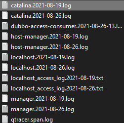
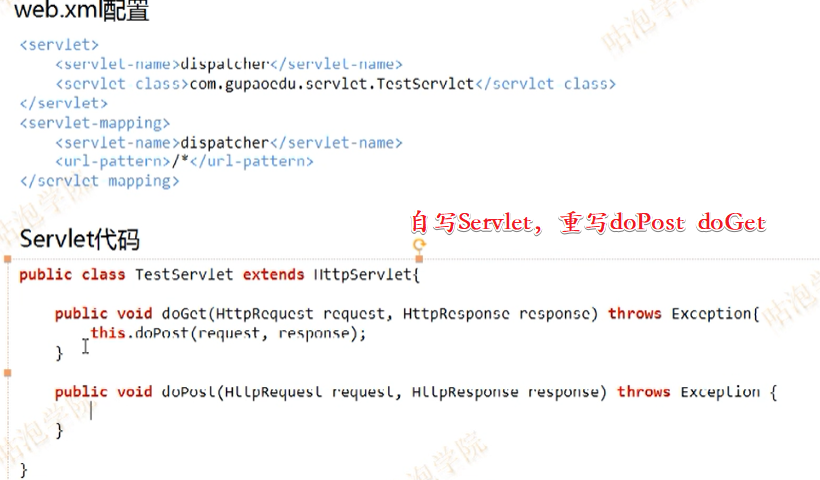
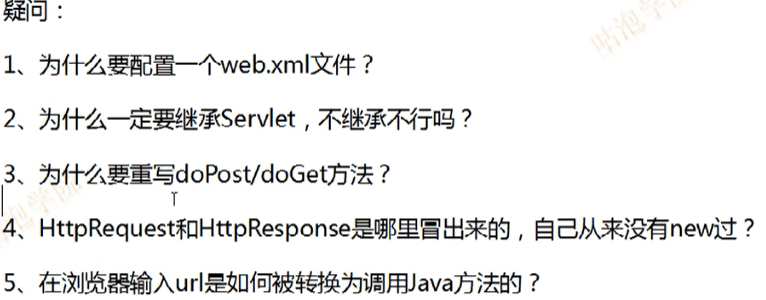

# Tomcat Notes

## Tomcat Basic

### Tomcat Logging



**日志的配置文件**：tomcat目录下的/conf/logging.properties。

```properties
 1 #可配置项(5类日志)：catalina、localhost、manager、admin、host-manager
 2 handlers = 1catalina.org.apache.juli.FileHandler, 2localhost.org.apache.juli.FileHandler,
 3 3manager.org.apache.juli.FileHandler, 4host-manager.org.apache.juli.FileHandler, java.util.logging.ConsoleHandler
 4 
 5 #日志输出为输出到文件和输出到控制台
 6 .handlers = 1catalina.org.apache.juli.FileHandler, java.util.logging.ConsoleHandler
 7 
 8 #日志输出级别：SEVERE (最高级别) > WARNING > INFO > CONFIG > FINE > FINER(精心) > FINEST (所有内容,最低级别)
 9 #配置文件使catalina日志输出级别为FINE
10 1catalina.org.apache.juli.FileHandler.level = FINE
11 #catalina文件输出位置
12 1catalina.org.apache.juli.FileHandler.directory = ${catalina.base}/logs
13 #catalina日志前缀为catalina
14 1catalina.org.apache.juli.FileHandler.prefix = catalina.
15 
16 #配置文件使localhost日志输出级别为FINE
17 2localhost.org.apache.juli.FileHandler.level = FINE
18 #localhost文件输出位置
19 2localhost.org.apache.juli.FileHandler.directory = ${catalina.base}/logs
20 #localhost日志前缀为localhost
21 2localhost.org.apache.juli.FileHandler.prefix = localhost.
22 
23 #配置文件使manager日志输出级别为FINE
24 3manager.org.apache.juli.FileHandler.level = FINE
25 #manager文件输出位置
26 3manager.org.apache.juli.FileHandler.directory = ${catalina.base}/logs
27 #manager日志前缀为manager
28 3manager.org.apache.juli.FileHandler.prefix = manager.
29 
30 #配置文件使host-manager日志输出级别为FINE
31 4host-manager.org.apache.juli.FileHandler.level = FINE
32 #host-manager文件输出位置
33 4host-manager.org.apache.juli.FileHandler.directory = ${catalina.base}/logs
34 #host-manager日志前缀为host-manager
35 4host-manager.org.apache.juli.FileHandler.prefix = host-manager.
36 
37 #配置文件使控制台日志输出级别为FINE
38 java.util.logging.ConsoleHandler.level = FINE
39 #控制台日志输出格式
40 java.util.logging.ConsoleHandler.formatter = java.util.logging.SimpleFormatter
41 
42 #localhost日志文件输出级别为INFO
43 org.apache.catalina.core.ContainerBase.[Catalina].[localhost].level = INFO
44 #localhost日志文件输出处理类2localhost.org.apache.juli.FileHandler
45 org.apache.catalina.core.ContainerBase.[Catalina].[localhost].handlers = 2localhost.org.apache.juli.FileHandler
46 
47 #manager日志文件输出级别为INFO
48 org.apache.catalina.core.ContainerBase.[Catalina].[localhost].[/manager].level = INFO
49 #manager日志文件输出处理类3manager.org.apache.juli.FileHandler
50 org.apache.catalina.core.ContainerBase.[Catalina].[localhost].[/manager].handlers = 3manager.org.apache.juli.FileHandler
51 
52 #host-manager日志文件输出级别为INFO
53 org.apache.catalina.core.ContainerBase.[Catalina].[localhost].[/host-manager].level = INFO
54 #host-manager日志文件输出处理类4host-manager.org.apache.juli.FileHandler
55 org.apache.catalina.core.ContainerBase.[Catalina].[localhost].[/host-manager].handlers = 4host-manager.org.apache.juli.FileHandler
```


日志输出级别：SEVERE (最高级别) > WARNING > INFO > CONFIG > FINE > FINER(精心) > FINEST (所有内容,最低级别)

**tomcat 有五类日志 ：**

- catalina
- localhost
- manager
- admin
- host-manager

catalina卡特琳娜

catalina.out即标准输出和标准出错，所有输出到这两个位置的都会进入catalina.out，这里包含tomcat运行自己输出的日志以及应用里向console输出的日志。默认这个日志文件是不会进行自动切割的，我们需要借助其他工具进行切割

catalina.{yyyy-MM-dd}.log是tomcat自己运行的一些日志，这些日志还会输出到catalina.out，但是应用向console输出的日志不会输出到catalina.{yyyy-MM-dd}.log,它是tomcat的启动和暂停时的运行日志，**注意，它和catalina.out是里面的内容是不一样的。**

localhost.{yyyy-MM-dd}.log主要是应用初始化(listener, filter, servlet)未处理的异常最后被tomcat捕获而输出的日志,它也是包含tomcat的启动和暂停时的运行日志,但它没有catalina.2018-09-19.log 日志全。它只是记录了部分日志。

localhost_access_log.2018-09-19.txt：这个是访问tomcat的日志，请求时间和资源，状态码都有记录。

tomcat 的 catalina.out 文件tomcat 是不会进行日志切割的，当这个文件大于2G 时，会影响tomcat的运行。那么我们需要对这个文件进行日志切割

## 视频课程01

https://ke.qq.com/course/3133740?taid=11258436430844204

知其然，知其所以然

### Question






Tomcat大概流程：

- 加载web.xml文件，初始化ServletMapping
- 用户请求，通过url找到对应的Servlet
- Servlet调用对应的doGet、doPost
- 


