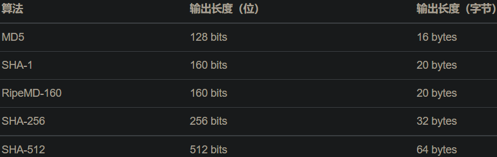

# 信息安全

## 加密算法

### 编码

#### ASCII

127位

#### Unicode

#### URL编码

URL编码是浏览器发送数据给服务器时使用的编码，它通常附加在URL的参数部分

URL编码有一套规则：

- 如果字符是`A`~`Z`，`a`~`z`，`0`~`9`以及`-`、`_`、`.`、`*`，则保持不变；
- 如果是其他字符，先转换为UTF-8编码，然后对每个字节以`%XX`表示。

例如：字符`中`的UTF-8编码是`0xe4b8ad`，因此，它的URL编码是`%E4%B8%AD`。URL编码总是大写。

#### Base64编码

Base64编码是对二进制数据进行编码，表示成文本格式。

Base64编码可以把任意长度的二进制数据变为纯文本，且只包含`A`~`Z`、`a`~`z`、`0`~`9`、`+`、`/`、`=`这些字符。它的原理是把3字节的二进制数据按6bit一组，用4个int整数表示，然后查表，把int整数用索引对应到字符，得到编码后的字符串。

因为6位整数的范围总是`0`~`63`，所以，能用64个字符表示：字符`A`~`Z`对应索引`0`~`25`，字符`a`~`z`对应索引`26`~`51`，字符`0`~`9`对应索引`52`~`61`，最后两个索引`62`、`63`分别用字符`+`和`/`表示

如果输入的`byte[]`数组长度不是3的整数倍肿么办？这种情况下，需要对输入的末尾补一个或两个`0x00`，编码后，在结尾加一个`=`表示补充了1个`0x00`，加两个`=`表示补充了2个`0x00`，解码的时候，去掉末尾补充的一个或两个`0x00`即可。

实际上，因为编码后的长度加上`=`总是4的倍数，所以即使不加`=`也可以计算出原始输入的`byte[]`。Base64编码的时候可以用`withoutPadding()`去掉`=`，解码出来的结果是一样的

因为标准的Base64编码会出现`+`、`/`和`=`，所以不适合把Base64编码后的字符串放到URL中。一种针对URL的Base64编码可以在URL中使用的Base64编码，它仅仅是把`+`变成`-`，`/`变成`_`

Base64编码的缺点是传输效率会降低，因为它把原始数据的长度增加了1/3。

和URL编码一样，Base64编码是一种编码算法，不是加密算法

如果把Base64的64个字符编码表换成32个、48个或者58个，就可以使用Base32编码，Base48编码和Base58编码。字符越少，编码的效率就会越低。

### Hash算法

哈希算法（Hash）又称摘要算法（Digest），它的作用是：对任意一组输入数据进行计算，得到一个固定长度的输出摘要。

哈希算法最重要的特点就是：

- 相同的输入一定得到相同的输出；
- 不同的输入大概率得到不同的输出。

哈希碰撞是指，两个不同的输入得到了相同的输出

常用的哈希算法有：



```java
public class Main {
    public static void main(String[] args) throws Exception {
        // 创建一个MessageDigest实例:
        MessageDigest md = MessageDigest.getInstance("MD5");
        // 反复调用update输入数据:
        md.update("Hello".getBytes("UTF-8"));
        md.update("World".getBytes("UTF-8"));
        byte[] result = md.digest(); // 16 bytes: 68e109f0f40ca72a15e05cc22786f8e6
        System.out.println(new BigInteger(1, result).toString(16));
    }
}
```


使用哈希口令时，还要注意防止彩虹表攻击:

如果只拿到MD5，从MD5反推明文口令，只能使用暴力穷举的方法。

然而黑客并不笨，暴力穷举会消耗大量的算力和时间。但是，如果有一个预先计算好的常用口令和它们的MD5的对照表, 那就不一样了。知道了md5值，如果知道原始密码，就得到一个匹配对，所以不要使用常用密码/如生日等


即使用户使用了常用口令，我们也可以采取措施来抵御彩虹表攻击，方法是对每个口令额外添加随机数，这个方法称之为 **加盐（salt）**：

```java
digest = md5(salt+inputPassword)
```


SHA-1也是一种哈希算法，它的输出是160 bits，即20字节。SHA-1是由美国国家安全局开发的，SHA算法实际上是一个系列，包括SHA-0（已废弃）、SHA-1、SHA-256、SHA-512等

注意：MD5因为输出长度较短，短时间内破解是可能的，目前已经不推荐使用。

### BouncyCastle

BouncyCastle是一个提供了很多哈希算法和加密算法的第三方库。它提供了Java标准库没有的一些算法，例如，RipeMD160哈希算法。

jar包就是`bcprov-jdk15on-xxx.jar`

Java标准库的`java.security`包提供了一种标准机制，允许第三方提供商无缝接入。我们要使用BouncyCastle提供的RipeMD160算法，需要先把BouncyCastle注册一下：

```java
public class Main {
    public static void main(String[] args) throws Exception {
        // 注册BouncyCastle:
        Security.addProvider(new BouncyCastleProvider());
        // 按名称正常调用:
        MessageDigest md = MessageDigest.getInstance("RipeMD160");
        md.update("HelloWorld".getBytes("UTF-8"));
        byte[] result = md.digest();
        System.out.println(new BigInteger(1, result).toString(16));
    }
}
```

### Hmac算法

存储用户的哈希口令时，要加盐存储，目的就在于抵御彩虹表攻击。

正是因为相同的输入会产生相同的输出，我们加盐的目的就在于，使得输入有所变化

```java 
digest = hash(salt + input)
```

这个salt可以看作是一个额外的“认证码”，同样的输入，不同的认证码，会产生不同的输出。因此，要验证输出的哈希，必须同时提供“认证码”。

Hmac算法就是一种基于密钥的消息认证码算法，它的全称是 **Hash-based Message Authentication Code**，是一种更安全的消息摘要算法。

Hmac算法总是和某种哈希算法配合起来用的。例如，我们使用MD5算法，对应的就是HmacMD5算法，它相当于“加盐”的MD5：

```
HmacMD5 ≈ md5(secure_random_key, input)
```

因此，HmacMD5可以看作带有一个安全的key的MD5。使用HmacMD5而不是用MD5加salt，有如下好处：

- HmacMD5使用的key长度是64字节，更安全；
- Hmac是标准算法，同样适用于SHA-1等其他哈希算法；
- Hmac输出和原有的哈希算法长度一致。

可见，Hmac本质上就是把key混入摘要的算法。验证此哈希时，除了原始的输入数据，还要提供key。

为了保证安全，我们不会自己指定key，而是通过Java标准库的KeyGenerator生成一个安全的随机的key

```java
public class Main {
    public static void main(String[] args) throws Exception {
        KeyGenerator keyGen = KeyGenerator.getInstance("HmacMD5");
        SecretKey key = keyGen.generateKey();
        // 打印随机生成的key:
        byte[] skey = key.getEncoded();
        System.out.println(new BigInteger(1, skey).toString(16));
        Mac mac = Mac.getInstance("HmacMD5");
        mac.init(key);
        mac.update("HelloWorld".getBytes("UTF-8"));
        byte[] result = mac.doFinal();
        System.out.println(new BigInteger(1, result).toString(16));
    }
}
```

### https://www.liaoxuefeng.com/wiki/1252599548343744/1305366354722849


murmurHash


AES 

DES


 


