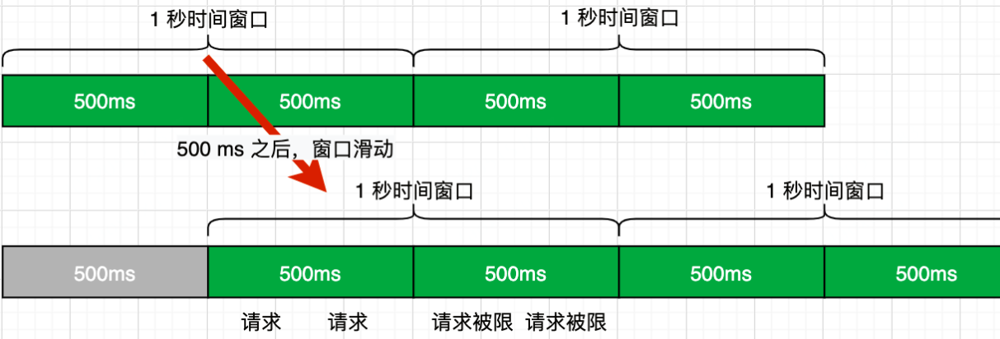
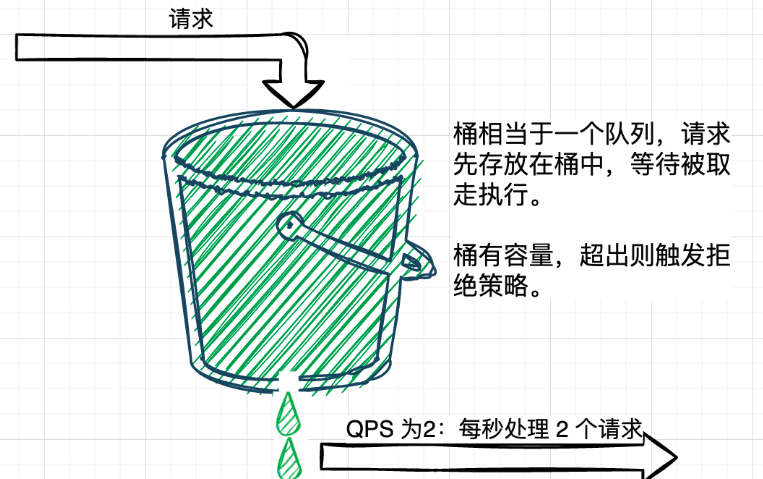
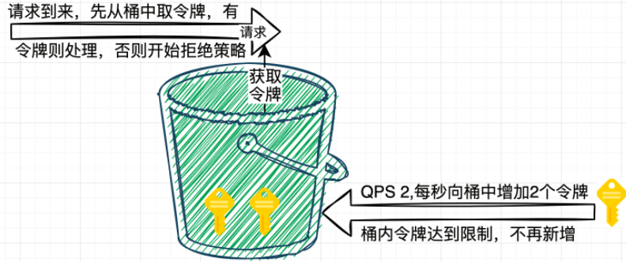

# 高并发笔记

高并发三板斧：

- 限流
- 降级
- 熔断

？缓存、限流、熔断降级、负载均衡

## 限流

### 5限流算法、7限流方式

https://www.cnblogs.com/niumoo/p/16007224.html

**限流**顾名思义，就是**对请求或并发数进行限制**；通过对一个时间窗口内的请求量进行限制来保障系统的正常运行。如果我们的服务资源有限、处理能力有限，就需要对调用我们服务的上游请求进行限制，以防止自身服务由于资源耗尽而停止服务。

两个概念：

- **阈值**：在一个**单位时间内允许的请求量**。如 QPS 限制为10，说明 1 秒内最多接受 10 次请求。
- **拒绝策略**：**超过阈值的请求的拒绝策略，**常见的拒绝策略有**直接拒绝、排队**等待等。

#### 固定窗口算法

**固定窗口算法**又叫**计数器算法**，是一种**简单**方便的限流算法。主要通过一个支持**原子操作**的计数器来累计 1 秒内的请求次数，当 1 秒内计数达到限流阈值时触发拒绝策略。每过 1 秒，计数器重置为 0 开始重新计数。

```java
/**
 * @author https://www.wdbyte.com
 */
public class RateLimiterSimpleWindow {
    // 阈值
    private static Integer QPS = 2;
    // 时间窗口（毫秒）
    private static long TIME_WINDOWS = 1000;
    // 计数器
    private static AtomicInteger REQ_COUNT = new AtomicInteger();
    
    private static long START_TIME = System.currentTimeMillis();

    public synchronized static boolean tryAcquire() {
        if ((System.currentTimeMillis() - START_TIME) > TIME_WINDOWS) {
            REQ_COUNT.set(0);
            START_TIME = System.currentTimeMillis();
        }
        return REQ_COUNT.incrementAndGet() <= QPS;
    }

    public static void main(String[] args) throws InterruptedException {
        for (int i = 0; i < 10; i++) {
            Thread.sleep(250);
            LocalTime now = LocalTime.now();
            if (!tryAcquire()) {
                System.out.println(now + " 被限流");
            } else {
                System.out.println(now + " 做点什么");
            }
        }
    }
}
```

这种简单的限流方式是有问题的，虽然我们限制了 QPS 为 2，但是当遇到时间窗口的临界突变时，如 1s 中的后 500 ms 和第 2s 的前 500ms 时，虽然是加起来是 1s 时间，却可以被请求 4 次

#### 滑动窗口算法

滑动窗口算法是对固定窗口算法的改进。既然固定窗口算法在遇到时间窗口的临界突变时会有问题，那么我们在遇到下一个时间窗口前也调整时间窗口不就可以了吗？



可以发现窗口滑动的间隔越短，时间窗口的临界突变问题发生的概率也就越小，不过只要有时间窗口的存在，还是有可能发生**时间窗口的临界突变问题**

```java
package com.wdbyte.rate.limiter;

import java.time.LocalTime;
import java.util.concurrent.atomic.AtomicInteger;

/**
 * 滑动窗口限流工具类
 *
 * @author https://www.wdbyte.com
 */
public class RateLimiterSlidingWindow {
    /**
     * 阈值
     */
    private int qps = 2;
    /**
     * 时间窗口总大小（毫秒）
     */
    private long windowSize = 1000;
    /**
     * 多少个子窗口
     */
    private Integer windowCount = 10;
    /**
     * 窗口列表
     */
    private WindowInfo[] windowArray = new WindowInfo[windowCount];

    public RateLimiterSlidingWindow(int qps) {
        this.qps = qps;
        long currentTimeMillis = System.currentTimeMillis();
        for (int i = 0; i < windowArray.length; i++) {
            windowArray[i] = new WindowInfo(currentTimeMillis, new AtomicInteger(0));
        }
    }

    /**
     * 1. 计算当前时间窗口
     * 2. 更新当前窗口计数 & 重置过期窗口计数
     * 3. 当前 QPS 是否超过限制
     *
     * @return
     */
    public synchronized boolean tryAcquire() {
        long currentTimeMillis = System.currentTimeMillis();
        // 1. 计算当前时间窗口
        int currentIndex = (int)(currentTimeMillis % windowSize / (windowSize / windowCount));
        // 2.  更新当前窗口计数 & 重置过期窗口计数
        int sum = 0;
        for (int i = 0; i < windowArray.length; i++) {
            WindowInfo windowInfo = windowArray[i];
            if ((currentTimeMillis - windowInfo.getTime()) > windowSize) {
                windowInfo.getNumber().set(0);
                windowInfo.setTime(currentTimeMillis);
            }
            if (currentIndex == i && windowInfo.getNumber().get() < qps) {
                windowInfo.getNumber().incrementAndGet();
            }
            sum = sum + windowInfo.getNumber().get();
        }
        // 3. 当前 QPS 是否超过限制
        return sum <= qps;
    }

    private class WindowInfo {
        // 窗口开始时间
        private Long time;
        // 计数器
        private AtomicInteger number;

        public WindowInfo(long time, AtomicInteger number) {
            this.time = time;
            this.number = number;
        }
        // get...set...
    }
}

```

#### 滑动日志算法

基本逻辑就是记录下所有的请求时间点，新请求到来时先判断最近指定时间范围内的请求数量是否超过指定阈值，由此来确定是否达到限流，这种方式没有了时间窗口突变的问题，限流比较准确，但是因为要记录下每次请求的时间点，所以**占用的内存较多**。

```java
package com.wdbyte.rate.limiter;

import java.time.LocalTime;
import java.util.HashSet;
import java.util.Set;
import java.util.TreeMap;

/**
 * 滑动日志方式限流
 * 设置 QPS 为 2.
 *
 * @author https://www.wdbyte.com
 */
public class RateLimiterSildingLog {

    /**
     * 阈值
     */
    private Integer qps = 2;
    /**
     * 记录请求的时间戳,和数量
     */
    private TreeMap<Long, Long> treeMap = new TreeMap<>();

    /**
     * 清理请求记录间隔, 60 秒
     */
    private long claerTime = 60 * 1000;

    public RateLimiterSildingLog(Integer qps) {
        this.qps = qps;
    }

    public synchronized boolean tryAcquire() {
        long now = System.currentTimeMillis();
        // 清理过期的数据老数据，最长 60 秒清理一次
        if (!treeMap.isEmpty() && (treeMap.firstKey() - now) > claerTime) {
            Set<Long> keySet = new HashSet<>(treeMap.subMap(0L, now - 1000).keySet());
            for (Long key : keySet) {
                treeMap.remove(key);
            }
        }
        // 计算当前请求次数
        int sum = 0;
        for (Long value : treeMap.subMap(now - 1000, now).values()) {
            sum += value;
        }
        // 超过QPS限制，直接返回 false
        if (sum + 1 > qps) {
            return false;
        }
        // 记录本次请求
        if (treeMap.containsKey(now)) {
            treeMap.compute(now, (k, v) -> v + 1);
        } else {
            treeMap.put(now, 1L);
        }
        return sum <= qps;
    }

    public static void main(String[] args) throws InterruptedException {
        RateLimiterSildingLog rateLimiterSildingLog = new RateLimiterSildingLog(3);
        for (int i = 0; i < 10; i++) {
            Thread.sleep(250);
            LocalTime now = LocalTime.now();
            if (rateLimiterSildingLog.tryAcquire()) {
                System.out.println(now + " 做点什么");
            } else {
                System.out.println(now + " 被限流");
            }
        }
    }
}

```

#### 漏桶算法

漏桶算法中的漏桶是一个形象的比喻，这里可以用生产者消费者模式进行说明，请求是一个生产者，每一个请求都如一滴水，请求到来后放到一个队列（漏桶）中，而桶底有一个孔，不断的漏出水滴，就如消费者不断的在消费队列中的内容，消费的速率（漏出的速度）等于限流阈值。即假如 QPS 为 2，则每 `1s / 2= 500ms` 消费一次。漏桶的桶有大小，就如队列的容量，当请求堆积超过指定容量时，会触发拒绝策略。



，漏桶模式中的消费处理总是能以恒定的速度进行，可以很好的**保护自身系统**不被突如其来的流量冲垮；但是这也是漏桶模式的缺点，假设 QPS 为 2，同时 2 个请求进来，2 个请求并不能同时进行处理响应，因为每 `1s / 2= 500ms` 只能处理一个请求。(？)

#### 令牌桶算法

令牌桶算法同样是实现限流是一种常见的思路，最为常用的 Google 的 Java 开发工具包 Guava 中的限流工具类 RateLimiter 就是令牌桶的一个实现。令牌桶的实现思路类似于生产者和消费之间的关系。

系统服务作为生产者，按照指定频率向桶（容器）中添加令牌，如 QPS 为 2，每 500ms 向桶中添加一个令牌，如果桶中令牌数量达到阈值，则不再添加。

请求执行作为消费者，每个请求都需要去桶中拿取一个令牌，取到令牌则继续执行；如果桶中无令牌可取，就触发拒绝策略，可以是超时等待，也可以是直接拒绝本次请求，由此达到限流目的。



思考令牌桶的实现可以以下特点。

1. 1s / 阈值（QPS） = 令牌添加时间间隔。
2. 桶的容量等于限流的阈值，令牌数量达到阈值时，不再添加。
3. 可以适应流量突发，N 个请求到来只需要从桶中获取 N 个令牌就可以继续处理。
4. 有启动过程，令牌桶启动时桶中无令牌，然后按照令牌添加时间间隔添加令牌，若启动时就有阈值数量的请求过来，会因为桶中没有足够的令牌而触发拒绝策略，不过如 RateLimiter 限流工具已经优化了这类问题。

Google 的 Java 开发工具包 Guava 中的限流工具类 RateLimiter 就是令牌桶的一个实现

```java
// qps 2
RateLimiter rateLimiter = RateLimiter.create(2);
for (int i = 0; i < 10; i++) {
    String time = LocalDateTime.now().format(DateTimeFormatter.ISO_LOCAL_TIME);
    System.out.println(time + ":" + rateLimiter.tryAcquire());
    Thread.sleep(250);
}

```

虽然演示了 Google Guava 工具包中的 RateLimiter 的实现，但是我们需要思考一个问题，就是令牌的添加方式，如果按照指定间隔添加令牌，那么需要开一个线程去定时添加，如果有很多个接口很多个 RateLimiter 实例，**线程数会随之增加**，这显然不是一个好的办法。显然 Google 也考虑到了这个问题，在 RateLimiter 中，是**在每次令牌获取时才进行计算令牌是否足够的**。它通过存储的下一个令牌生成的时间，和当前获取令牌的时间差，再结合阈值，去计算令牌是否足够，同时再记录下一个令牌的生成时间以便下一次调用。

```java
void resync(long nowMicros) { // 当前微秒时间
    // 当前时间是否大于下一个令牌生成时间
    if (nowMicros > this.nextFreeTicketMicros) { 
      	// 可生成的令牌数 newPermits = （当前时间 - 下一个令牌生成时间）/ 令牌生成时间间隔。
      	// 如果 QPS 为2，这里的 coolDownIntervalMicros 就是 500000.0 微秒(500ms)
        double newPermits = (double)(nowMicros - this.nextFreeTicketMicros) / this.coolDownIntervalMicros();
				// 更新令牌库存 storedPermits。
      	this.storedPermits = Math.min(this.maxPermits, this.storedPermits + newPermits);
				// 更新下一个令牌生成时间 nextFreeTicketMicros
      	this.nextFreeTicketMicros = nowMicros;
    }
}

```

#### Redis分布式限流

Redis 是一个开源的内存数据库，可以用来作为数据库、缓存、消息中间件等。Redis 是单线程的，又在内存中操作，所以速度极快，得益于 Redis 的各种特性，所以使用 Redis 实现一个限流工具是十分方便的。

##### 固定窗口限流


##### 滑动窗口限流


#### **单机限流与分布式限流**

上面演示的基于代码形式的窗口算法和桶算法限流都适用于单机限流，如果需要分布式限流可以结合注册中心、负载均衡计算每个服务的限流阈值，但这样会降低一定精度，如果对精度要求不是太高，可以使用。

而 Redis 的限流，由于 Redis 的单机性，本身就可以用于分布式限流。使用 Redis 可以实现各种可以用于限流算法，如果觉得麻烦也可以使用开源工具如 redisson，已经封装了基于 Redis 的限流。


#### **其他限流工具**

文中已经提到了 `Guava` 的限流工具包，不过它毕竟是单机的，开源社区中也有很多分布式限流工具，如阿里开源的 **Sentinel** 就是不错的工具，Sentinel 以流量为切入点，从**流量控制、熔断降级、系统负载**保护等多个维度保护服务的稳定性。


