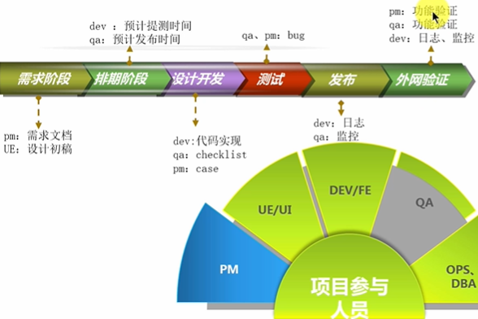
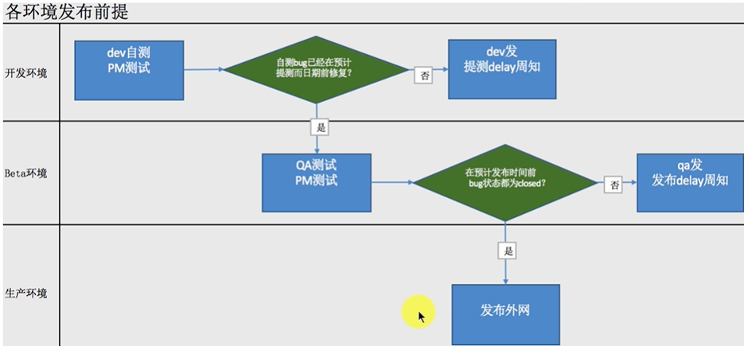
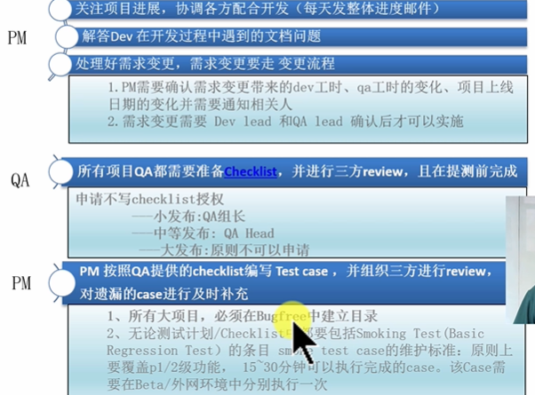

# Software Development

### Principle

### SOLID

SOLID

D is COLD

SOLID中没有CRP

合成复用原则（Composite Reuse Principle，CRP）又叫组合/聚合复用原则（Composition/Aggregate Reuse Principle，CARP）。它要求在软件复用时，要尽量先使用组合或者聚合等关联关系来实现，其次才考虑使用继承关系来实现。

通常类的复用分为继承复用和合成复用两种，继承复用虽然有简单和易实现的优点，但它也存在以下缺点。

1. 继承复用破坏了类的封装性。因为继承会将父类的实现细节暴露给子类，父类对子类是透明的，所以这种复用又称为“白箱”复用。
2. 子类与父类的耦合度高。父类的实现的任何改变都会导致子类的实现发生变化，这不利于类的扩展与维护。
3. 它限制了复用的灵活性。从父类继承而来的实现是静态的，在编译时已经定义，所以在运行时不可能发生变化。

采用组合或聚合复用时，可以将已有对象纳入新对象中，使之成为新对象的一部分，新对象可以调用已有对象的功能，它有以下优点。

1. 它维持了类的封装性。因为成分对象的内部细节是新对象看不见的，所以这种复用又称为“黑箱”复用。
2. 新旧类之间的耦合度低。这种复用所需的依赖较少，新对象存取成分对象的唯一方法是通过成分对象的接口。
3. 复用的灵活性高。这种复用可以在运行时动态进行，新对象可以动态地引用与成分对象类型相同的对象。

### DDD

领域模型分为4大类：失血模型、贫血模型、充血模型、胀血模型。这类理论都是些软件设计领域的大牛（如Martin Fowler）提出来的

“血”指的是domain object的model层内容

- 失血模型

  失血模型中，domain object只有属性的get set方法的纯数据类，所有的业务逻辑完全由Service层来完成的，由于没有dao，Service直接操作数据库，进行数据持久化。

  service: 肿胀的服务逻辑

  model：只包含get set方法

  显然失血模型service层负担太重，一般不会有这种设计。

- 贫血模型

  贫血模型中，**domain ojbect包含了不依赖于持久化的原子领域逻辑，而组合逻辑在Service层**。

  service ：组合服务，也叫事务服务

  model：除包含get set方法，还包含原子服务（如获得关联model的id）

  dao：数据持久化

  贫血模型比较常见，其问题在于原子服务往往不能直接拿到关联model，因此可以把这个原子服务变成直接用关联modelRepo拿到关联model，这就是充血模型。

- 充血模型

  充血模型中，绝大多业务逻辑都应该被放在domain object里面，包括持久化逻辑，而Service层是很薄的一层，仅仅封装事务和少量逻辑，不和DAO层打交道。

  service ：组合服务 也叫事务服务

  model：除包含get set方法，还包含原子服务和数据持久化的逻辑

  充血模型的问题也很明显，当model中包含了数据持久化的逻辑，实例化的时候可能会有很大麻烦，拿到了太多不一定需要的关联model。

- 胀血模型

  胀血模型取消了Service层，只剩下domain object和DAO两层，在domain object的domain logic上面封装事务。

   一般来说失血模型和胀血模型不常见，多采用贫血模型。

推荐前两个

## 软件开发流程

### QUNAR软件开发流程

项目流程：

创建PMO 

提交ideaFR

ideaFR通过

RDQA会

提交需求FR

需求FR通过

排期会

技术方案设计和case编写

执行编码

自测和连调

show case

测试阶段

发布阶段

验收阶段

后评估和Review

#### 需求阶段

PM：需求文档

QA、DEV：共同review需求

反复修改、review，直到Final Review，达成共识

#### 排期阶段

有很多项目，每个项目的需求也有优先级，故需要排期

考虑因素：

- 根据需求优先级：P1 P2 P3 P4
- 考虑工期
  - DEV规划从设计到正是提测的时间
  - QA进行beta测试需要的时间
  - 发布数据准备的时间
  - 预计发布时间

不要接私活

#### 设计开发阶段

开发之前：

- 在PMO中可以找到需求文档和文档的历史版本（Project Management Office，项目管理办公室）
- 需求被DEV、leader、QA review过，并有沟通记录和评分在里面
- 设计方案已经被DEV Leader确认过。如果需要配置服务器胡哪家，还需要OPS （Operations Service Clerk 运营服务业务员？）review，如果需要数据库，还需要DBA
- 开发环境
- git模块

开发过程中

开发完成后

- DEV和PM开发环境下自测
  - 执行Test case
  - PM关注原有功能受到的影响
  - DEV关注新功能的性能和稳定性
  - DEV关注日志的规范
  - DEV关注系统监控
- PM通知QA测试
- DEV提交代码到Git，在POM中更新发布步骤，发邮件周知提测

#### 提测

DEV需要达到的标准：

- 执行全部case，有记录
- 发现bug，及时修复
- 所有bug状态为closed
- 写清楚pmo中的发布步骤
- 所有工程都可以编译通过

QA检测

如果DEV提交的没有通过，则reject，三次reject的话DEV后面的提交都需要CEO的签字

#### 测试

- 部署beta环境
- 分配case
- code diff
- 记录bug
- 验证发布步骤
- 发进度邮件

#### 发布阶段

标准：

- 执行全部case，有执行记录
- 发现bug，进行修复
- 所有bug closed

QA主导发布，和DEV、PM配合

- QA：操作发布、观察监控
- DEV：观察日志、监控
- PM：观察线上业务

如果有问题：回滚

#### 外网验证阶段

QA主导

- 功能检查
- 外网日志检查
- 系统监控
- 数据检查

不小于30分钟

## 敏捷

### 敏捷宣言

- 个体和互动 高于 流程和工具
- 工作的软件 高于 详尽的文档
- 客户合作 高于 合作谈判
- 响应变化 高于 遵循计划

### 敏捷开发十二原则

我们最重要的目标，是通过及早和持续不断地交付有价值的软件使客户满意。

欣然面对需求变化，即使在开发后期也一样。为了客户的竞争优势，敏捷过程掌控变化。

经常地交付可工作的软件，相隔几星期或一两个月，倾向于采取较短的周期。

业务人员和开发人员必须相互合作，项目中的每一天都不例外。

激发个体的斗志，以他们为核心搭建项目。提供所需的环境和支援，辅以信任，从而达成目标。

不论团队内外，传递信息效果最好效率也最高的方式是面对面的交谈。

可工作的软件是进度的首要度量标准。

敏捷过程倡导可持续开发。责任人、开发人员和用户要能够共同维持其步调稳定延续。

坚持不懈地追求技术卓越和良好设计，敏捷能力由此增强。

以简洁为本，它是极力减少不必要工作量的艺术。

最好的架构、需求和设计出自自组织团队。

团队定期地反思如何能提高成效，并依此调整自身的行为表现。

