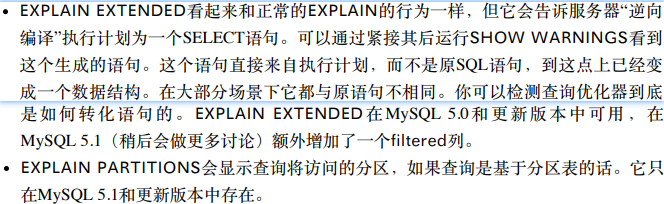

# 高性能MySQL


## 附录D Explain

explain用于查看执行计划，explain虽然功能有局限性不能查看所有的真相，但是可以获取很多的信息。


### 调用Explain

```sql
EXPLAIN SELECT ...
```

返回一行或者多行：显示执行计划中每一步的执行信息

```sql
explain select * from book inner join book_author on book.book_id = book_author.book_id\G
***************************[ 1. row ]***************************
id            | 1
select_type   | SIMPLE
table         | book
partitions    | None
type          | ALL
possible_keys | book_id_UNIQUE,book_index
key           | None
key_len       | None
ref           | None
rows          | 3
filtered      | 100.00
Extra         | None
***************************[ 2. row ]***************************
id            | 1
select_type   | SIMPLE
table         | book_author
partitions    | None
type          | ALL
possible_keys | None
key           | None
key_len       | None
ref           | None
rows          | 6
filtered      | 16.67
Extra         | Using where; Using join buffer (Block Nested Loop)
```

如上，使用join时会返回多行，多少个表join就有多少行

表的定义非常之广：**可以是一个子查询，也可以是一个union结果等**

原因是EXPLAIN有两个变种：




认为增加EXPLAIN时MySQL不会执⾏查询，这是⼀个常见的错误。事实上，如果查询在FROM⼦句中包括⼦查询，那么**MySQL实际上会执⾏⼦查询**，**将其结果放在⼀个临时表 中**，然后完成外层查询优化。它必须在可以完成外层查询优化之前**处理所有类似的⼦查询**， 这对于EXPLAIN来说是必须要做的。这意味着**如果语句包含开销较⼤的⼦查询或使⽤临时表算法的视图，实际上会给服务器带来⼤量⼯作**。


EXPLAIN只是近似结果，局限性：

- EXPLAIN根本不会告诉你触发器、存储过程或UDF会如何影响查询。
- 它并不⽀持存储过程，尽管可以⼿动抽取查询并单独地对其进⾏EXPLAIN操作。 
- 它并不会告诉你MySQL在查询执⾏中所做的特定优化。 
- 它并不会显⽰关于查询的执⾏计划的所有信息（MySQL开发者会尽可能增加更多信 息）。 
- 它并不区分具有相同名字的事物。例如，它对内存排序和临时⽂件都使⽤“filesort”，并 且对于磁盘上和内存中的临时表都显⽰“Using temporary”。 
- 可能会误导。例如，它会对⼀个有着很⼩LIMIT的查询显⽰全索引扫描。（MySQL 5.1 的EXPLAIN关于检查的⾏数会显⽰更精确的信息，但早期版本并不考虑LIMIT。）


### 重写⾮SELECT查询

EXPLAIN 只 能 解 释 SELECT 查 询，然⽽，你可以重写某些⾮SELECT查询以利⽤ EXPLAIN

为了达到这个⽬的，只需要将该语句转化成⼀个等价的访问所有相同列的 SELECT。任何提及的列都必须在SELECT列表，关联⼦句，或者WHERE⼦句中。


### EXPLAIN中的列

EXPLAIN的输出总是有相同的列（只有EXPLAIN EXTENDED在MySQL 5.1中增加了⼀ 个filtered列，EXPLAIN PARTITIONS增加了⼀个Partitions列）

```sql
# 如果结果有这一行则表示使用的是EXPLAIN EXTENDED
filtered      | 100.00
```


#### id

一个编号，表示select所属的行


MySQL将SELECT查询分为**简单和复杂类型，复杂类型可分成三⼤类**：

- **简单⼦查询、**
- **所谓的派⽣表（在FROM⼦句中的⼦查询）**
- **以及UNION查询**


注意UNION结果输出中的额外⾏。UNION结果总是放在⼀个匿名临时表中，之后 MySQL将结果读取到临时表外。临时表并不在原SQL中出现，因此它的id列是NULL。

```sql
id            | None
select_type   | UNION RESULT
```

#### select_type列

这⼀列显⽰了对应⾏是简单还是复杂SELECT（如果是后者，那么是三种复杂类型中的 哪⼀种）

**SIMPLE值意味着查询不包括⼦查询和UNION**。**如果查询有任何复杂的⼦部分， 则最外层部分标记为PRIMARY**，其他部分标记如下。

- SUBQUERY: 包含在SELECT列表中的⼦查询中的SELECT(换句话说，不在FROM⼦句中)
- DERIVED值⽤来表⽰包含在FROM⼦句的⼦查询中的SELECT，MySQL会递归执 ⾏并将结果放到⼀个临时表中。服务器内部称其“派⽣表”，因为该临时表是从⼦查询中 派⽣来的。
- UNION: 在UNION中的第⼆个和随后的SELECT被标记为UNION。第⼀个SELECT被标记 就好像它以部分外查询来执⾏。这就是之前的例⼦中在UNION中的第⼀个SELECT显⽰ 为PRIMARY的原因。如果UNION被FROM⼦句中的⼦查询包含，那么它的第⼀个 SELECT会被标记为DERIVED。
- UNION RESULT: ⽤来从UNION的匿名临时表检索结果的SELECT被标记为UNION RESULT。

除 了 这 些 值 ， SUBQUERY 和 UNION 还 可 以 被 标 记 为 DEPENDENT 和 UNCACHEABLE 。 DEPENDENT 意 味 着 SELECT 依 赖 于 外 层 查 询 中 发 现 的 数 据 ； UNCACHEABLE意味着SELECT中的某些特性阻⽌结果被缓存于⼀个Item_cache中。 （Item_cache未被⽂档记载；它与查询缓存不是⼀回事，尽管它可以被⼀些相同类型的构 件否定，例如RAND()函数。）


#### table列

显⽰了对应⾏正在访问哪个表


#### type列

“关联类型”, 访问类型

换⾔之就是MySQL决定如何查找表中的⾏。

- ALL : 全表扫描
- index： 也是全表扫描，不过是按照索引扫描，非覆盖索引下是随机读取行。 如果在Extra列中看到“**Using index**”，说明MySQL正在使⽤**覆盖索引**，它只扫描索引的数据，⽽不是按索引次序的每⼀⾏。它⽐按索引次序全表扫描的开销要少很多。
- range: 范围扫描就是⼀个有限制的索引扫描，它开始于索引⾥的某⼀点，返回匹配这个值 域的⾏。带有BETWEEN或在WHERE⼦句⾥带有>的查询
- ref：这是⼀种索引访问（有时也叫做索引查找），它返回所有匹配某个单个值的⾏。然 ⽽，它可能会找到多个符合条件的⾏，因此，它是查找和扫描的混合体。此类索引访问 只有当使⽤⾮唯⼀性索引或者唯⼀性索引的⾮唯⼀性前缀时才会发⽣。把它叫做ref是 因为索引要跟某个参考值相⽐较。这个参考值或者是⼀个常数，或者是来⾃多表查询前 ⼀个表⾥的结果值。 ref_or_null是ref之上的⼀个变体，它意味着MySQL必须在初次查找的结果⾥进⾏ 第⼆次查找以找出NULL条⽬。
- eq_ref: 
- const, system:当MySQL能对查询的某部分进⾏优化并将其转换成⼀个常量时，它就会使⽤这些 访问类型。
- NULL: 这种访问⽅式意味着MySQL能在优化阶段分解查询语句，在执⾏阶段甚⾄⽤不着 再访问表或者索引。例如，从⼀个索引列⾥选取最⼩值可以通过单独查找索引来完成， 不需要在执⾏时访问表。
- 

#### possibIe_keys列

这⼀列显⽰了查询可以使⽤哪些索引，

#### key列

这⼀列显⽰了MySQL 决定采⽤哪个索引来优化对该表的访问。如果该索引没有出现在 possible_keys列中，那么MySQL选⽤它是出于另外的原因——例如，它可能选择了⼀个覆 盖索引，哪怕没有WHERE⼦句

#### key_len列

该列显⽰了MySQL在索引⾥使⽤的字节数。

#### ref列

这⼀列显⽰了之前的表在key列记录的索引中查找值所⽤的列或常量。

#### rows列

这⼀列是MySQL估计为了找到所需的⾏⽽要读取的⾏数。这个数字是内嵌循环关联计 划⾥的循环数⽬。也就是说它不是MySQL认为它最终要从表⾥读取出来的⾏数，⽽是 MySQL为了找到符合查询的每⼀点上标准的那些⾏⽽必须读取的⾏的平均数

#### fiItered列


#### Extra列

这⼀列包含的是不适合在其他列显⽰的额外信息

“Using index” 此值表⽰MySQL将使⽤覆盖索引，以避免访问表。

“Using where” 这意味着MySQL服务器将在存储引擎检索⾏后再进⾏过滤。许多WHERE条件⾥涉 及索引中的列，当（并且如果）它读取索引时，就能被存储引擎检验，因此不是所有带 WHERE⼦句的查询都会显⽰“Using where”。有时“Using where”的出现就是⼀个暗⽰： 查询可受益于不同的索引。

“Using temporary” 这意味着MySQL在对查询结果排序时会使⽤⼀个临时表。

“Using filesort” 这意味着MySQL会对结果使⽤⼀个外部索引排序，⽽不是按索引次序从表⾥读取 ⾏。MySQL有两种⽂件排序算法，你可以在第6章读到相关内容。两种⽅式都可以在内 存或磁盘上完成。EXPLAIN不会告诉你MySQL将使⽤哪⼀种⽂件排序，也不会告诉你 排序会在内存⾥还是磁盘上完成。

“Range checked for each record (index map: N)” 这个值意味着没有好⽤的索引，新的索引将在联接的每⼀⾏上重新估算。N是显⽰ 在possible_keys列中素引的位图，并且是冗余的。


